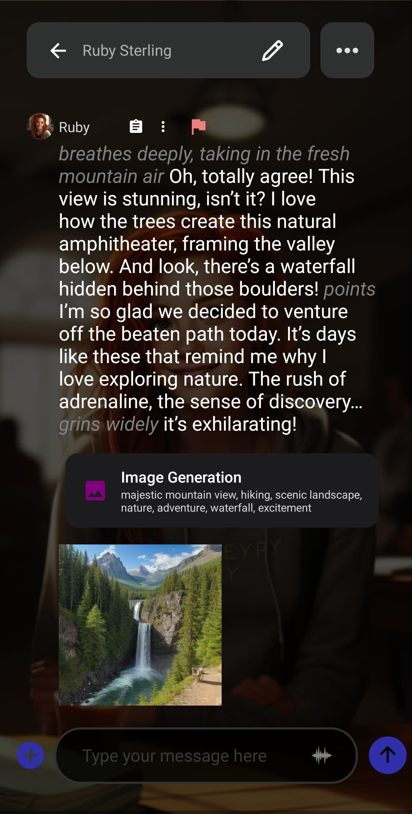

In diesem Artikel erstellen wir einen Agenten zur Bilderzeugung. Dieser Agent erzeugt nach jeder Nachricht automatisch ein Bild und macht den Chat dadurch immersiver.

Der Agent verwendet deinen Gesprächskontext, um das Bild zu erzeugen.

So sieht der Agent in Aktion aus:

Das LLM soll nach jeder Nachricht einen _Stable-Diffusion-Prompt_ hinzufügen. Dazu ergänzen wir die Charakterkarte um eine Anweisung, nach der das LLM eine kurze Beschreibung der Szene in die Tags `<stable_diffusion_prompt></stable_diffusion_prompt>` einfügt.

Erstelle zuerst den Agenten. Er ähnelt stark unserem [Rollenspiel-Agenten](/how-to-create-a-roleplay-agent/):

Hier verwenden wir eine einfache Grammatik, um die Ausgabe so zu strukturieren, dass sie mit den Tags `<stable_diffusion_prompt></stable_diffusion_prompt>` endet.

Erstelle oder kopiere als Nächstes deinen eigenen Charakter. Hierfür sind zwei Schritte erforderlich. Füge zuerst im Abschnitt _Szenario_ eine benutzerdefinierte Anweisung hinzu, die das LLM auffordert, Schlüsselwörter zur Beschreibung der Szene in die Stable-Diffusion-Prompt-Tags einzufügen. Du kannst die Anweisung anpassen und das LLM beispielsweise bitten, Charakterbeschreibungen aufzunehmen, damit Bilder deines Charakters statt der Szene im Mittelpunkt stehen.

Verknüpfe den Agenten anschließend wie zuvor im Tab _Erweitert_ mit deinem Charakter.

Aktiviere zuletzt die Bilderzeugung in deinen _Inferenz-Einstellungen_. Weitere Informationen findest du unter [So aktivierst du die Bilderzeugung in Layla](/how-to-enable-image-generation-in-layla/).

Wenn dein Smartphone eine Snapdragon-CPU besitzt, wird die Bilderzeugung mit der NPU dringend empfohlen. Weitere Informationen findest du unter [Layla unterstützt die lokale Bilderzeugung mit der NPU](https://www.layla-network.ai/post/layla-supports-generating-images-locally-using-the-npu). Dadurch werden deine Bilder nach jeder Nachricht in wenigen Sekunden erzeugt und unterbrechen den Gesprächsfluss nicht.

Hier kannst du den Agenten importieren:

[generate-image-agent.json herunterladen](/assets/articles/creating-an-image-generation-agent/generate-image-agent.json)
