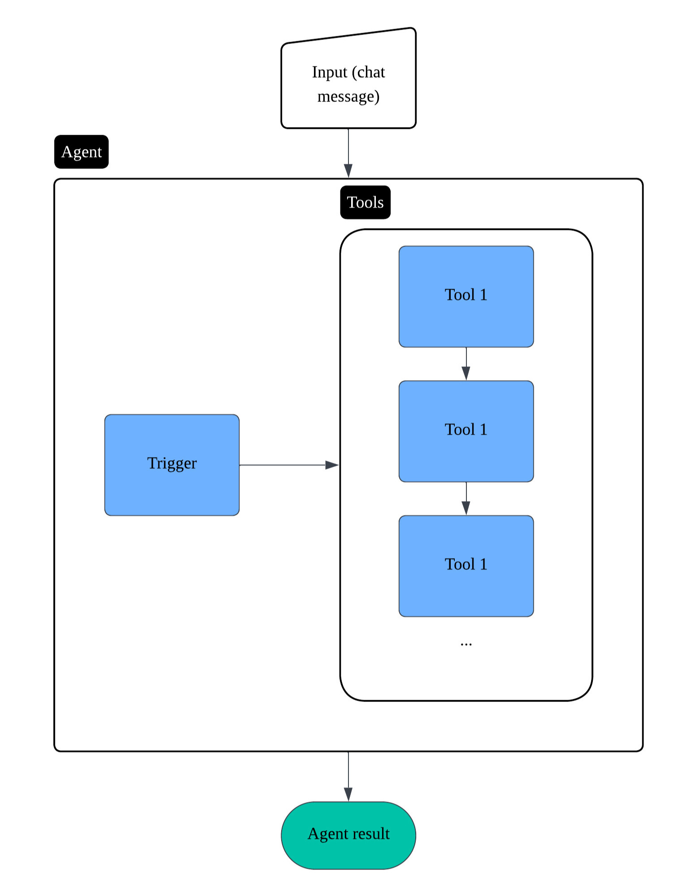
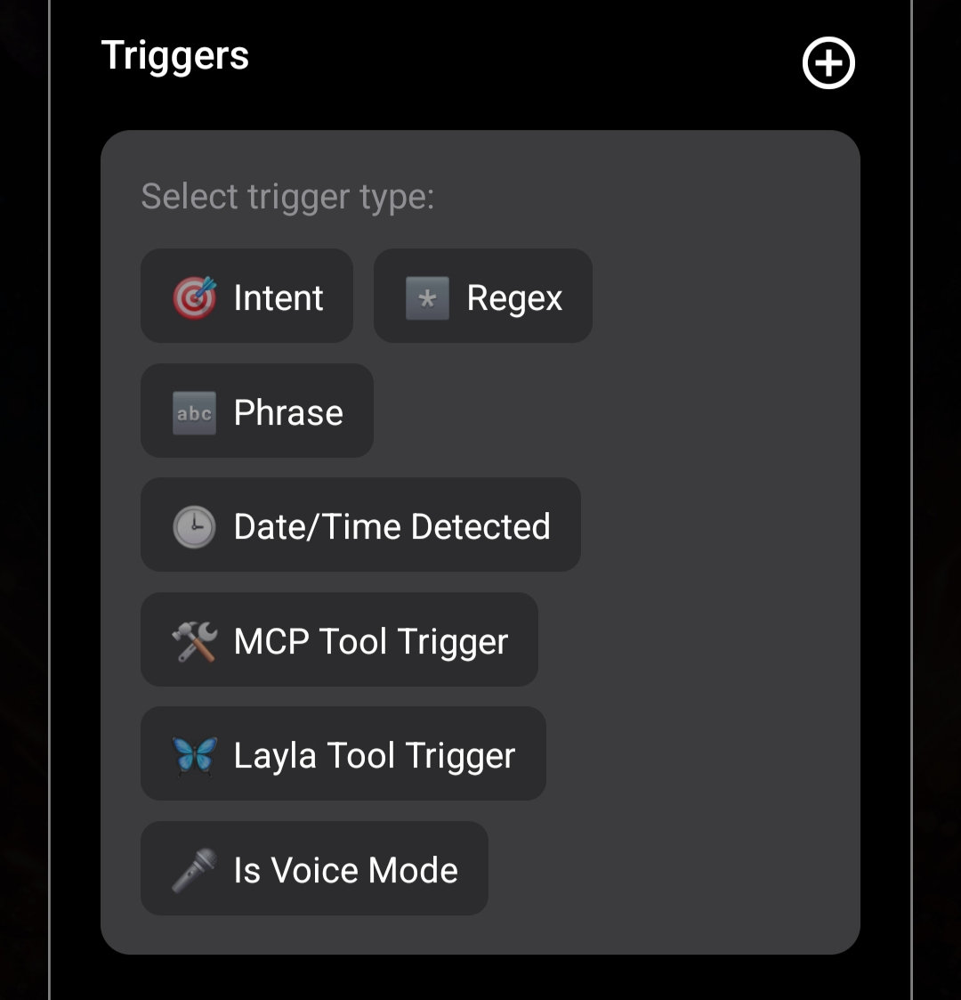
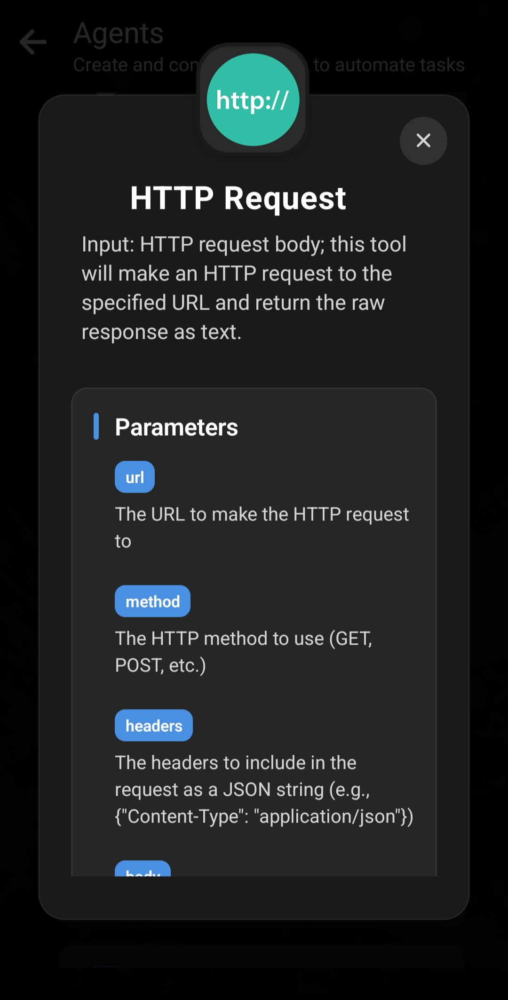

_Falls noch nicht geschehen, lies zuerst [die kurze Einführung in die Funktionsweise von Agents in Layla](/how-to-enable-agents-functions-and-tool-calling-in-layla/)._

Dieser Artikel untersucht Laylas Agent-Funktionen im Detail.

**Interner Aufbau von Agents**

Agents sind eigenständige Arbeitsabläufe, die bei Bedarf während eines Chats mit dem LLM ausgeführt werden. Jeder Agent besitzt einen _Trigger_, der unter bestimmten konfigurierbaren Bedingungen aktiviert wird, und eine Liste nacheinander auszuführender Tools.

Das Agent-Ergebnis wird als Kontext in die Unterhaltung eingefügt. Das LLM verwendet ihn für eine kontextbezogene Antwort.

**Trigger**

Layla bietet viele Arten von Triggern. Die folgende Abbildung zeigt einige davon:

- **Intent** — Layla klassifiziert die Absicht deiner Eingabe und löst den Agent entsprechend aus. Der Klassifikator enthält zahlreiche Absichten wie „search news“, „query weather“, „set alarm“ und „set calendar“. Die vollständige Liste steht nach dem Hinzufügen eines _Intent Trigger_ im Auswahlmenü.
- **Regex** — Der Agent wird ausgelöst, wenn der reguläre Ausdruck in der Chatnachricht übereinstimmt. Der gefundene Text ist die Eingabe des ersten Tools.
- **Phrase** — Der Agent wird ausgelöst, wenn die angegebene Phrase unabhängig von Groß- und Kleinschreibung in der Nachricht erkannt wird. Sie ist die Eingabe des ersten Tools.
- **Date/Time Detected** — Der Agent wird ausgelöst, wenn eine Datums- oder Zeitangabe erkannt wird. Der erkannte Wert ist die Eingabe des ersten Tools.
- **MCP/Layla Tool Trigger** — Diese fortgeschrittene Funktion wird im Artikel über [vollständige MCP-Unterstützung in Layla](/full-mcp-support-in-layla/) behandelt.
- **Is Voice Mode** — Ein einfacher Trigger, der bei aktiviertem Voice Mode auslöst.

Diese Trigger werden für jede Ein- und Ausgabenachricht im Chat geprüft. Bei einer Aktivierung startet der Agent, und die Triggerbedingung wird zur Eingabe des ersten Tools.

**Tools**

_Tools_ bilden das Herzstück der Agents in Layla.

Sie führen Funktionen aus, etwa externe Dienste aufzurufen, dein Smartphone zu bedienen und vieles mehr. Layla bringt zahlreiche integrierte Tools mit, und weitere kommen regelmäßig hinzu.

Da es zu viele für diesen Artikel gibt, betrachten wir einige häufig verwendete.

Scrolle in der Mini-App _Agents_ nach unten zur Liste verfügbarer Tools. Tippe ein Tool an, um weitere Informationen zu öffnen. Als Beispiel dient _HTTP Request_:

_HTTP Request_ besitzt mehrere konfigurierbare Parameter. Du kannst sie fest vorgeben — beispielsweise eine bestimmte aufzurufende URL — oder vom LLM generieren lassen, wie weiter unten beschrieben.

Nach dem Hinzufügen konfigurierst du die Parameter im Edit-Agent-Fenster. Wie im vorherigen Artikel gezeigt, kannst du die URL direkt eingeben.

Die Ausgabe jedes Tools dient als Eingabe des nächsten. Auf diese Weise lassen sich mehrere Tools in einem Agent verketten. Im Beispiel ist die Ausgabe von _HTTP Request_ die rohe Zeichenfolge, die der URL-Aufruf mit den konfigurierten Parametern zurückgibt.

_Provide Context_ ist ein wichtiges Tool, das die endgültige Ausgabe des Agents in den Kontext des LLM einfügt. Dadurch erhält das LLM nach der Ausführung fundierte Ergebnisse.

**Agents testen**

Nach der Erstellung kannst du einen Agent über _Test Agent_ in der Agent-Liste testen. Dabei werden die Ein- und Ausgaben jedes Schritts sichtbar, sodass die Funktionsweise leichter nachzuvollziehen ist.

Als Beispiel verwenden wir den Agent „What's My IP?“:

Das Tool sendet zunächst eine HTTP-Anfrage an [https://api.ipify.org](https://api.ipify.org).

Die Ausgabe — deine IP-Adresse als Klartext — wird angezeigt.

Anschließend wird sie an _Provide Context_ übergeben, das sie als Kontextnachricht für das LLM formatiert.

Diese Nachricht lässt sich im Tool konfigurieren. In diesem Beispiel:

Beachte die Vorlagen in doppelten geschweiften Klammern, etwa `{{input}}`. `{{input}}` wird durch die Eingabe dieses Tools ersetzt.

Im Beispiel ist die HTTP-Ausgabe die Eingabe von _Provide Context_. Nach der Ersetzung lautet die Ausgabe: `{{user}}'s current IP address is xx.xx.xx.xx`.

Beim Einfügen in die Unterhaltung wird `{{user}}` zusätzlich durch die ausgewählte Persona ersetzt. Das funktioniert wie bei eigenen Prompts.

**Vom LLM generierte Parameter**

Bislang haben wir die Parameter jedes Tools immer fest vorgegeben und höchstens passende Eingaben als Parameter verwendet.

Bei LLM-integrierten Agents können wir _**das LLM Eingaben für die Tools erzeugen lassen**_. Dadurch verbinden wir Flexibilität mit den Fähigkeiten des Modells für natürliche Sprache.

Ein häufiges Beispiel ist eine Websuche. Die gesamte Nachricht sollte nicht unverändert als Suchbegriff dienen. Das LLM kann aus deiner Nachricht und den Hinweisen im Gespräch passende Suchbegriffe ableiten.

Ein weiteres Beispiel ist das Verfassen einer E-Mail. Du könntest sagen: „draft an email to my co-worker reminding him of our meeting“. Das LLM soll den Text erstellen und die E-Mail-App mit dem vorausgefüllten Inhalt öffnen.

Layla kann dies umsetzen:

Der Agent „Send Email“ besitzt zwei Parameter: „Subject“ und „Message“. **LLM tool call** ist auf **ON** gestellt.

Dadurch erzeugt das LLM den Inhalt dieser Parameter. Beim Auslösen erstellt es Betreff und Nachricht und führt das Tool aus, das deinen E-Mail-Client mit den notwendigen Informationen öffnet.

Wenn **LLM tool call** auf **ON** steht, kannst du in die Parameterfelder Anweisungen in natürlicher Sprache eingeben. Das LLM versteht den Zweck jedes Feldes und erzeugt anhand des Gesprächskontexts passende Eingaben.

Ein komplexeres Beispiel ist der Agent _Schedule Event_: Er besitzt viele Parameter, die dem LLM jeweils ausführlich erklärt werden.
