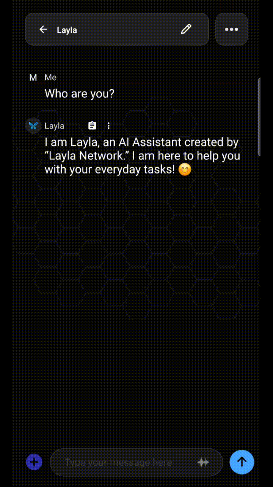
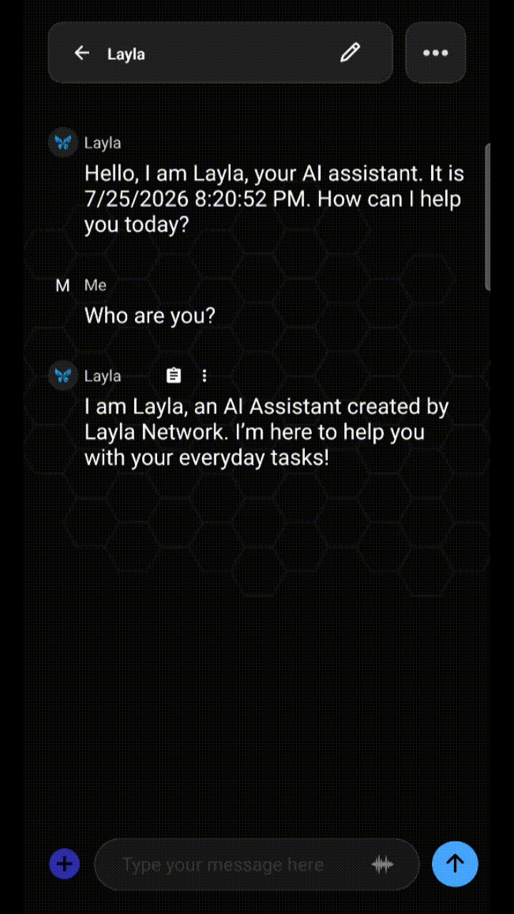

**Ja. Für jede Nachricht in einem Layla-Chat stehen eigene Aktionen bereit: Du kannst sie bearbeiten, neu generieren, kopieren, löschen, übersetzen, vorlesen lassen und mehr. Halte die Nachricht gedrückt oder tippe auf ihr Überlaufmenü, um die Nachrichtenaktionen zu öffnen.** Nicht jede Aktion gilt für jede Nachricht. Manche sind nur für deine Nachrichten sinnvoll, andere nur für Laylas Antworten.

Dieser Leitfaden erklärt die einzelnen Aktionen und die zugehörigen Nachrichtentypen. Da Layla vollständig auf dem Gerät läuft, finden alle Aktionen lokal statt; zum Bearbeiten oder erneuten Generieren wird nichts übertragen.

## Das Menü für Nachrichtenaktionen öffnen

Du erreichst die Aktionen einer Nachricht auf zwei Arten:

- **Halte die Nachrichtenblase gedrückt.** Drücke auf eine beliebige Nachricht — deine oder Laylas — bis das Aktionsmenü erscheint. Diese Hauptgeste funktioniert in der gesamten Chatansicht.
- **Tippe auf das Überlaufmenü.** Bei manchen Nachrichten steht nahe der Blase ein kleines Symbol mit drei Punkten. Es öffnet dieselben Aktionen ohne langes Drücken und hilft bei der genauen Auswahl.

Das Menü berücksichtigt den Kontext. Bei deinen Nachrichten zeigt es Eingabeaktionen wie Bearbeiten, Kopieren, Löschen, Zitieren, Anheften und Verzweigen. Bei Laylas Antworten kommen Generierungsaktionen wie Regenerate und Retry hinzu. Fehlt eine Aktion, ist sie für diesen Nachrichtentyp nicht verfügbar.

| Aktion     | Funktion                                                         | Gilt für                               |
| ---------- | ---------------------------------------------------------------- | -------------------------------------- |
| Edit       | Ändert den Text einer Nachricht direkt                           | Deine Nachrichten und Laylas Antworten |
| Regenerate | Erzeugt eine neue Version einer Antwort                          | Laylas Antworten                       |
| Continue   | Setzt eine möglicherweise abgeschnittene Nachricht fort          | Laylas Antworten                       |
| Copy       | Kopiert den Nachrichtentext in die Zwischenablage                | Alle Nachrichten                       |
| Delete     | Entfernt die Nachricht aus der Unterhaltung                      | Alle Nachrichten                       |
| Speak      | Liest die Nachricht mit der aktuellen Text-zu-Sprache-Stimme vor | Alle Nachrichten                       |

## Eine Nachricht bearbeiten

Mit Bearbeiten änderst du den Nachrichtentext, ohne neu anzufangen. Halte die Nachricht gedrückt, tippe auf **Edit**, ändere den Text und bestätige.

Dies funktioniert auf beiden Seiten. Am häufigsten bearbeitest du **deine eigene Nachricht**, um einen Tippfehler zu korrigieren, einen Prompt zu präzisieren oder die Frage zu ändern. Sende sie danach erneut, damit Layla auf die korrigierte Version antwortet. Das Bearbeiten von **Laylas Antwort** ist beim Rollenspiel und Schreiben nützlich: Behalte gelungene Teile und passe den Rest von Hand an, statt alles neu zu generieren.

Wenn du eine ältere eigene Nachricht bearbeitest und erneut sendest, beruhen die nachfolgenden Antworten noch auf dem ursprünglichen Wortlaut. Je nachdem, wie weit sie zurückliegt, solltest du Laylas nächste Antwort neu generieren, damit die Unterhaltung konsistent bleibt.

## Eine Antwort neu generieren oder wiederholen

**Regenerate** fordert Layla auf, eine neue Version einer Antwort zu erstellen. Passt eine Antwort nicht, halte sie gedrückt und tippe auf **Regenerate**. Damit verbesserst du Ergebnisse, ohne den Prompt neu zu schreiben.

Neu generierte Antworten bleiben normalerweise als Alternativen erhalten, zwischen denen du wechseln kannst. So vergleichst du die neue Version mit der vorherigen und wählst die bevorzugte aus, ohne das Original zu verlieren.

Da die Generierung auf deinem Gerät erfolgt, hängt ihre Geschwindigkeit von der Smartphone-Hardware und der Größe des geladenen Modells ab, nicht von einer Netzwerkverbindung.

## Eine Nachricht löschen

Löschen entfernt eine einzelne Nachricht aus der Unterhaltung. Halte sie gedrückt, tippe auf **Delete** und bestätige. Anders als beim Löschen einer ganzen Unterhaltung oder des gesamten Verlaufs betrifft dies nur die ausgewählte Nachricht.

So kannst du Fehlstarts, doppelte Antworten oder unerwünschte Kontextnachrichten entfernen. Da das Modell den Verlauf für seine nächste Antwort liest, kann das Entfernen einer überflüssigen Nachricht den Kontext bereinigen. Das Löschen ist lokal und dauerhaft; die Nachricht lässt sich nicht wiederherstellen.

> **Hinweis:** Wenn du eine frühere Nachricht löschst, wird der Chat neu geladen, und das Modell beginnt die Verarbeitung ab der gelöschten Nachricht neu. Je nach Position kann dies etwas dauern.

## Eine Unterhaltung verzweigen

**Branch** zweigt die Unterhaltung an der aktuellen Nachricht ab. Dadurch kannst du einen getrennten Verlauf erkunden, ohne das Original zu verlieren. Ab diesem Punkt entsteht ein neuer Pfad für eine andere Richtung, Formulierung oder ein anderes Ergebnis; die ursprüngliche Unterhaltung bleibt erhalten.

Verzweigungen eignen sich besonders für Rollenspiele und Texte, wenn eine Szene auf zwei Arten weitergehen soll. Bei Produktivitätsaufgaben kannst du alternative Ansätze testen, ohne den ersten zu verwerfen. Statt einen Pfad zu überschreiben, behältst du beide.

## Häufig gestellte Fragen

### Kann ich Laylas Antworten bearbeiten oder nur meine Nachrichten?

Beides. Das Bearbeiten deiner Nachrichten ist häufiger, aber auch Laylas Antworten lassen sich direkt ändern, wenn du den Großteil behalten und einen Abschnitt von Hand anpassen möchtest.

### Löscht Regenerate die alte Antwort?

Nein. Neu generierte Antworten bleiben als auswählbare Alternativen erhalten, sodass du Versionen vergleichen und eine davon auswählen kannst.

### Kann ich eine gelöschte Nachricht wiederherstellen?

Nein. Das Löschen ist lokal und dauerhaft. Bestätige nur, wenn du die Nachricht später nicht mehr benötigst.

### Kann ich eine Unterhaltung verzweigen, ohne das Original zu verlieren?

Ja. Eine Verzweigung erstellt ab der gewählten Nachricht einen separaten Pfad und lässt die ursprüngliche Unterhaltung für die spätere Rückkehr unverändert.

### Funktionieren Nachrichtenaktionen offline?

Ja. Layla läuft auf deinem Gerät. Bearbeiten, neu generieren, kopieren, löschen und alle weiteren Aktionen erfolgen lokal und benötigen keine Internetverbindung.

Nachrichtenaktionen machen einen geräteinternen Assistenten im Alltag praktisch: Prompts bearbeiten, Antworten neu generieren und Gespräche verzweigen geschieht lokal auf deiner Hardware, ohne dass Daten das Gerät verlassen.
