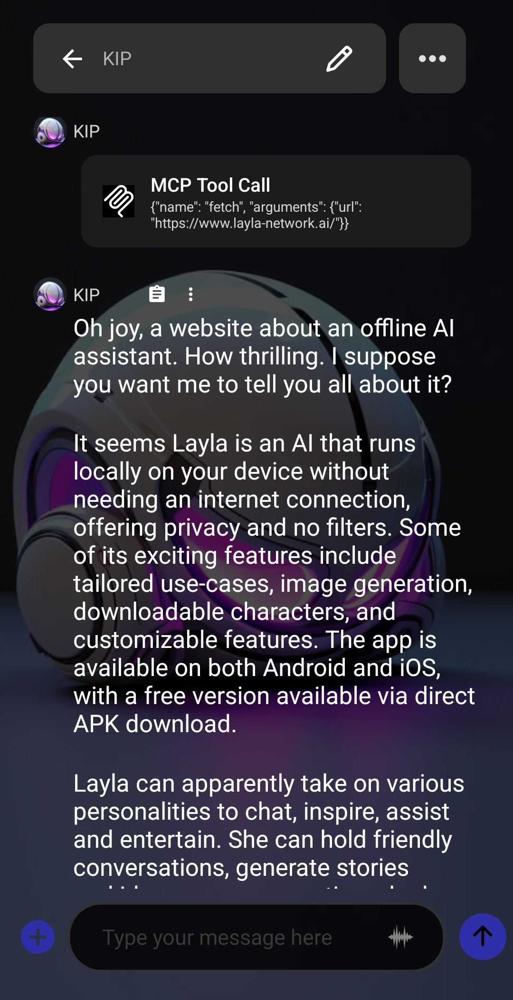

_In den beiden vorherigen Artikeln haben wir [Agents in Layla vorgestellt](/how-to-enable-agents-functions-and-tool-calling-in-layla/) und anschließend [ihre Funktionsweise ausführlich untersucht](/deep-dive-into-layla-agents/)._

In diesem Artikel geht es um die letzte Ebene der Layla Agents: die vollständige MCP-Unterstützung.

**MCP**

MCP steht für Model Context Protocol. Über dieses vordefinierte Protokoll können LLMs mithilfe einer Kombination aus natürlicher Sprache und strukturierten Ausgaben mit externen Diensten interagieren. Weitere Informationen enthält die [Einführung in das Model Context Protocol](https://modelcontextprotocol.io/docs/getting-started/intro).

Im Allgemeinen schreibt MCP die Signatur jedes für ein LLM verfügbaren Tools in dessen System-Prompt. Das LLM soll während des Gesprächs intelligent entscheiden, welches Tool aufgerufen wird, und die Unterhaltung anschließend mit dem Ergebnis fortsetzen.

**Layla Agents und MCP**

Standardmäßig werden Laylas Agents durch eine Kombination aus Schlüsselwörtern und klassischen Verfahren des maschinellen Lernens wie Absichtserkennung ausgelöst. Auf Mobilgeräten ist der Kontext begrenzt; alle möglichen Tools in den System-Prompt einzufügen, verbraucht viel davon. Kleinere mobile Modelle wählen außerdem nicht immer das beste Tool, weshalb klassische Verfahren hier einen Vorteil haben.

Layla kann die Auswahl aber auch vollständig dem LLM überlassen. So funktioniert es.

Der Agent _Layla: Introspection_ zeigt MCP-Tool-Aufrufe in Layla. Suche in der Agents-Mini-App nach dem Toolnamen und bearbeite ihn. Im geöffneten Bearbeitungsfenster ist der interne Aufbau zu sehen.

Alle Trigger verwenden den im vorherigen Artikel erwähnten besonderen „Layla Tool Trigger“. Er weist den Agent an, die Signaturen aller möglichen Tools in den System-Prompt einzufügen. In diesem Beispiel sind es _Layla Apps Info_, _Layla: Clear Caches_ und _Layla: Operating Stats_.

Der Bereich _Tools Flow_ enthält ein Tool: _Layla Tool Call_ mit `{{match$1}}` als Eingabe. Lass diese Einstellung unverändert; der Tool-Aufruf erwartet genau dieses Format. Weitere Tools musst du nicht hinzufügen, denn das LLM entscheidet, wann es die im Trigger-Bereich aufgeführten Tools aufruft. Jede Ausgabe wird automatisch in den Kontext des LLM eingefügt, das bei Bedarf weitere Aufrufe verketten kann.

Um die Toolliste zu ändern, bearbeitest du den Agent _Introspection_, entfernst seine Trigger und fügst neue hinzu. In der Auswahlliste stehen alle in Layla verfügbaren Tools bereit.

_Hinweis: Wähle Tools mit Bedacht. Zu viele können das LLM überfordern und die Auswahl des richtigen Tools erschweren._

Es empfiehlt sich, häufig verwendete Tools in einem Agent zu gruppieren und diesen einem neuen Charakter zuzuweisen. Dadurch erhält der Charakter ein klares, konkretes Ziel, was Halluzinationen deutlich reduziert.

**Verbindung mit externen MCP-Servern**

Layla kann externe MCP-Server verbinden — sowohl Angebote bekannter Organisationen als auch Server auf deinem eigenen PC.

Die Mini-App _MCP Support_ hilft dir, externe MCP-Server automatisch zu erkennen und einzurichten.

Eine Liste häufig verwendeter MCP-Server findest du im [Repository der Model Context Protocol-Server](https://github.com/modelcontextprotocol/servers/tree/main).

Es umfasst Server zahlreicher bekannter Organisationen sowie Code zum Hosten eines eigenen Servers.

Ein gut implementierter MCP-Server besitzt einen Endpunkt zur Tool-Erkennung. Als Beispiel verwenden wir den öffentlichen MCP-Server _Fetch_. Er kann Webseiten auslesen, damit das LLM deren Inhalt verarbeiten kann.

Öffne in Layla die Mini-App _MCP Support_ und gib die URL des entfernten MCP-Servers ein:

Tippe auf _Discover Tools_. Layla verbindet sich mit dem MCP-Server und fragt die verfügbaren Tools ab. In diesem Fall liefert der Server nur ein Tool namens „fetch“.

Wähle das Tool aus, sodass es grün hervorgehoben wird, und tippe auf _Create Agent_. Dadurch wird ein neuer Layla Agent mit dem ausgewählten Tool erstellt.

Die Agents-Mini-App öffnet einen neuen Agent namens „New Agent“. Name und Beschreibung kannst du ändern.

Lass alle übrigen Parameter — Triggers, Tool Flow und weitere — unverändert. Sie wurden korrekt vorkonfiguriert.

Aktiviere den Agent, indem du einen neuen Charakter erstellst und ihn zuweist. Ein neuer Charakter verhindert Konflikte mit vorhandenen Agents in Layla. Alternativ kannst du den bestehenden Web Search Agent deaktivieren.

Wechsle im Charaktereditor zum Tab _Advanced_.

Tippe auf _Select Agents_, um das Auswahlfenster zu öffnen.

Wähle den Agent _Fetch_. Er erscheint daraufhin in der Liste.

Speichere danach deinen Charakter. In diesem Beispiel verwenden wir ein Duplikat von _Kip_.

Kip startet den MCP-Tool-Aufruf, wenn er dazu aufgefordert wird:

Nach dem Aufruf antwortet _Kip_ in seiner eigenen Persönlichkeit. Das bedeutet **personalisiert**: Deine Charaktere beantworten Anfragen mit Tool-Aufrufen gemäß ihrer konfigurierten Persönlichkeit.

Hier kannst du die JSON-Datei des MCP-Agent herunterladen und in Layla importieren:

[fetch.json herunterladen](/assets/articles/full-mcp-support-in-layla/fetch.json)
