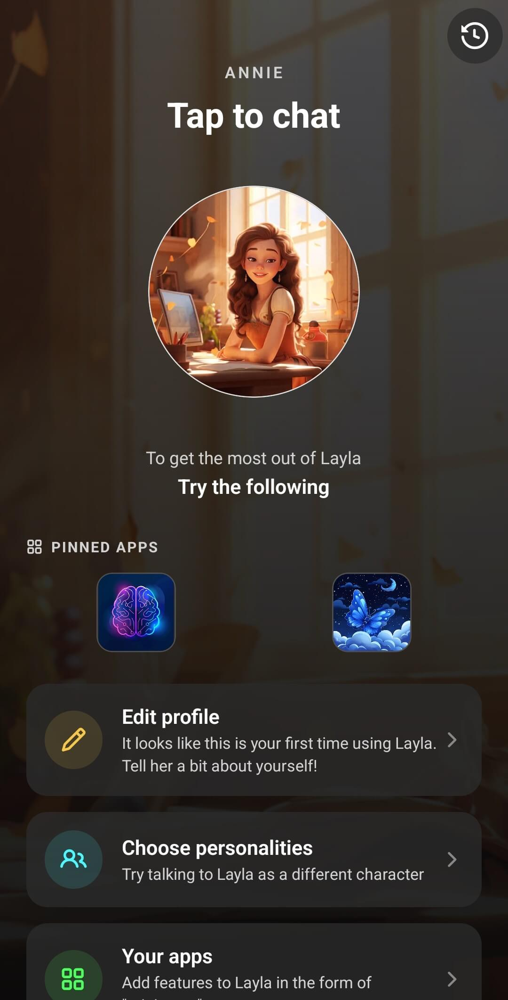

**Dein Standardcharakter ist der Charakter, den Layla auswählt, wenn du eine Interaktion beginnst, ohne selbst einen Charakter festzulegen.** Er kann auf dem Startbildschirm erscheinen, beim direkten Start von Layla im Chat geöffnet werden, Schnellaktionen ohne eigenen Charakter übernehmen und als Charakter dienen, wenn Layla der Assistent deines Smartphones ist.

Standardmäßig verwendet Layla den integrierten Charakter Layla. Du kannst ihn jederzeit durch einen vorgegebenen, importierten oder selbst erstellten Charakter ersetzen.

## Einen Standardcharakter festlegen

Die Option findest du in einem normalen Chat mit dem Charakter, den du verwenden möchtest:

1. Öffne **Persönlichkeiten auswählen** und wähle den Charakter aus.
2. Starte einen Chat mit diesem Charakter oder öffne einen vorhandenen Chat.
3. Tippe oben rechts im Chat auf die **drei Punkte**.
4. Tippe auf **Als Standard festlegen**.

Im folgenden Beispiel ist Annie im Chat geöffnet und als Standardcharakter festgelegt.

Das Medaillensymbol neben **Als Standard festlegen** wird golden angezeigt, wenn der geöffnete Charakter bereits dein Standard ist. Es gibt keine separate Liste mit Standardcharakteren: Es kann immer nur ein Charakter als Standard festgelegt sein. Um ihn zu ändern, öffne einen Chat mit einem anderen Charakter und wiederhole die Schritte.

Wenn du noch keinen Charakter erstellt hast, lies [So erstellst du einen eigenen KI-Charakter in Layla](/how-do-i-create-custom-characters/) oder [lade einen Charakter aus dem Personalities Hub herunter](/personality-hub-ai-characters/).

## Was sich durch den Standardcharakter ändert

Mit dieser Einstellung weiß Layla, welcher Charakter verwendet werden soll, wenn ein anderer Bereich der App einen Charakter benötigt, aber keine bestimmte Auswahl vorgibt. Beim Vorbereiten der neuen Interaktion verwendet Layla die Identität, Persönlichkeit, das Aussehen und die konfigurierten Chat-Funktionen dieses Charakters.

Die Einstellung ersetzt weder den Charakter in bereits geöffneten Unterhaltungen noch verändert sie gespeicherte Nachrichten oder den Charakter selbst. Chatverläufe werden ebenfalls nicht zusammengeführt. Über **Persönlichkeiten auswählen** kannst du weiterhin wie gewohnt jeden anderen Charakter wählen.

## Der Startbildschirm

Wenn **Willkommen** als Startbildschirm aktiv ist, siehst du das Ergebnis, sobald du dorthin zurückkehrst. Layla zeigt den Namen und das Hauptbild des Standardcharakters an. Wenn du auf das große Charakterbild tippst, beginnt ein Chat mit diesem Charakter. Außerdem verwendet Layla dessen Hintergrund, sofern du kein eigenes Hintergrundbild ausgewählt hast.

Hier zeigt der Startbildschirm jetzt Annie anstelle des integrierten Layla-Charakters:

Eine Standard-Mini-App ist eine separate Einstellung. Wenn du eine Mini-App ausgewählt hast, die das große Symbol auf dem Startbildschirm ersetzt, öffnet dieses Symbol die Mini-App statt deines Standardcharakters. In allen anderen Bereichen bleibt der Charakter weiterhin der Standard. Entferne die Standard-Mini-App in der Mini-App **Wallpaper & UI**, wenn das Symbol auf dem Startbildschirm wieder deinen Charakter öffnen soll.

## Layla direkt im Chat öffnen

Öffne **Einstellungen** > **UI-Einstellungen** > **Startbildschirm** und wähle **Chat**, wenn Layla direkt einen Charakterchat öffnen soll. Layla verwendet dafür deinen Standardcharakter.

Diese Option funktioniert unabhängig davon, ob **Willkommen** als Startbildschirm ausgewählt ist. Bei **Willkommen** siehst du zuerst den Charakter und tippst ihn an, um den Chat zu beginnen. Bei **Chat** wechselt Layla direkt zum Chatbildschirm.

## Layla als Assistent deines Smartphones

Wenn Layla als Standardassistent deines Smartphones eingerichtet ist, verwendet der geöffnete Assistent deinen Standardcharakter aus Layla. Das Eingabefeld ändert sich zu **[Charaktername] fragen**, und für die Sitzung werden die Persönlichkeit und die konfigurierten Fähigkeiten des Charakters verwendet. Im Beispiel ändert dieselbe Einstellung, die Annie auf dem Startbildschirm platziert hat, auch die Eingabeaufforderung des Assistenten zu **Ask Annie...**.

Einen Charakter in Layla als Standard festzulegen, ersetzt nicht automatisch Google Gemini oder einen anderen Systemassistenten. Dafür gibt es eine separate Einstellung auf deinem Smartphone. Die Android-Einrichtung wird unter [So ersetzt du Google Gemini durch Layla als Standardassistent deines Smartphones](/how-to-replace-google-gemini-with-layla-as-your-phone-s-default-assistant/) beschrieben.

## Schnellaktionen und geteilte Texte

Schnellaktionen können einem bestimmten Charakter zugeordnet werden. Wenn eine Aktion keinen eigenen Charakter hat, verwendet Layla deinen Standardcharakter. Das gilt auch für die vorgegebenen Aktionen, mit denen du an Layla geteilte Texte zusammenfassen oder erklären, eine Erinnerung einrichten oder im Web suchen kannst.

Bei der Charakterauswahl für eine Schnellaktion wird der Standardcharakter außerdem an erster Stelle angezeigt. Wenn du einer einzelnen Aktion einen anderen Charakter zuweist, überschreibt diese Auswahl den Standard nur für diese Aktion.

Bei unterstützten iOS-Kurzbefehlen wird Text, der ohne eine andere Charakterauswahl an Layla gesendet wird, ebenfalls mit dem Standardcharakter geöffnet.

## Integrationen mit dem Langzeitgedächtnis

Wenn eine andere App oder Automatisierung Text an Laylas Aktion **Merken** sendet, ordnet Layla diese Erinnerung dem Standardcharakter zu. Das ist wichtig, weil das Langzeitgedächtnis nach Charakteren organisiert ist: Wenn du den Standard später änderst, werden bereits gespeicherte Erinnerungen nicht verschoben.

Dies unterscheidet sich davon, Nachrichten in einem geöffneten Chat manuell auszuwählen und **Zum Langzeitgedächtnis hinzufügen** zu verwenden. In diesem Fall gehören die Nachrichten zum Charakter des geöffneten Chats.

## Einstellungen, die getrennt bleiben

Mehrere ähnlich klingende Optionen übernehmen den Standardcharakter nicht automatisch:

- **Vorhandene Chats:** Beim erneuten Öffnen einer gespeicherten Unterhaltung wird deren eigener Charakter verwendet und nicht durch den aktuellen Standard ersetzt.
- **Schnellaktionen mit zugewiesenem Charakter:** Der für die Aktion ausgewählte Charakter hat Vorrang.
- **Standard-Mini-App:** Sie kann festlegen, was über das große Symbol auf dem Startbildschirm geöffnet wird, ersetzt aber nicht den anderweitig verwendeten Standardcharakter.
- **Begleitermodus:** Der Begleitermodus besitzt eine eigene Charakterauswahl. Eine Änderung des Standardcharakters wechselt nicht den aktiven Begleiter.
- **Rollenspielszenarien und Gruppenchats:** Die Charaktere werden in der Rollenspiel-Mini-App ausgewählt und nicht von der Einstellung für den Standardcharakter übernommen.

## Häufig gestellte Fragen

### Kann ich mehrere Standardcharaktere verwenden?

Nein. Layla speichert jeweils einen Standardcharakter. Wenn du einen anderen Charakter als Standard festlegst, ersetzt er die vorherige Auswahl.

### Wie erkenne ich den aktuellen Standardcharakter?

Öffne einen Chat mit dem Charakter, tippe auf die drei Punkte und sieh dir **Als Standard festlegen** an. Das Medaillensymbol wird beim aktuellen Standardcharakter golden angezeigt.

### Startet das Ändern des Standards einen neuen Chat?

Nein. Mit **Als Standard festlegen** wird nur die Auswahl gespeichert. Ein neuer Chat beginnt erst, wenn du den Charakter später über den Startbildschirm öffnest, Layla mit der Startoption **Chat** startest, eine passende Schnellaktion verwendest oder Layla als Assistent deines Smartphones aufrufst.

### Werden vorhandene Chatverläufe geändert?

Nein. Vorhandene Verläufe und ihre Nachrichten bleiben unverändert. Der Standard wird verwendet, wenn Layla einen Charakter für eine neue Interaktion auswählen muss.

### Warum öffnet sich eine Mini-App, wenn ich auf dem Startbildschirm meinen Charakter antippe?

Wahrscheinlich hast du eine Standard-Mini-App ausgewählt. Öffne **Wallpaper & UI**, suche die Einstellung für die Standard-Mini-App und wähle **Standard-App entfernen**. Danach verwendet das Symbol auf dem Startbildschirm wieder deinen Standardcharakter.

### Wird der Standardcharakter auch mein Charakter im Begleitermodus?

Nein. Wähle den Charakter für den Begleitermodus separat aus.

Die Einstellung für den Standardcharakter ist besonders nützlich, wenn du denselben Charakter regelmäßig in Chats, Schnellaktionen und der Smartphone-Assistentenoberfläche verwendest. Sie sorgt an diesen Einstiegspunkten für einen einheitlichen Charakter, ohne die Auswahl anderer Persönlichkeiten für weitere Unterhaltungen einzuschränken.
