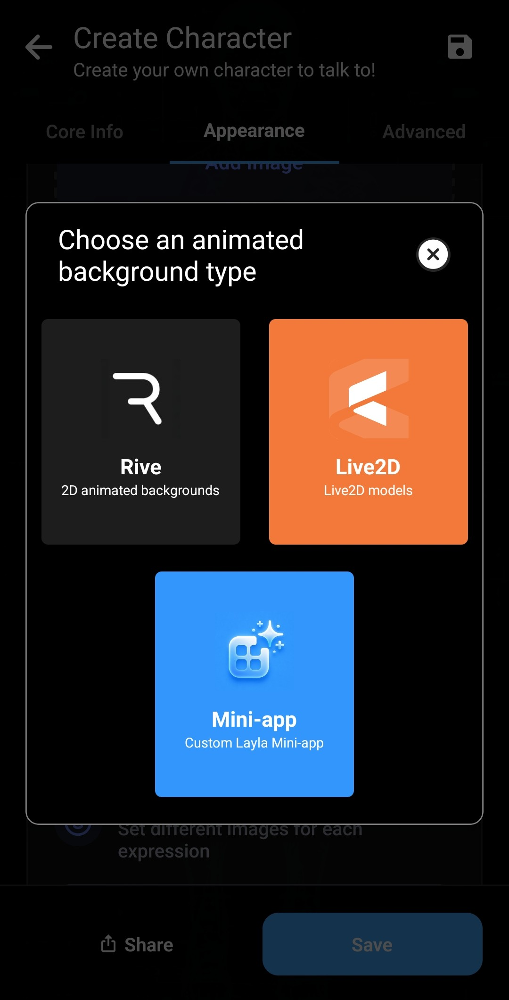
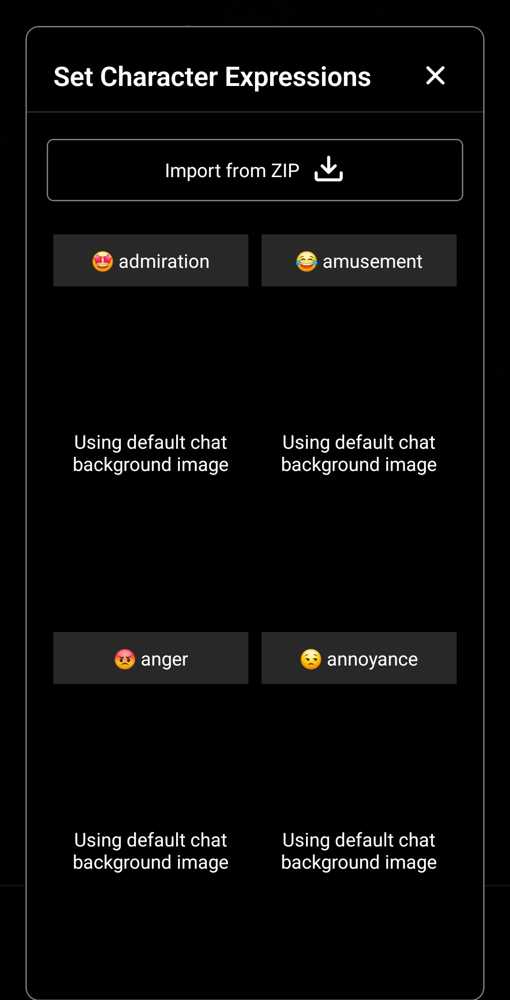
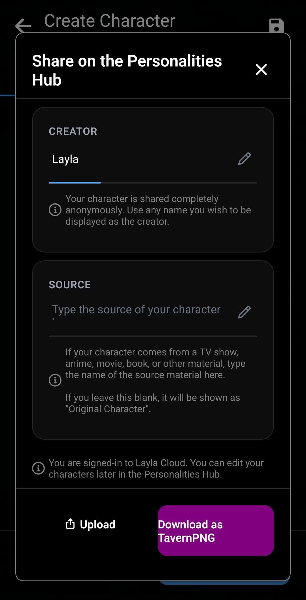

Wenn du zunächst Charaktere anderer Personen verwenden möchtest, lies [Charaktere aus dem Personalities Hub importieren](/personality-hub-ai-characters/).

Mit Laylas Charaktereditor erstellst du einen eigenen KI-Charakter für private Unterhaltungen auf deinem Gerät. Du legst fest, wer der Charakter ist, wie er spricht, worum es in euren Gesprächen geht, wie er aussieht und welche optionalen Funktionen er nutzen kann.

Dieser Leitfaden führt durch alle Tabs des Editors, von den Basisdaten bis zu Stimmen, Bilderzeugung und Freigabe.

## Den Charaktereditor öffnen

Tippe in der Charakterauswahl auf die große Schaltfläche **+** unter deiner Charakterliste. Der Editor öffnet sich direkt.

Alternativ öffnest du **Apps** und wählst die Mini-App **Create Character**. Beide Wege führen zum selben Editor.

## Basisdaten des Charakters hinzufügen

Der Tab **Core Info** enthält die Angaben, die Identität und Verhalten bestimmen.

Fülle die Felder folgendermaßen aus:

- **Character picture:** Wähle das Profilbild zur Erkennung des Charakters. Es erscheint im Chat als kleiner Kreis neben seinen Nachrichten.

- **Character name:** Gib den Namen ein, den Layla verwenden soll.

- **Description:** Erkläre, wer der Charakter ist. Du kannst Vorgeschichte, Rolle, Wissen, Beziehungen und andere Fakten aufnehmen, an die er sich über sich selbst erinnern soll.

- **Personality:** Beschreibe Verhalten und Kommunikation, darunter Eigenschaften, Werte, Gewohnheiten, Temperament, Humor, Wortschatz und Sprechstil.

- **Scenario:** Lege die Situation des Gesprächs fest, zum Beispiel den Ort, die Beziehung zwischen Charakter und Nutzer und das Geschehen zu Beginn.

- **Impression:** Dies ist der Eindruck, den der Charakter von dir hat. Die Dream-Mini-App kann ihn anhand früherer Chats erstellen, einschließlich einer Zusammenfassung eurer gemeinsamen Geschichte und seiner Sicht auf dich. Du kannst ihn auch manuell bearbeiten.

- **Greetings:** Schreibe die Eröffnungsnachricht für einen neuen Chat. Bei mehreren Begrüßungen wählt Layla für jedes Gespräch eine zufällig aus. Füge eine leere Begrüßung hinzu, wenn du zuerst sprechen möchtest.

- **Tags:** Verwende kommagetrennte Bezeichnungen zur Organisation. Beim späteren Teilen helfen sie anderen Nutzern, den Charakter zu finden.

Die Platzhalter `{{char}}` und `{{user}}` funktionieren in Beschreibung, Persönlichkeit und Szenario. Layla ersetzt sie bei der Vorbereitung des Gesprächs durch die aktuellen Namen.

Die Felder sind nur zur leichteren Eingabe getrennt. Sie werden nicht als unabhängige Anweisungen an verschiedene Teile der KI gesendet. Layla kombiniert Beschreibung, Persönlichkeit und Szenario zu einem langen Textblock für den System-Prompt. Beim Start eines Chats wird zusätzlich eine ausgewählte Begrüßung eingefügt.

Die **Summary** unten zeigt eine Vorschau des kombinierten Texts. Layla schätzt auch die Ladezeit, was bei besonders detaillierten Charakteren hilfreich ist.

## Das Aussehen konfigurieren

Im Tab **Appearance** legst du die Bilder des Charakters und des Chats fest.

Das unter **Core Info** gewählte Profilbild ist der kleine Kreis neben Nachrichten. **Character Background** ist das statische Hauptbild, während **Chat Background** den Hintergrund der Unterhaltung füllt.

Du kannst außerdem einen animierten Hintergrund auswählen:

- **Rive:** Ein animierter 2D-Hintergrund.
- **Live2D:** Ein Live2D-Charaktermodell.
- **Mini-app:** Eine eigene Layla-Mini-App als Charakterhintergrund.

Rive, Live2D und Charakter-Mini-Apps erfordern eine eigene Einrichtung. Spätere Leitfäden erklären sie genauer; beim ersten Charakter kannst du den animierten Hintergrund leer lassen.

### Bilder für verschiedene Ausdrücke hinzufügen

Layla kann je nach Emotion in der Antwort ein anderes Bild anzeigen. Öffne die Ausdruckseinstellungen und weise Emotionen wie Bewunderung, Belustigung, Ärger oder Genervtheit Bilder zu.

Während eines Gesprächs erkennt Layla den Ausdruck und wechselt das Bild. Ohne eigenes Bild wird der Standard-Chathintergrund verwendet. Du kannst Bilder einzeln hinzufügen oder eine vorbereitete ZIP-Datei importieren.

## Stimmen, Bilderzeugung, Referenzen und Agents auswählen

Der Tab **Advanced** enthält optionale Integrationen und die Funktion zum Importieren einer TavernPNG-Charakterkarte.

### Einen TavernPNG-Charakter importieren

Eine TavernPNG ist eine Bilddatei mit eingebetteten Charakterkartendaten. Beim Import werden kompatible Felder und das Bild automatisch ausgefüllt. Die vollständige Anleitung findest du unter [TavernPNG-Charaktere in Layla importieren](/how-to-import-tavernpng-characters-in-layla/).

### Dem Charakter eine eigene Stimme geben

Tippe auf **Voice**, um die Stimmen deines Smartphones und installierter Text-zu-Sprache-Mini-Apps zu durchsuchen. Suche nach Name oder Tag und höre vor der Auswahl eine Vorschau.

Nach der Auswahl kannst du einen Sprachchat beginnen und den Charakter mit dieser Stimme hören. Weitere Hilfe: [Mehrsprachige Text-zu-Sprache-Stimmen hinzufügen](/how-to-add-multilingual-text-to-speech-for-your-characters-in-layla/) und [einen Sprachchat mit Charakteren beginnen](/how-to-hear-your-characters-speak-in-layla/).

### Den Charakter Bilder erzeugen lassen

Wähle ein Bilderzeugungsmodell, wenn der Charakter auf Anfrage im Chat erzeugte Bilder senden soll. Die Auswahl enthält die auf deinem Gerät oder über konfigurierte Dienste verfügbaren Optionen.

Bilderzeugung ist optional. Lass **No Image Generation** ausgewählt, wenn du sie nicht benötigst. Zur Einrichtung eines Modells siehe [Bilderzeugung in Layla aktivieren](/how-to-enable-image-generation-in-layla/).

### Referenzen und Agents

Referenzdokumente geben dem Charakter Zugriff auf ausgewählte Hintergrundinformationen. Agents ermöglichen konfigurierte Tools und Arbeitsabläufe. Beide erweiterten Funktionen können anfangs leer bleiben.

Beginne später mit [Agents, Functions und Tool-Aufrufe in Layla aktivieren](/how-to-enable-agents-functions-and-tool-calling-in-layla/).

## Den Charakter teilen oder exportieren

Das Teilen ist optional. Tippe auf **Share**, um den Charakter in den Personalities Hub hochzuladen oder als TavernPNG herunterzuladen.

Charaktere werden anonym in den Personalities Hub hochgeladen. Du kannst einen beliebigen Erstellernamen anzeigen und die Quelle angeben, wenn der Charakter aus einer Serie, einem Film, Anime, Buch oder anderem Werk stammt. Bei einem eigenen Charakter bleibt die Quelle leer.

Wähle **Download as TavernPNG**, um eine portable Charakterkarte direkt an Freunde zu senden oder in eine kompatible App zu importieren.

## Speichern und chatten

Tippe auf **Save**, wenn du fertig bist. Der neue Charakter erscheint in deiner Liste auf dem Auswahlbildschirm. Tippe ihn an, um einen Chat zu beginnen.

Du kannst später zurückkehren, um Persönlichkeit oder Aussehen zu verfeinern, eine andere Stimme auszuwählen oder Funktionen hinzuzufügen. Mit Laylas Offline-KI-Modellen laufen Unterhaltungen lokal auf deinem Gerät.

## Häufig gestellte Fragen

### Muss ich jedes Feld ausfüllen?

Nein. Beginne mit einem Namen und ausreichend Beschreibung, Persönlichkeit, Szenario und Begrüßung. Bilder, Ausdrücke, Stimmen, Bilderzeugung, Referenzen und Agents sind optional.

### Was ist der Unterschied zwischen Profilbild und Chathintergrund?

Das Profilbild ist der kleine Kreis neben den Nachrichten. Der Chathintergrund ist das Hauptbild hinter der Unterhaltung.

### Kann ein Layla-Charakter einen animierten Hintergrund verwenden?

Ja. Er kann eine Rive-Animation, ein Live2D-Modell oder eine eigene Layla-Mini-App verwenden.

### Kann ich einen Layla-Charakter privat teilen?

Ja. Lade ihn als TavernPNG herunter und sende die Datei direkt an einen Freund. Alternativ kannst du ihn anonym im Personalities Hub veröffentlichen.
