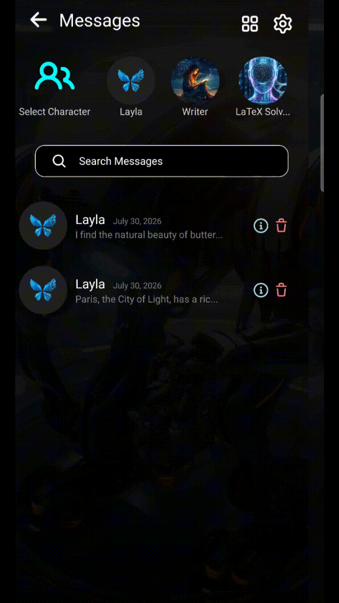

Layla hält deine Gespräche automatisch im Bildschirm **Verlauf** bereit, sodass du frühere Chats leicht fortsetzen kannst. Dort kannst du Gespräche suchen, Kopien exportieren oder sie dauerhaft entfernen.

Diese Anleitung erklärt die Verwaltung deines Layla-Gesprächsverlaufs und was beim Löschen eines Chats mit deinen Daten geschieht.

> **Hinweis:** Menünamen und Schaltflächenpositionen können je nach Layla-Version und Gerät leicht abweichen.

## Gesprächsverlauf öffnen

So zeigst du frühere Gespräche an:

1. Öffne **Layla**.
2. Öffne das Hauptnavigationsmenü, indem du von links wischst oder das Zeitsymbol verwendest.
3. Wähle **Verlauf**.
4. Tippe auf ein Gespräch, um es erneut zu öffnen.

Aktive Gespräche werden mit Titel, Charakter oder Assistent, Vorschau der neuesten Nachricht und Datum der letzten Aktivität angezeigt.

Wenn du ein vorhandenes Gespräch öffnest, kannst du mit den bisherigen Nachrichten und Einstellungen weiterchatten.

## Layla-Gesprächsverlauf durchsuchen

Über die Suchleiste oben im Verlaufsbildschirm findest du bestimmte Gespräche.

Layla kann nach folgenden Informationen suchen:

- Gesprächstitleln
- Namen von Charakteren oder Assistenten
- Wörtern und Ausdrücken aus Nachrichten
- Gesprächstags oder -kategorien

So durchsuchst du deine Chats:

1. Öffne **Verlauf**.
2. Tippe auf das Feld **Suchen**.
3. Gib einen Titel, Charakternamen, ein Schlüsselwort oder einen Ausdruck ein.
4. Wähle ein Ergebnis aus, um das Gespräch zu öffnen.

Die Suchergebnisse werden während der Eingabe aktualisiert, sodass meist ein Teil eines Wortes oder Titels genügt.

## Gespräch löschen

Beim Löschen wird ein Gespräch aus dem aktiven oder archivierten Verlauf entfernt und nach **Kürzlich gelöscht** verschoben.

So löschst du ein Gespräch:

1. Öffne **Verlauf**.
2. Tippe auf das **Papierkorb**-Symbol des Gesprächs.
3. Bestätige das Löschen.

## Wie lange speichert Layla den Gesprächsverlauf?

Die Aufbewahrung hängt vom Status des Gesprächs ab:

| Gesprächsstatus    | Aufbewahrungsverhalten                                       |
| ------------------ | ------------------------------------------------------------ |
| Aktiv              | Bleibt im Verlauf, bis du es archivierst oder löschst        |
| Dauerhaft gelöscht | Wird sofort entfernt und kann nicht wiederhergestellt werden |

## Was geschieht, wenn ich Layla deinstalliere oder die Daten lösche?

Der lokal auf deinem Gerät gespeicherte Verlauf kann entfernt werden, wenn du:

- Layla deinstallierst
- den Speicher oder die Anwendungsdaten löschst
- dein Gerät auf Werkseinstellungen zurücksetzt
- Laylas Daten über das Betriebssystem löschst
- ohne Datenübertragung oder -wiederherstellung auf ein anderes Gerät wechselst

Exportiere wichtige Gespräche oder erstelle eine Sicherung, bevor du die App deinstallierst, ihre Daten löschst oder das Gerät wechselst.

Wenn du deine Daten gesichert hast, können verfügbare Gespräche möglicherweise aus der Sicherung wiederhergestellt werden. Chats, die vor der Sicherung dauerhaft gelöscht wurden, können nicht wiederhergestellt werden.

## Häufig gestellte Fragen

### Speichert Layla meine Gespräche automatisch?

Ja. Gespräche werden beim Chatten automatisch zum Verlauf hinzugefügt und müssen nicht einzeln gespeichert werden.

### Kann ich ein altes Gespräch fortsetzen?

Ja. Öffne es im Verlauf und sende eine neue Nachricht. Layla verwendet weiterhin den verfügbaren Verlauf und die bisherigen Einstellungen.

### Kann ich frühere Chats durchsuchen?

Ja. Suche im Verlauf nach Titel, Charakter, Assistent, Schlüsselwort oder Nachrichteninhalt.

### Kann ich einen dauerhaft gelöschten Chat wiederherstellen?

Nein. Dauerhaftes Löschen kann nicht rückgängig gemacht werden. Ein unabhängig gespeicherter Export oder eine Sicherung kann noch existieren, aber Layla kann die dauerhaft gelöschte Kopie nicht aus dem Verlauf wiederherstellen.

### Entfernt das Exportieren eines Gesprächs dieses aus Layla?

Nein. Beim Exportieren wird eine separate Kopie erstellt, während das Original unverändert bleibt.

### Werden beim Löschen eines Charakters alle zugehörigen Gespräche gelöscht?

Ja. Beim Löschen eines Charakters werden der gesamte zugehörige Gesprächsverlauf und alle Erinnerungen gelöscht.

## Wichtige Gespräche schützen

Für Chats, die du später noch benötigen könntest:

- Gib dem Gespräch einen eindeutigen und leicht auffindbaren Titel.
- Exportiere vor dem Löschen des Originals eine separate Kopie.

Ein Export eignet sich für unabhängige Sicherungen. Dauerhaftes Löschen solltest du nur für Gespräche verwenden, die du sicher nicht mehr benötigst.
