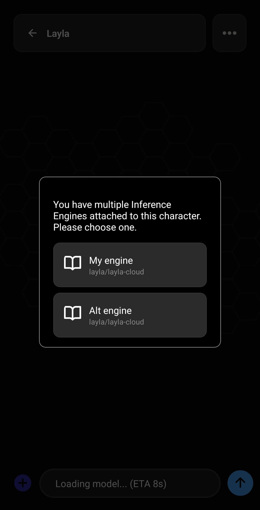

**Eine gespeicherte Inferenz-Engine ist eine wiederverwendbare Sammlung von Einstellungen, die Layla vorgibt, wie eine Antwort erzeugt wird.** Sie kann ein Modell oder eine Modellverbindung mit einem Vision-Modell, einer Prompt-Vorlage, einer Benutzer-Persona und einer Sampler-Voreinstellung kombinieren. Du kannst eine Engine selbst auswählen oder sie einem oder mehreren Charakteren zuweisen, damit Layla beim Start eines Chats die passende Konfiguration verwendet.

Das ist nützlich, wenn eine einzige Konfiguration nicht zu jeder Unterhaltung passt. Ein allgemeiner Assistent, ein Rollenspielcharakter und ein Charakter mit Bildverständnis können unterschiedliche Modelle und Prompts benötigen, obwohl sie alle in derselben App laufen.

## Eine Inferenz-Engine ist mehr als ein KI-Modell

Das Modell ist der Teil, der Text erzeugt. In Layla beschreibt eine Inferenz-Engine die umfassendere Konfiguration, mit der dieses Modell ausgeführt oder kontaktiert und seine Antworten vorbereitet werden.

Zwei gespeicherte Engines können zum Beispiel dasselbe lokale GGUF-Modell mit unterschiedlichen Prompt-Vorlagen, Personas oder Generierungseinstellungen verwenden. Eine Engine kann stattdessen ein Modell auf deinem Smartphone nutzen, während eine andere eine Verbindung zu Layla Server, Layla Cloud, einer OpenAI-kompatiblen API oder einer Claude-API herstellt.

Unter **Meine Modelle** findest du die Modelle und Verbindungen, die Layla zur Verfügung stehen. Unter **Gespeicherte Engines** wird eine bestimmte Kombination von Einstellungen zu einer benannten Konfiguration, zu der du später zurückkehren kannst.

Wenn du dein gewünschtes Modell oder deine Verbindung noch nicht hinzugefügt hast, lies [So fügst du Layla ein benutzerdefiniertes KI-Modell hinzu](/de/how-to-add-custom-models-to-layla/).

## Was eine gespeicherte Inferenz-Engine enthält

Wenn du die aktuelle Konfiguration als Engine speicherst, hält Layla die folgenden Auswahlen zusammen:

- **Modell und Inferenzquelle:** ein lokales Modell, Layla Server, Layla Cloud, ein OpenAI-kompatibler Dienst oder ein Claude-kompatibler Dienst.
- **Vision-Modell:** die ausgewählte Komponente für Bildverständnis, falls das Sprachmodell Bilder verstehen soll.
- **Prompt-Vorlage:** das Format, in dem Charakteranweisungen, Kontext, Benutzernachrichten und Antworten für das Modell angeordnet werden.
- **Persona:** die Identität und Beschreibung des Benutzers, die dem Charakter präsentiert wird.
- **Sampler-Voreinstellung:** eine optionale gespeicherte Gruppe von Generierungsparametern, die du beim Benennen oder Bearbeiten der Engine auswählst.
- **Charakterzuweisungen:** die Charaktere, die automatisch diese Engine verwenden sollen.

Die Engine enthält nicht die Modelldatei selbst. Beim Speichern einer Engine wird daher keine weitere Kopie eines lokalen GGUF-Modells erstellt. Das ursprüngliche Modell oder die konfigurierte Verbindung muss weiterhin verfügbar sein, damit die Engine funktioniert.

Modelle zur Bilderzeugung werden separat konfiguriert. Charakterstimmen, Agents, LoreBooks, Charakteranweisungen und Chatverläufe gehören ebenfalls nicht zur gespeicherten Inferenz-Engine.

## So erstellst du eine gespeicherte Inferenz-Engine

Öffne **Inferenz-Einstellungen** über die Seite **Einstellungen** von Layla oder direkt über die Mini-App **Inferenz-Einstellungen**.

1. Wähle unter **Meine Modelle** das gewünschte Modell oder die gewünschte Verbindung aus.
2. Wähle eine für dieses Modell geeignete Prompt-Vorlage.
3. Wähle ein Vision-Modell aus, wenn die Konfiguration Bilder verarbeiten soll.
4. Wähle die Benutzer-Persona, die mit dieser Konfiguration verwendet werden soll.
5. Tippe unter **Gespeicherte Engines** auf **Aktuelle Konfiguration als eigene Engine speichern**.

Layla zeigt zunächst eine Zusammenfassung des aktuellen Modells, der Bildverarbeitung, des Prompts und der Persona. Prüfe diese Angaben, bevor du fortfährst: Aus diesen Einstellungen wird die wiederverwendbare Engine erstellt. Tippe auf **Neue Engine erstellen**, um eine separate Konfiguration hinzuzufügen. Wenn bereits Engines gespeichert sind, kannst du stattdessen unter **Vorhandene ersetzen** eine Engine auswählen und mit der aktuellen Konfiguration aktualisieren.

Im nächsten Fenster legst du fest, wie Layla die Engine benennt und verwendet:

6. Gib einen eindeutigen Namen für die Engine ein.
7. Wähle eine gespeicherte Sampler-Voreinstellung aus oder lasse **Global** ausgewählt, um die allgemeinen Generierungseinstellungen von Layla zu verwenden.
8. Wähle unter **An Charakter anhängen** alle Charaktere aus, die automatisch zu dieser Engine wechseln sollen.
9. Tippe auf **Änderungen speichern**.

Namen wie „Lokaler allgemeiner Chat“, „Vision-Assistent“ oder „Rollenspiel – kreativ“ erleichtern die Orientierung in der Engineliste. Der Name ist besonders wichtig, wenn einem Charakter mehrere Engines zugewiesen sind, da Layla ihn im Auswahlfenster anzeigt.

Weitere Informationen zur passenden Prompt-Vorlage für ein Modell findest du unter [Benutzerdefinierte Prompt-Vorlagen für Modelle in Layla einrichten](/de/how-to-set-up-custom-prompt-templates-for-models/).

## So wählt Layla eine Engine für einen Chat aus

Beim Start eines Chats prüft Layla, ob dem Charakter gespeicherte Engines zugewiesen sind.

### Dem Charakter ist keine Engine zugewiesen

Layla verwendet die aktuelle allgemeine Konfiguration aus den **Inferenz-Einstellungen**. Dies ist die normale Ausweichlösung für Charaktere, die keine eigene Konfiguration benötigen.

Du kannst die allgemeine Konfiguration ändern, indem du unter **Gespeicherte Engines** die Karte der aktuellen Engine öffnest und eine andere gespeicherte Engine auswählst. Dadurch werden deren Modell-, Vision-, Prompt- und Persona-Einstellungen als aktuelle Konfiguration geladen.

### Dem Charakter ist eine Engine zugewiesen

Layla verwendet diese Engine automatisch. Sie hat Vorrang vor der allgemeinen Konfiguration, sodass der Charakter ohne manuelles Umschalten vor jedem Chat zuverlässig sein vorgesehenes Modell und seinen Prompt verwendet.

### Dem Charakter sind mehrere Engines zugewiesen

In einem normalen Charakterchat fragt Layla vor dem Laden der Unterhaltung, welche Engine verwendet werden soll. Ein Charakter kann dadurch mehrere geeignete Konfigurationen besitzen, etwa ein schnelles lokales Modell für kurze Chats und ein größeres Modell für längere Rollenspiele.

Im Auswahlfenster werden Name und Modellquelle jeder Engine angezeigt. Tippe auf die Konfiguration, die du für diesen Chat verwenden möchtest. Layla lädt anschließend die gewählte Engine.

## So prüfst du die in einem geöffneten Chat verwendete Engine

Tippe oben in einer geöffneten Unterhaltung auf den Chattitel, um die **Chat-Info** anzuzeigen. Klappe den Bereich **Inferenz-Engine** auf, um die ausgewählte Engine, das Prompt-Format, den Status des System-Prompts und die Persona zu sehen. Im selben Fenster werden die Sampler-Einstellungen und andere Chatfunktionen separat angezeigt. So lässt sich die Inferenz-Engine von Bilderzeugung, Langzeitgedächtnis und Agents unterscheiden.

## So funktionieren zugewiesene Engines im Gruppenrollenspiel

Im Gruppenrollenspiel kann jedem Teilnehmer eine andere Engine zugewiesen sein. Layla prüft die Engine des Charakters, der gerade an der Reihe ist, und ändert die Modellkonfiguration bei Bedarf.

So kann ein Teilnehmer ein rollenspielorientiertes lokales Modell verwenden und ein anderer ein anderes Modell oder Prompt-Format. Wenn aufeinanderfolgende Sprecher dieselbe Engine verwenden, kann Layla das Modell geladen lassen, anstatt es erneut zu starten. Der Wechsel zwischen verschiedenen lokalen Modellen kann Zeit beanspruchen und viel Arbeitsspeicher benötigen. Auf Geräten mit begrenzten Ressourcen läuft es daher meist flüssiger, wenn mehrere Teilnehmer dieselbe Engine verwenden.

## Sampler-Voreinstellungen mit Engines verwenden

Sampler-Einstellungen beeinflussen, wie ein Modell seine nächsten Wörter auswählt. Sie können sich unter anderem auf Vorhersagbarkeit, Abwechslung, Antwortlänge und Wiederholungen auswirken.

Beim Bearbeiten einer gespeicherten Engine kannst du eine deiner gespeicherten Sampler-Voreinstellungen zuweisen oder **Global** ausgewählt lassen. Eine einem Charakter zugewiesene Engine mit eigener Voreinstellung verwendet diese beim Start des Modells. **Global** verwendet stattdessen die aktuellen Generierungseinstellungen aus den erweiterten Einstellungen von Layla.

Sampler-Voreinstellungen sind nützlich, wenn ein bestimmter Charakter oder ein bestimmtes Modell ein anderes Generierungsverhalten benötigt. Eine kreative Rollenspielkonfiguration kann beispielsweise eine andere Voreinstellung verwenden als ein knapper Assistent. Eine Voreinstellung repariert jedoch keine inkompatible Prompt-Vorlage und sorgt nicht dafür, dass ein zu großes Modell in den Arbeitsspeicher passt. Dies sind getrennte Bestandteile der Konfiguration.

## Engines bearbeiten, ersetzen und löschen

Öffne unter **Gespeicherte Engines** die Karte der aktuellen Engine, um die gespeicherte Liste anzuzeigen. Jede Karte zeigt Enginenamen, Modellquelle, Prompt, Persona und zugewiesene Charaktere. Weitere Kennzeichnungen erscheinen, wenn eine Engine Bildverständnis oder eine Sampler-Voreinstellung enthält.

Mit den Charakterfiltern oben kannst du die Liste auf Engines beschränken, die einem bestimmten Charakter zugewiesen sind. Tippe auf eine Enginekarte, um diese Konfiguration zu aktivieren, oder auf das Stiftsymbol, um sie zu bearbeiten.

Über die Bearbeitungsfunktion kannst du eine Engine umbenennen, ihre Sampler-Voreinstellung ändern, Charakterzuweisungen aktualisieren oder sie löschen. Um Modell, Vision, Prompt und Persona gemeinsam zu aktualisieren, stelle zuerst die neue Kombination auf der Hauptseite **Inferenz-Einstellungen** zusammen. Tippe dann auf **Aktuelle Konfiguration als eigene Engine speichern** und ersetze die vorhandene Engine.

Beim Löschen einer Engine werden die wiederverwendbare Konfiguration und ihre Charakterzuweisungen entfernt. Das zugrunde liegende lokale Modell, der Charakter, die Persona, die Prompt-Vorlage und der Chatverlauf werden nicht gelöscht.

## Datenschutz und Netzwerknutzung

Ob eine Inferenz-Engine offline arbeitet, wird nicht durch das Speichern bestimmt, sondern durch die Modellquelle innerhalb der Engine.

Ein lokales Modell und ein lokales Vision-Modell können vollständig auf deinem Gerät ausgeführt werden. Layla Server stellt eine Verbindung zu deinem eigenen Computer her, während Layla Cloud und Drittanbieter-APIs Anfragen an die jeweils konfigurierten Dienste senden. Beim Wechsel der Engine kann sich daher auch ändern, wo die Inferenz stattfindet und welche Datenschutzbestimmungen gelten.

## Häufig gestellte Fragen

### Ist eine gespeicherte Inferenz-Engine dasselbe wie ein Modell?

Nein. Das Modell ist nur ein Teil der Engine. Die gespeicherte Engine merkt sich außerdem die zugehörigen Vision-, Prompt-, Persona-, Sampler- und Charakterzuweisungen.

### Wird mein lokales Modell beim Speichern einer Engine dupliziert?

Nein. Die Engine verweist auf das Modell, das Layla bereits zur Verfügung steht. Sie erstellt keine weitere Kopie der GGUF- oder LiteRT-Datei.

### Kann ich eine Engine mehreren Charakteren zuweisen?

Ja. Wähle beim Erstellen oder Bearbeiten der Engine alle Charaktere aus, die sie verwenden sollen.

### Was passiert, wenn ich demselben Charakter mehrere Engines zuweise?

Wenn du einen normalen Chat mit diesem Charakter öffnest, fragt Layla, welche der zugewiesenen Engines du verwenden möchtest.

### Überschreibt eine zugewiesene Engine meine allgemeinen Inferenz-Einstellungen?

Ja. Wenn Layla eine Engine findet, die dem aktiven Charakter zugewiesen ist, hat diese Vorrang. Ist keine passende Zuweisung vorhanden, verwendet Layla die allgemeine Konfiguration aus den **Inferenz-Einstellungen**.

### Enthält eine gespeicherte Engine die Bilderzeugung?

Nein. Modelle und Einstellungen für die Bilderzeugung werden getrennt von den Inferenz-Engines für Sprachmodelle verwaltet.

### Was passiert, wenn ich ein Modell lösche, das eine gespeicherte Engine verwendet?

Die Engine kann dann kein funktionierendes Modell mehr laden. Wähle ein anderes Modell und ersetze die gespeicherte Engine oder stelle das fehlende Modell beziehungsweise die Verbindung wieder her.

Mit gespeicherten Inferenz-Engines kann Layla mehrere Modellkonfigurationen organisieren, ohne Modelldateien zu duplizieren. Eine lokale Engine bleibt eine Offline-Konfiguration auf deinem Gerät; entfernte Engines stehen zur Verfügung, wenn du bewusst einen PC oder Onlinedienst verwenden möchtest.
