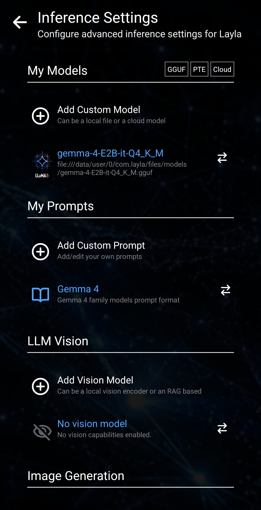

Layla kann ein eigenes KI-Modell lokal auf deinem Android-Gerät ausführen oder eine Verbindung zu einem Modell auf deinem PC beziehungsweise in der Cloud herstellen. Dieser Leitfaden erklärt alle Optionen: lokale GGUF- und LiteRT-Modelle, Layla Server, Layla Cloud, OpenAI-kompatible APIs und die Claude-API.

Für eine private Offline-KI-Konfiguration importierst du ein kompatibles lokales Modell und führst es direkt auf deinem Gerät aus. Die anderen Optionen erfordern eine Verbindung zu einem PC oder Onlinedienst.

## 1. Inference Settings öffnen

Öffne **Inference Settings** auf Laylas Seite **Settings**. Du kannst auch direkt die Mini-App **Inference Settings** öffnen.

Tippe im Bereich **My Models** auf **Add Custom Model**.

## 2. Ausführungsort des Modells auswählen

Layla öffnet ein Fenster mit mehreren Optionen für die Inferenz-Engine. Du kannst ein lokales Modell importieren, dich mit Layla Server auf deinem PC verbinden, Layla Cloud verwenden oder einen API-Anbieter einrichten.

### Lokales Modell: interner Speicher oder SD-Karte

Wähle **Internal storage** oder **SD card**, um ein kompatibles GGUF- oder LiteRT-Modell zu importieren und lokal auf deinem Android-Gerät auszuführen.

**Internal storage** kopiert das Modell in Laylas privaten Speicher. Die Originaldatei bleibt dabei erhalten. Das Modell belegt daher doppelt Speicherplatz, sofern du das Original anschließend nicht entfernst. Durch die Kopie kann Layla besonders zuverlässig auf das Modell zugreifen; gewöhnlich bietet sie die beste Leistung und Stabilität. Diese Option wird empfohlen.

**SD card** verweist auf das Modell in seinem vorhandenen Ordner, statt es nach Layla zu kopieren. Das spart Speicherplatz, kann aber weniger stabil sein. Verschiebe, benenne oder lösche die ursprüngliche Modelldatei nach dem Hinzufügen nicht, da Layla weiterhin auf genau diesen Speicherort zugreifen muss.

### Dein PC mit Layla Server

Wähle **Your PC**, um Layla über Layla Server mit einem Modell auf deinem Computer zu verbinden. Das Einrichtungsfenster enthält eine kurze Anleitung zum Herstellen der Verbindung. Ein eigener Artikel zu Layla Server wird die vollständige Einrichtung beschreiben.

### Layla Cloud

Wähle **Layla Cloud**, um die über Layla Cloud angebotenen Modelle zu verwenden. Diese Modelle laufen online und nicht lokal auf deinem Smartphone.

### OpenAI-kompatible API

Wähle **OpenAI API**, um einen beliebigen Dienst mit einer OpenAI-kompatiblen Chat-Completions-API zu verbinden. Dazu gehören OpenAI, der API-Anbieter hinter ChatGPT, sowie Dienste wie OpenRouter, Google AI Studio, Azure und weitere kompatible Anbieter.

Gib einen Namen für die Verbindung, den von deinem Anbieter bereitgestellten Endpunkt und gegebenenfalls den API-Schlüssel ein. Du kannst außerdem einen Modellnamen eingeben oder **Find models** verwenden, wenn der Anbieter die Modellsuche unterstützt.

Als Endpunkt muss die vollständige Chat-Completions-URL angegeben werden, nicht nur die Domain oder die Basis-API-URL des Anbieters. Häufig endet sie mit `/v1/chat/completions`; verwende jedoch den exakten Pfad aus der Dokumentation deines Anbieters. Ein fehlender Pfadabschnitt oder Tippfehler in diesem Feld führt häufig dazu, dass Layla keine Verbindung herstellen kann.

### Claude-API

Wähle **Claude API**, um einen Dienst zu verbinden, der das API-Format von Anthropic verwendet. Die Einrichtung ähnelt einer OpenAI-kompatiblen Verbindung: Gib die angeforderten Verbindungsdaten, den API-Schlüssel, das Modell und den vollständigen, vom Anbieter genannten API-Endpunkt ein.

Die Claude-API und OpenAI-kompatible APIs verwenden unterschiedliche Anfrageformate. Wähle deshalb die zu deinem Anbieter passende Option. Wie bei der Option OpenAI API kann die alleinige Angabe der Domain oder ein unvollständiger Pfad die Verbindung verhindern.

## 3. Mit dem eigenen Modell chatten

Speichere die Modell- oder Verbindungseinstellungen. Kehre dann zu Layla zurück und beginne einen Chat mit einem beliebigen Charakter. Layla verwendet die unter **Inference Settings** ausgewählte Modellkonfiguration.

Du kannst jederzeit zu **My Models** zurückkehren, um ein weiteres lokales LLM hinzuzufügen, den API-Anbieter zu wechseln oder zwischen einem Offline-Modell, Layla Server und einem Cloud-Modell umzuschalten.

## Häufig gestellte Fragen

### Kann ich Layla mein eigenes GGUF-Modell hinzufügen?

Ja. Tippe unter **Inference Settings** auf **Add Custom Model** und wähle anschließend **Internal storage** oder **SD card**, um ein kompatibles GGUF-Modell auf deinem Gerät auszuwählen.

### Funktioniert ein lokales Modell ohne Internetzugang?

Ja. Nach dem Import wird die lokale Inferenz auf deinem Android-Gerät ausgeführt und kann offline funktionieren. Verbindungen zu Layla Server, Layla Cloud oder einer externen API haben eigene Netzwerkanforderungen.

### Sollte ich ein Modell in den internen Speicher importieren oder die SD-Karte verwenden?

Der interne Speicher wird für die beste Leistung und Stabilität empfohlen. Die SD-Karten-Option vermeidet eine zweite Kopie, setzt aber voraus, dass das Modell an seinem ursprünglichen Speicherort verfügbar bleibt.

### Warum kann Layla keine Verbindung zu meinem API-Modell herstellen?

Überprüfe zuerst den Endpunkt. Er muss dem vollständigen API-Pfad entsprechen, den dein Anbieter erwartet, bei einem OpenAI-kompatiblen Dienst häufig mit `/v1/chat/completions` am Ende, und darf keine Tippfehler enthalten. Prüfe außerdem, ob API-Schlüssel und Modellname für diesen Anbieter gültig sind.
