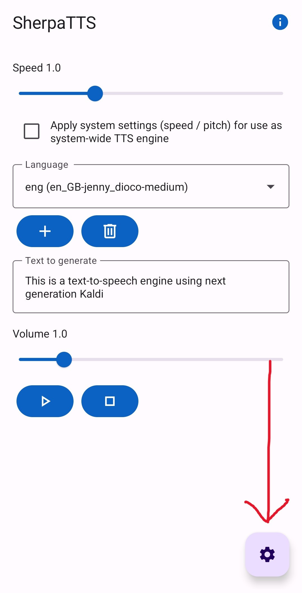
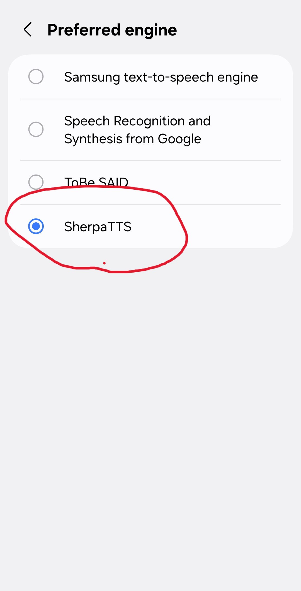

Die standardmäßigen TTS-Mini-Apps in Layla funktionieren alle auf Englisch. Mehrsprachige Sprachausgabe lässt sich unter Android jedoch sehr einfach hinzufügen.

Layla unterstützt SherpaTTS, eine lokale Text-to-Speech-App, die eine Internetverbindung herstellt.

**Schritt 1: SherpaTTS herunterladen**

Lade die App von [F-Droid](https://f-droid.org/en/packages/org.woheller69.ttsengine/) herunter.

Scrolle zum Abschnitt **Versionen** und lade die neueste APK herunter.

_F-Droid ist eine Alternative zu Google Play, die **freie und quelloffene Software (FOSS)** veröffentlicht._

**Schritt 2: SherpaTTS konfigurieren**

Öffne die heruntergeladene SherpaTTS-App, um sie zu konfigurieren:

Tippe auf das Pluszeichen, um ein neues Modell hinzuzufügen.

Eine Liste von Modellen wird angezeigt:

Lade die gewünschte Sprache herunter. Die Sprache wird durch den zweistelligen Ländercode angegeben. Beispielsweise steht „de“ für Deutsch und „fr“ für Französisch.

Tippe nach dem Download auf **Start**, um das Modell zu laden.

**Schritt 3: SherpaTTS als standardmäßiges TTS-Modell des Smartphones festlegen**

Tippe auf dem SherpaTTS-Hauptbildschirm auf das Einstellungssymbol:

Dadurch werden die Android-Systemeinstellungen geöffnet. Tippe auf die Einstellung **Standard-Text-to-Speech**:

Ändere die Standard-Engine zu SherpaTTS:

Deine Standardstimme verwendet nun Sherpa.

**Schritt 4: Layla konfigurieren**

Layla erkennt diese Einstellung automatisch und stellt die ausgewählten Stimmen bereit. _(Starte Layla neu, damit die Änderungen wirksam werden.)_

Öffne die Einstellungen deines Charakters (**Charakter bearbeiten** → Tab **Erweitert**):

Wähle deine neuen Stimmen im Abschnitt **Nativ** aus:

Alle über Sherpa installierten Stimmen werden hier angezeigt.

Dein Charakter kann jetzt mehrsprachig sprechen.
