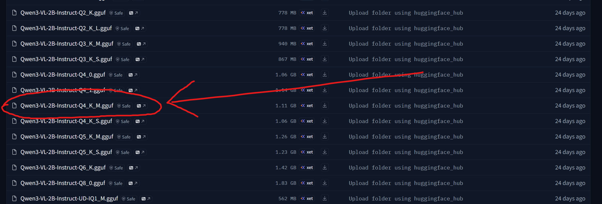
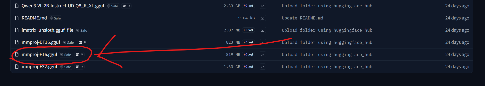

Dieser Artikel zeigt, wie du Vision-LLMs zu Layla hinzufügst.

Layla unterstützt Vision-LLMs. Dadurch kannst du Bilder im Chat senden, die Layla erkennen und besprechen kann.

Als Beispiel verwenden wir die Qwen3-VL-Modellfamilie. Diese Modelle verfügen über Bilderkennungsfunktionen, die auf Mobilgeräten gut funktionieren.

So verwendest du sie in Layla:

**Schritt 1: Qwen3-VL-Modelle herunterladen**

Du findest sie im [Qwen3-VL-2B-Instruct-GGUF-Repository auf Hugging Face](https://huggingface.co/unsloth/Qwen3-VL-2B-Instruct-GGUF/tree/main).

Empfohlen wird das 2B-Modell. Es arbeitet schnell und ist ziemlich genau. Mit einem leistungsfähigen Smartphone kannst du auch die größeren 4B- oder 8B-Modelle ausprobieren.

Wähle in der Dateiliste auf der Seite die **Q4_K_M**-Quantisierung aus und lade sie herunter.

Scrolle etwas nach unten und suche die Datei **mmproj-F16**:

Lade auch diese Datei herunter.

**Schritt 2: Modell in Layla konfigurieren**

Kehre zu Layla zurück und öffne **Inferenz-Einstellungen**. Wähle im Abschnitt **LLM** die Option **Benutzerdefiniertes Modell hinzufügen** und anschließend **Aus internem Speicher auswählen**.

Deine Einstellungen sollten anschließend wie folgt aussehen. Achte auf das Suffix **Q4_K_M** des ausgewählten Modells:

Öffne als Nächstes den Abschnitt **LLM Vision** und wähle deine `mmproj`-Datei aus. Deine Einstellungen sollten so aussehen:

Mit diesen Einstellungen kannst du Bilder im Chat senden und Layla kann sie erkennen.
