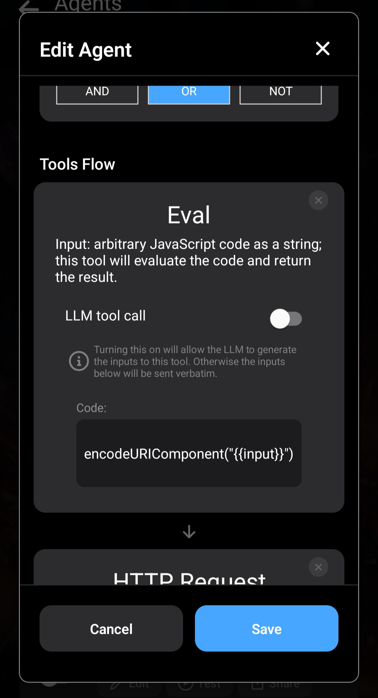

Brave bietet eine stärker auf Datenschutz ausgerichtete Alternative zur Google-Suche.

Brave stellt eine API bereit: [Brave Search API](https://brave.com/search/api/).

Wenn du in Layla Brave Search statt DuckDuckGo verwenden möchtest, zeigt dieser Artikel, wie du mit deinem eigenen API-Schlüssel einen Brave-Suchagenten erstellst und damit den DuckDuckGo-Agenten ersetzt.

_Dies ist eine fortgeschrittene Anleitung. Du lernst mehrere Methoden kennen, um Ergebnisse aus HTTP-Anfragen abzurufen und zu verarbeiten. Diese kannst du auch in zukünftigen Agenten verwenden._

**API-Schlüssel registrieren**

Registriere dich zunächst bei [Brave](https://brave.com/) und rufe nach den Anweisungen auf der Website einen API-Schlüssel ab. Im weiteren Verlauf gehen wir davon aus, dass du ihn gespeichert hast.

Mache dich mit der [Dokumentation der Brave Search API](https://api-dashboard.search.brave.com/app/documentation/web-search/get-started) vertraut. Wir verwenden sie für unseren Agenten.

**DuckDuckGo-Agenten in Layla duplizieren**

Am einfachsten beginnst du, indem du den DuckDuckGo-Agenten in Layla duplizierst. Dadurch ist der Großteil bereits eingerichtet.


Entferne nach dem Duplizieren alle Tools, behalte aber die Auslöser. Der neue Agent soll ebenfalls durch eine Websuche ausgelöst werden, und der standardmäßige DuckDuckGo-Agent ist dafür bereits eingerichtet.

Füge diese vier Tools in der angegebenen Reihenfolge hinzu:

1. Eval
2. HTTP Request
3. Eval
4. Provide Context

Im Folgenden erklären wir ihre Aufgaben und Verknüpfungen.

**Eval (1)**



Das erste Tool ist einfach: Die Eingabe muss als URI-Komponente codiert werden, bevor sie an die API gesendet wird. Dafür dient diese JavaScript-Funktion:

```js
encodeURIComponent;
```

Eval verarbeitet die Eingabe und gibt das Ergebnis als Tool-Ausgabe zurück. `{{input}}` steht für den Rohtext deiner Eingabenachricht.

**HTTP Request (2)**

Das zweite Tool ist HTTP Request. Es ruft die Brave Search API auf. Siehe [Dokumentation der Brave Search API](https://api-dashboard.search.brave.com/app/documentation/web-search/get-started).


Beachte URL und Header. Der Header `X-Subscription-Token` enthält den API-Schlüssel.

In der URL-Abfragezeichenfolge siehst du `{{input}}`, das an die API gesendet wird.

**Eval (3)**

Dies ist der bislang komplizierteste Tool-Aufruf.

Das Tool übernimmt die Ausgabe des vorherigen HTTP-Request-Aufrufs. Laut Brave-API-Dokumentation sollte sie im JSON-Format vorliegen. Es analysiert das JSON und wandelt es in einfachen Text um, der an das LLM gesendet werden kann.


Das Tool übernimmt `{{input}}` als Rohzeichenfolge und weist sie der Variablen `i` zu. Es ruft `JSON.parse` auf und wandelt das Ergebnis in eine normale Aufzählungsliste um, die zur Tool-Ausgabe wird.

Dies ist gewöhnliches JavaScript und sollte Programmierenden vertraut sein.

**Provide Context (4)**

Im letzten Schritt wird die Ausgabe dem LLM als Kontext bereitgestellt.


Das Tool erklärt, dass die Ergebnisse von der Brave API stammen, und weist deinen Charakter an, sie dir zu erläutern.

Mit diesen vier Tools ist der Agent fertig.

Deaktiviere am besten den ursprünglichen DuckDuckGo-Agenten, damit die beiden nicht miteinander in Konflikt geraten.

Hier kannst du die Agenten-JSON direkt importieren:

[brave-search.json herunterladen](/assets/articles/how-to-create-a-brave-search-agent/brave-search.json)
