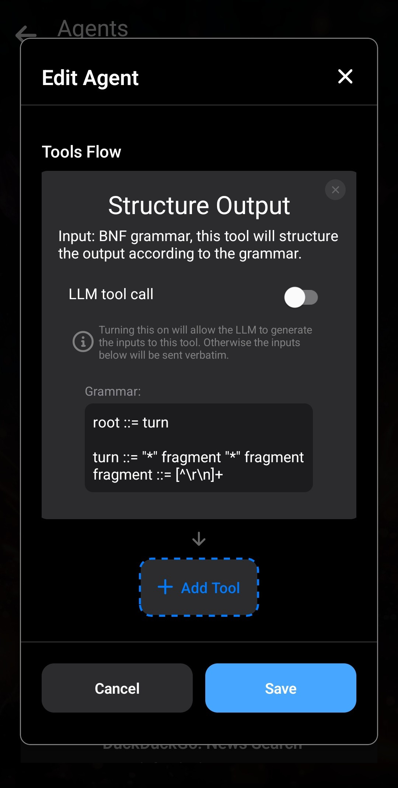

In dieser Anleitung erstellen wir einen einfachen _Rollenspiel-Agenten_ in Layla.

Dieser Agent zwingt deinen Charakter zu Antworten im **Aktions-Dialog-Format**.

Zum Beispiel:

> `*winkt und lächelt* Hallo!`

Erstelle einen Agenten mit den folgenden Einstellungen:

Sehen wir uns an, was dieser Agent macht:

1. Name und Beschreibung können beliebig gewählt werden. Sie helfen dir, deinen Agenten leicht zu erkennen.

2. Wir verwenden den _Regex-Auslöser_. Der reguläre Ausdruck `.` (Punkt) entspricht jedem Inhalt, sodass der Agent bei jeder Nachricht ausgelöst wird. Das ist beabsichtigt, da alle Ausgaben unserem Format entsprechen sollen.

3. Wir verwenden das Werkzeug _Strukturierte Ausgabe_. Es strukturiert die Ausgabe mithilfe einer BNF-Grammatik:

   - `root` wird immer benötigt und beginnt die Grammatikdefinition.
   - `::=` ist der Zuweisungsoperator, der Variablen eine Grammatik zuweist.
   - `turn` ist eine von uns definierte Variable. Ihre Definition steht in der nächsten Zeile. Sie besteht aus dem literalen Zeichen `*`, gefolgt von `fragment` — einer weiteren benutzerdefinierten Variable —, einem weiteren `*` und anschließend einem weiteren Fragment.
   - `fragment` ist unsere Aktion oder unser Dialog. Es ist als beliebiger Inhalt definiert, der kein Zeilenumbruch ist.

4. Zusammengenommen ist die Ausgabe als `*fragment*fragment` definiert, wobei jedes `fragment` beliebigen Text ohne Zeilenumbruch enthalten kann. Genau dieses Ergebnis wollen wir erzielen.

Hier kannst du die Agentendatei herunterladen und importieren. Verwende zum Importieren die Schaltfläche _Neuen Agenten hinzufügen_.

[roleplay-action-dialogue.json herunterladen](/assets/articles/how-to-create-a-roleplay-agent/roleplay-action-dialogue.json)
