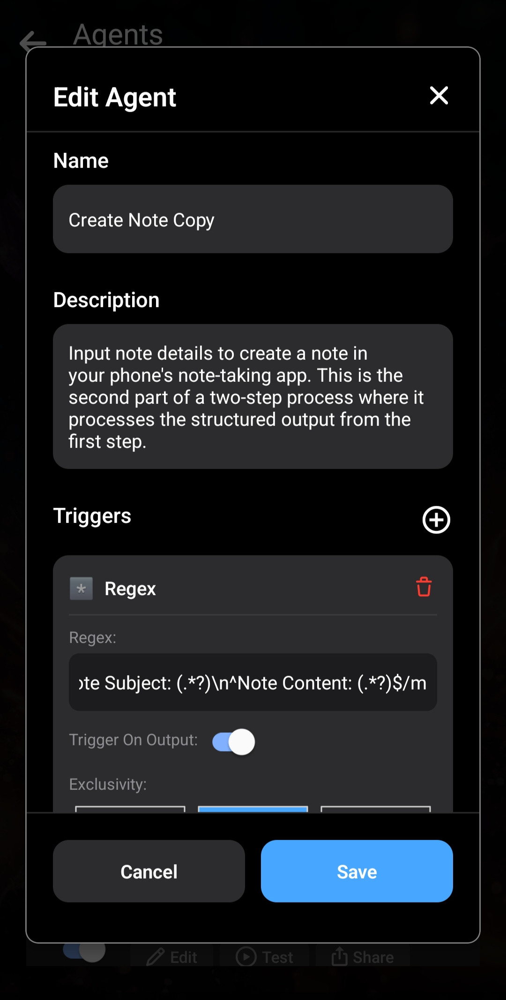

Mit Layla kannst du eigene Agents erstellen und anpassen und damit eigene Funktionen entwickeln.

Dieser Artikel führt zuerst durch die Erstellung eines einfachen Agents, erklärt die Funktionsweise und erstellt danach einen etwas komplexeren Agent.

Eine allgemeine Einführung findest du unter [Agents, Functions und Tool-Aufrufe in Layla aktivieren](/how-to-enable-agents-functions-and-tool-calling-in-layla/).

**Einen Agent erstellen**

Beginnen wir direkt, ohne die Funktionsweise zuerst im Detail zu behandeln.

Öffne in Layla die Mini-App _Agents_:

Am einfachsten erstellst du einen Agent, indem du einen vorhandenen duplizierst. _Die Schaltfläche **Add New Agent** kannst du zunächst ignorieren; sie ist für fortgeschrittene Nutzer gedacht._

Bearbeite die neue Kopie anschließend über die Schaltfläche _Edit_.

_Edit_ öffnet ein Fenster mit den Agent-Details. Wir erstellen einen einfachen Agent, der über eine öffentliche API eine zufällige Katzeninformation abruft.

Schritt 1: Öffne das Fenster Edit Agent.

Schritt 2: Lösche die vorhandenen Trigger und Tools.

Schritt 3: Ändere Name und Beschreibung.

Name und Beschreibung dienen derzeit nur zu deiner Orientierung. _Bei komplexeren Agents sind sie wichtig._

Füge als Nächstes einen _Trigger_ hinzu. Tippe neben „Triggers“ auf das Pluszeichen und wähle „Phrase“. Dieser einfache Trigger aktiviert den Agent, wenn du im Chat eine bestimmte Formulierung eingibst. Die anderen Optionen kannst du vorerst ignorieren.

Der Agent soll ausgelöst werden, wenn die Wörter „**cat fact**“ gesendet werden. Dazu gehören Nachrichten wie „send me a **cat fact**“ und „what's a cool **cat fact**?“.

Die _Triggerphrase_ lautet „cat fact“. Groß- und Kleinschreibung spielen keine Rolle; „cat fact“ und „Cat fact“ funktionieren gleich. Da wir nur einen Trigger verwenden, hat _exclusivity_ keine Auswirkung. Lass die Option auf _OR_ stehen.

Füge dem Agent nun ein Tool hinzu. Wir verwenden _HTTP Request_. Die öffentliche Katzenfakten-API ist hier dokumentiert: [MeowFacts auf GitHub](https://github.com/wh-iterabb-it/meowfacts).

Füge _HTTP Request_ hinzu und konfiguriere es wie gezeigt:

Das Feld _URL_ enthält einfach die in der API-Dokumentation genannte Adresse. Die Anfrage verwendet GET. Die anderen beiden Felder können leer bleiben.

Damit ist das erste Tool hinzugefügt.

Es sendet eine GET-Anfrage an die API und erhält das Ergebnis. Nun müssen wir Layla _mitteilen_, wie dieses Ergebnis verwendet wird. Am einfachsten geht das mit _Provide Context_. Dieses Tool übernimmt eine Eingabe und fügt sie in den Gesprächskontext ein. Layla verwendet den Kontext anschließend für ihre Antwort.

Scrolle im Tool nach unten und tippe erneut auf _Add Tool_. Wähle diesmal _Provide Context_. Es wird hinter dem eben hinzugefügten _HTTP Request_ verkettet.

Wir teilen dem LLM mit, dass diese Katzeninformation aus einer Websuche stammt:

Dabei verwenden wir die besondere Vorlage `{{input}}`. Sie wird durch die _Ausgabe_ des vorherigen Tools ersetzt: Dessen Ausgabe wird zur Eingabe des aktuellen Tools. Andere Optionen wie _LLM tool call_ kannst du vorerst ignorieren.

Der Agent ist fertig. Speichere ihn und beginne wieder einen Chat mit Layla.

Nun siehst du den neuen Agent in Aktion. Er sendet eine HTTP-Anfrage an deine URL und fügt Ergebnis und Anweisungen in den Kontext ein.

**Fazit**

So funktionieren Agents in Layla grundsätzlich: Jeder Agent wird unter bestimmten Bedingungen _ausgelöst_, etwa durch Phrasen, reguläre Ausdrücke oder komplexere Bedingungen. Danach ruft er die konfigurierten Tools der Reihe nach auf und übergibt die Ausgabe eines Tools als Eingabe an das nächste.

_Provide Context_ spielt dabei eine wichtige Rolle. Meist ist es das letzte Tool eines Agents, weil es dem LLM — hier Layla — die Ausführungsergebnisse bereitstellt. Ohne dieses Tool läuft der Agent unbemerkt, und Layla erfährt nichts davon. Beim Erstellen eigener Agents wirst du es fast immer verwenden.

**Ein etwas komplexerer Agent**

Im nächsten Beispiel verwendet ein etwas komplexerer Agent das „Gehirn“ deines LLM.

Wir senden eine weitere _HTTP Request_ an eine API. Sie liefert ein zufälliges Hundebild: [https://random.dog/woof.json](https://random.dog/woof.json).

Diesmal gibt die API die URL eines Bildes zurück. Anschließend bitten wir das LLM, sie korrekt zu formatieren und anzuzeigen.

Schritt 1: HTTP Request funktioniert wie zuvor, lediglich die API-URL ändert sich. Der Unterschied liegt in der Anweisung für _Provide Context_. Wir erklären dem LLM, dass das Ergebnis JSON mit einem Feld `url` ist, das zur Anzeige des Bildes im Markdown-Format verwendet werden soll.

Schritt 2: Dies ist das Ergebnis der Agent-Ausführung.

Dieser komplexere Agent funktioniert am besten mit einem größeren Modell ab ungefähr 8 Milliarden Parametern. Es können dennoch Artefakte auftreten, bei denen das LLM das Bild nicht vollständig korrekt formatiert.

Das Beispiel zeigt, welche Funktionen sich mit Layla Agents umsetzen lassen.

In den nächsten Artikeln erfährst du, wie du **tatsächlich nützliche** Agents erstellst:

- [Einen Roleplay-Agent erstellen](/how-to-create-a-roleplay-agent/)
- [Einen Agent zur Bilderzeugung erstellen](/creating-an-image-generation-agent/)
