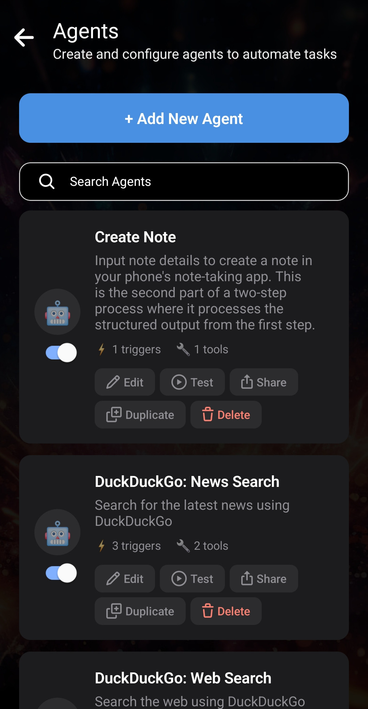
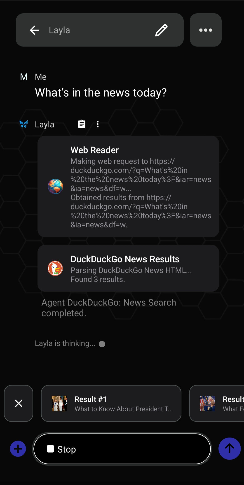
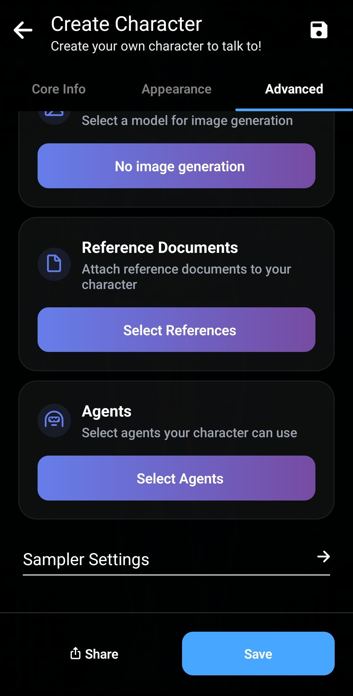

Layla v6 unterstützt lokale _Agenten_, die auf deinem Gerät ausgeführt werden. Dadurch kann Layla Tools verwenden und mit externen Diensten kommunizieren.

Dieser Artikel gibt einen Überblick über die Funktionsweise der Agenten in Layla und ihre Einsatzmöglichkeiten.

**Die Agenten-Mini-App**

Installiere die **Agenten**-Mini-App über den Bildschirm „Apps durchsuchen“, um agentische Funktionen in Layla freizuschalten.

Lade die **Agenten**-Mini-App in Layla herunter und installiere sie. Beim Öffnen der App wird eine große Auswahl vorgefertigter Agenten angezeigt, die du sofort verwenden kannst.

_Diese Tools sind bereits erstellt und funktionsfähig. Du musst sie nicht bearbeiten._ Du kannst zurückgehen und einen neuen Chat mit Layla beginnen; die Tools funktionieren automatisch.

Im Bildschirm oben sind die Agenten _Web Reader_ und _DuckDuckGo News Results_ aktiviert und liefern aktuelle Nachrichten aus dem Internet.

Laylas Agenten können viele weitere Aufgaben erledigen, etwa Termine im Kalender planen, Wecker und Erinnerungen erstellen sowie E-Mails oder SMS senden. Eine Liste aller verfügbaren Agenten findest du in der Agenten-Mini-App.

**Agenten aktivieren und deaktivieren**

Standardmäßig kann Layla – der Charakter – alle in der _Agenten-Mini-App_ aktivierten Agenten verwenden. Wenn Layla nicht auf einen Agenten zugreifen soll, schalte den Schalter unter dessen Symbol aus.

Du kannst Agenten auch mit deinen benutzerdefinierten Charakteren verknüpfen. Öffne dazu den Tab _Erweitert_ im Charaktereditor:

Tippe auf _Agenten auswählen_, um eine Liste aller verfügbaren Agenten zu öffnen. Wähle die Agenten aus, die du mit deinem Charakter verknüpfen möchtest. Nur die ausgewählten Agenten werden aktiviert.

Manchmal sollen deine Charaktere nicht auf alle Agenten zugreifen. Zu viele Agenten können einen Charakter verwirren. Vielleicht verwendest du einen Charakter ausschließlich für Rollenspiele und möchtest die Immersion nicht unterbrechen, indem er mitten in der Sitzung „das Web durchsucht“. In Layla kannst du die Agenten nach deinen Anforderungen anpassen.

_Kurzer Hinweis: „Layla“ bezeichnet sowohl die gesamte App als auch den Standardcharakter mit dem Schmetterlingslogo. Dieser Charakter wird verwendet, wenn du keine eigenen Charaktere erstellst._

**Eigene Agenten erstellen**

In Layla kannst du eigene Tools und Agenten erstellen. Du kannst sie an deine Anforderungen anpassen oder in deine eigenen Dienste integrieren.

Weitere Informationen zur Erstellung eigener Agenten und Tools sowie zu ihrer internen Funktionsweise findest du in diesen Artikeln:

- [Schnell den ersten Agenten erstellen](/how-to-create-agents-in-layla/)
- [Detaillierte Funktionsweise der Agenten](/deep-dive-into-layla-agents/)
- [MCP-Unterstützung in Layla](/full-mcp-support-in-layla/)
