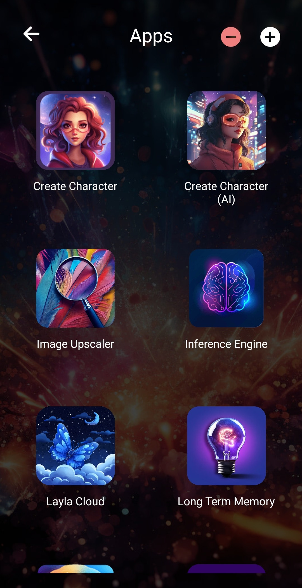

Layla enthält viele Funktionen, die standardmäßig nicht aktiviert sind. Diese Funktionen sind optional, stehen dir bei Bedarf jedoch jederzeit zur Verfügung.

<video controls playsinline src="/assets/articles/how-to-enable-disable-mini-apps-within-layla/browse-mini-apps.mp4"></video>

Diese Funktionen sind in Layla als **Mini-Apps** organisiert. Mini-Apps ähneln den gewöhnlichen Apps auf deinem Smartphone, sind jedoch in Layla enthalten und für die Zusammenarbeit mit Laylas Funktionen ausgelegt.

Mini-Apps bieten Funktionen von der Konfiguration von Charakteren bis zur Aktivierung der Bilderzeugung und vieles mehr.

Eine Liste deiner derzeit installierten Apps findest du, indem du auf einem der unten gezeigten Bildschirme auf _Meine Apps_ tippst:

Daraufhin wird eine Liste deiner derzeit aktivierten Apps angezeigt:

Über das Plus- oder Minuszeichen oben rechts kannst du alle Funktionen durchsuchen, die Layla anbietet.

_Hinweis: Alle Mini-Apps erfordern die Premium-Version von Layla. Du kannst die Premium-Version über Google Play oder über den Kaufbildschirm der direkten APK-Version erwerben. Layla bietet einen einmaligen Kauf zum Freischalten aller Funktionen an; ein monatliches Abonnement ist nicht erforderlich._
