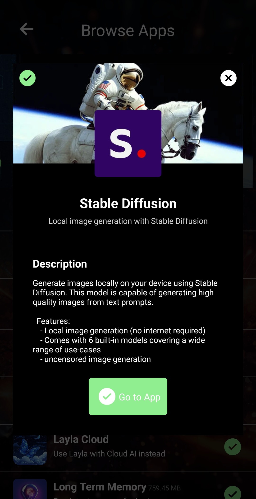

Layla v5 unterstützt die Bilderzeugung mit Stable-Diffusion-Modellen.

In Layla kannst du Bilder auf verschiedene Arten erzeugen:

1. Direkt auf deinem Gerät, ohne Verbindung zu einem externen Anbieter
2. Durch eine Verbindung zwischen deinem Smartphone und deinem PC
3. Mit Layla Cloud

Unabhängig von der gewählten Methode musst du die Stable-Diffusion-Mini-App in Layla aktivieren:

**Direkt auf deinem Gerät**

Die CPU deines Smartphones oder Tablets erzeugt die Bilder. Layla enthält verschiedene Stable-Diffusion-Modelle. Du kannst sie über die Stable-Diffusion-Mini-App herunterladen:

Tippe auf die blaue Cloud-Downloadschaltfläche, um das Modell herunterzuladen. Da die Modelle recht groß sind, kann dies einige Zeit dauern. Tippe oben auf die Modellkachel, um ein anderes Modell auszuwählen.

Nach der Auswahl eines Modells und dem Download seiner Dateien kannst du einen Prompt und weitere Einstellungen eingeben, um ein Bild zu erzeugen.

**Verbindung mit deinem PC**

Auf einem PC kannst du die verbreitete [Stable Diffusion WebUI von AUTOMATIC1111](https://github.com/AUTOMATIC1111/stable-diffusion-webui) installieren.

Die Einrichtung von AUTOMATIC1111s Stable Diffusion WebUI ist nicht Bestandteil dieser Anleitung. Folge der README-Datei im GitHub-Repository oder einer der verfügbaren YouTube-Anleitungen.

Nachdem du die WebUI und ihre API konfiguriert hast, stellst du über die Inferenz-Einstellungen in Layla eine Verbindung her. Scrolle nach unten zu den Einstellungen für die Bilderzeugung:

Tippe auf _Benutzerdefiniertes Modell hinzufügen_. Dort kannst du deine API-Einstellungen konfigurieren:

Die IP-Adresse deines PCs findest du über deinen Router oder mit anderen Methoden.

Nach der Konfiguration ist dein PC bei der Bilderzeugung als Stable-Diffusion-Modell verfügbar:

**Layla Cloud verwenden**

Einige Modelle haben oben rechts ein Schmetterlingssymbol. Diese Modelle werden von Layla Cloud bereitgestellt und benötigen ein in der Layla-Cloud-App erworbenes Abonnement. Alle anderen Modelle erzeugen Bilder lokal auf deinem Smartphone.

Diese Layla-Cloud-Modelle ermöglichen eine schnelle und nahtlose Bilderzeugung und erfordern ein entsprechendes Abonnement.

**Deinen Charakteren das Senden von Bildern im Chat erlauben**

Du kannst außerdem festlegen, dass deine Charaktere während eines Chats Bilder erzeugen. Diese Funktion steht für benutzerdefinierte Charaktere zur Verfügung.

Konfiguriere die Bilderzeugung auf dem Bildschirm zur Charaktererstellung:

Du kannst für diesen Charakter ein bestimmtes Stable-Diffusion-Modell auswählen.
