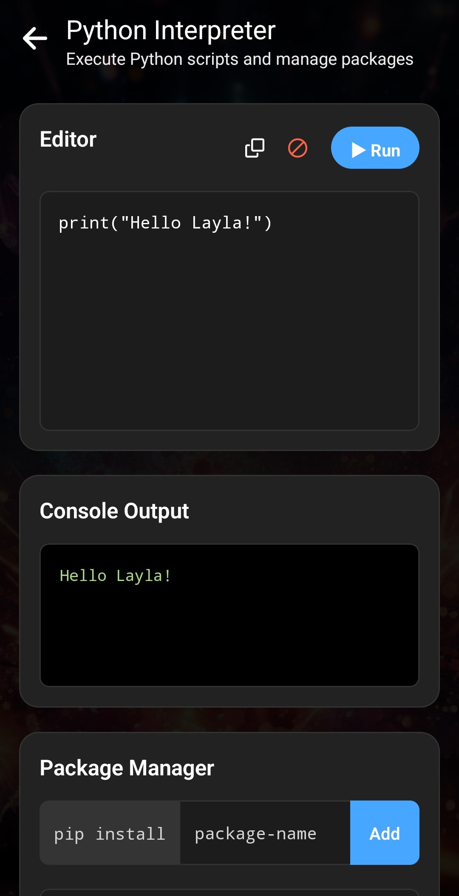
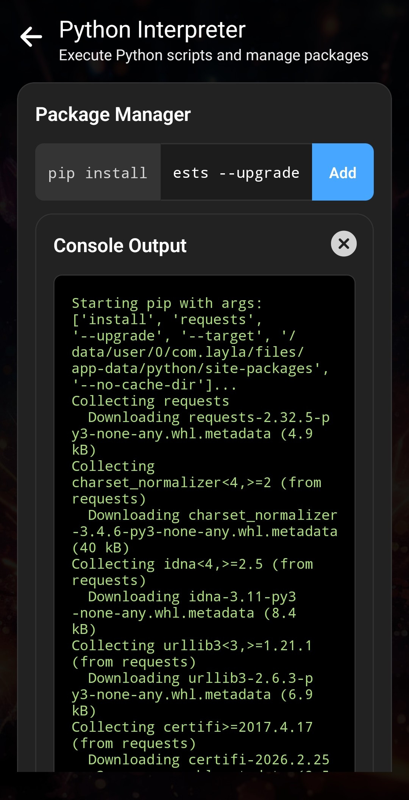
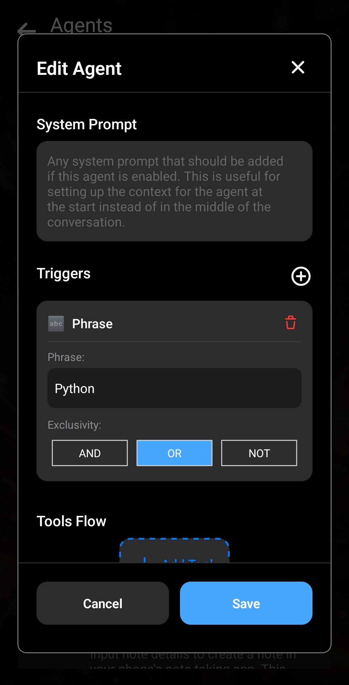

Seit dem Update v6.7.0 können Layla-Agenten Python ausführen: [Layla v6.7.0 wurde veröffentlicht](https://www.layla-network.ai/post/layla-v6-7-0-has-been-published).

Für die Python-Codeausführung müssen einige Mini-Apps installiert werden. Eine Auffrischung findest du unter [So fügst du Funktionen (Mini-Apps) in Layla hinzu](/how-to-add-features-mini-apps-in-layla/).

**Schritt 1: Mini-Apps _Agenten_ und _Python-Interpreter_ installieren**

Öffne deine Apps, tippe auf das Pluszeichen und durchsuche die Mini-Apps. Suche nach _Agenten_ und _Python-Interpreter_. Tippe auf **Herunterladen**, um sie zu Layla hinzuzufügen.

**Schritt 2: _Python-Interpreter_ testen**

Öffne nach der Installation beider Mini-Apps den Python-Interpreter, um ihn zu testen.

Führe ein einfaches „Hello Layla“-Skript aus, indem du oben rechts auf **Ausführen** tippst.

In der Konsolenausgabe darunter sollte der grüne Text „Hello Layla!“ erscheinen. Damit ist bestätigt, dass Python in Layla funktioniert.

**Schritt 3 (optional): Abhängigkeiten installieren**

Python-Skripte werden wesentlich nützlicher, wenn Bibliotheken und Abhängigkeiten installiert werden können. Layla unterstützt dies.

Mit dem **Paketmanager** unter der Ausgabe kannst du Python-Pakete wie auf einem PC über `pip` installieren.

Installiere testweise `requests`, eine verbreitete Bibliothek für Netzwerkanfragen, die du häufig benötigen wirst.

Gib `requests` in das Eingabefeld des Paketmanagers ein und tippe auf **Hinzufügen**.

Tipp: Das Eingabefeld funktioniert wie eine Befehlszeile. Du kannst Argumente wie `--upgrade` zum Ersetzen installierter Pakete hinzufügen, eine Version mit `[Paketname]==[Version]` festlegen oder mehrere Paketnamen durch Leerzeichen getrennt eingeben.

Anschließend sollte grüner Text den Installationsfortschritt anzeigen.

**Schritt 3: Testagenten erstellen**

Python-Skripte werden noch nützlicher, wenn Agenten sie ausführen können. Layla unterstützt dies.

Wir erstellen einen einfachen Testagenten, der eine Ausgabe an das LLM sendet. Spätere Artikel behandeln komplexere Agenten.

Kehre zur Agenten-Mini-App zurück und dupliziere einen vorhandenen Agenten.

Gib der Kopie einen einprägsamen Namen und eine Beschreibung.

Bearbeite den neuen Agenten:

Vorerst verwenden wir nur den Ausdruck **Python**. Sobald du in einer Nachricht an Layla „Python“ erwähnst, wird dieser Agent ausgelöst. Komplexere Agenten benötigen später natürlich ausgefeiltere Auslöser.

Füge das Tool **Python-Code ausführen** hinzu:

Im Python-Code-Tool kannst du das auszuführende Skript bearbeiten und benötigte Abhängigkeiten hinzufügen. Für den Test genügt eine einfache `print`-Anweisung:

Da der `print`-Code keine Abhängigkeiten benötigt, bleibt dieser Abschnitt leer.

Der Agent ist fertig.

Kehre zurück und beginne einen Chat mit Layla. Prüfe in der Agentenliste, ob der Schalter des Agenten aktiviert ist.

Wenn du „Python“ erwähnst, wird der Code ausgeführt und die Ausgabe an das LLM gesendet.

