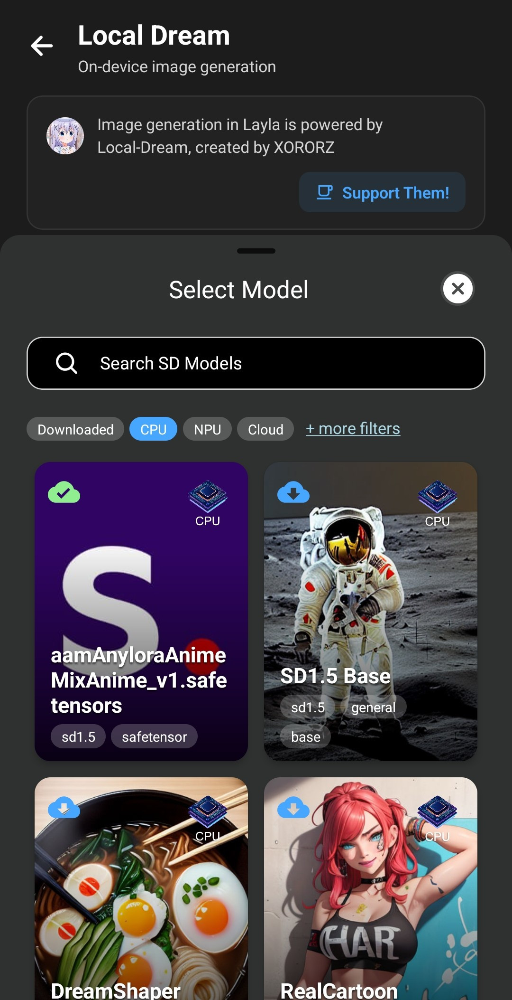

Layla unterstützt Safetensor-Modelle für die Bilderzeugung. Die meisten Safetensor-Dateien für die Bilderzeugung findest du auf [Civitai](https://civitai.com/).

Diese Anleitung erklärt, wie du Safetensor-Dateien von Civitai in Layla importierst.

**Schritt 1: [Civitai](https://civitai.com/) öffnen**

Öffne den Bereich **Modelle**. Wähle in den Filtern oben rechts unter **Modelltyp** die Option **Checkpoint**. Wähle unter **Dateiformat** die Option **SafeTensor** und unter **Basismodell** die Option **SD 1.5**.

Daraufhin wird eine Liste aller von Layla unterstützten Bildmodelle angezeigt.

**Schritt 2: Safetensor-Datei herunterladen**

Lade die Safetensor-Datei von der Downloadseite herunter. _Achte darauf, dass die Datei ungefähr 2 GB groß ist. Daran erkennst du, dass sie richtig formatiert ist._

**Schritt 3: In Layla importieren**

Öffne **Einstellungen** → **Inferenz-Einstellungen**.

Scrolle nach unten zu den Einstellungen für die **Bilderzeugung** und tippe auf **Benutzerdefiniertes Modell hinzufügen**.

Wähle die gerade heruntergeladene Safetensor-Datei aus. Layla beginnt mit dem Import.

**Schritt 4: Bild erzeugen**

Öffne nach dem Import deines Bildmodells die Mini-App Local Dream und erzeuge damit ein Bild.

