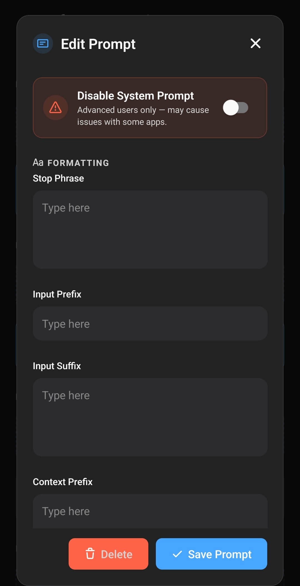

Eine benutzerdefinierte Prompt-Vorlage legt fest, wie Layla die Charakterbeschreibung, Anweisungen, den Gesprächsverlauf, Benutzernachrichten und Modellantworten anordnet, bevor diese an ein KI-Modell gesendet werden. Sie verändert das Modell selbst nicht. Stattdessen überträgt sie ein Layla-Gespräch in genau die Struktur, die das Modell während des Trainings gelernt hat.

Die in Layla enthaltenen Modelle verfügen bereits über passende Prompt-Einstellungen. Sie müssen diese normalerweise nur ändern, wenn Sie ein eigenes Modell hinzufügen oder bewusst anpassen möchten, wie Layla dem Modell Anweisungen erteilt. Falls Sie noch kein Modell importiert haben, beginnen Sie mit [So fügen Sie Layla ein benutzerdefiniertes KI-Modell hinzu](/de/how-to-add-custom-models-to-layla/).

## Warum die Prompt-Vorlage zum Modell passen muss

Jedes Chatmodell erwartet ein bestimmtes Prompt-Format. Modelle können beispielsweise ChatML, Llama, Gemma, Mistral oder ein anderes familienspezifisches Format verwenden. Diese Formate nutzen unterschiedliche Markierungen für die Systemnachricht, den Benutzer, den Assistenten und das Ende jedes Gesprächsbeitrags.

Das richtige Format hängt vom Modell oder Fine-Tune ab, nicht nur vom GGUF-Dateityp. Zwei GGUF-Modelle können unterschiedliche Prompt-Vorlagen benötigen. Selbst Modelle mit derselben Grundarchitektur können mit verschiedenen Chatformaten trainiert worden sein.

Wenn Sie ein lokales Modell auswählen, kann Layla anhand des Dateinamens eine wahrscheinlich passende Prompt-Voreinstellung wählen. Betrachten Sie diese Auswahl als Ausgangspunkt. Suchen Sie auf der Modellkarte oder Downloadseite nach Begriffen wie **Prompt-Format**, **Chat Template** oder **Instruct Template** und prüfen Sie anschließend, ob die in Layla gewählte Voreinstellung dazu passt.

Eine falsche Vorlage kann dazu führen, dass das Modell:

- die Charakterbeschreibung oder Systemanweisungen ignoriert,
- besondere Markierungen in seiner Antwort ausgibt,
- als Benutzer weiterschreibt, anstatt anzuhalten,
- Benutzer- und Assistentennachrichten verwechselt oder
- kurze, sich wiederholende oder anderweitig schlecht strukturierte Antworten erzeugt.

Weitere Informationen zu Modellen, Quantisierungen und Modellkarten finden Sie unter [Was ist GGUF? Eine verständliche Einführung in GGUF-Modelle](/de/what-are-gguf-models-what-are-model-quants/).

## Meine Prompts öffnen und das gewählte Format prüfen

Öffnen Sie die **Inference-Einstellungen** über Laylas Seite **Einstellungen** oder direkt über die Mini-App **Inference-Einstellungen**. Das gewählte Modell wird unter **Meine Modelle** angezeigt. Sein aktives Prompt-Format steht direkt darunter unter **Meine Prompts**.

Im folgenden Beispiel ist ein Gemma-4-Modell ausgewählt und **Gemma 4** als Prompt aktiv. Über die Karte **Benutzerdefinierten Prompt hinzufügen** erstellen Sie ein neues Format. Die Wechsel-Schaltfläche am aktiven Prompt öffnet die Liste der verfügbaren Formate.

Tippen Sie auf die Wechsel-Schaltfläche des aktiven Prompts, um **Prompt auswählen** zu öffnen. Integrierte Formate wie ChatML, Llama 3, Phi, OpenELM und Gemma werden zusammen mit Ihren gespeicherten benutzerdefinierten Prompts angezeigt. Das aktive Format ist blau hervorgehoben.

Wenn die Modelldokumentation eines dieser Formate nennt, tippen Sie darauf, um die Voreinstellung ohne weitere Einrichtung zu verwenden. Erstellen Sie einen benutzerdefinierten Prompt, wenn das Modell eine nicht aufgeführte Variante benötigt oder wenn Sie eigene Anweisungen ergänzen und dabei das erforderliche Modellformat beibehalten möchten.

## Einen benutzerdefinierten Prompt erstellen

Tippen Sie unter **Meine Prompts** auf **Benutzerdefinierten Prompt hinzufügen**, um den Editor zu öffnen. Oben im Editor befindet sich eine horizontal scrollbare Zeile mit **Voreinstellungen**. Wenn Sie auf eine Voreinstellung tippen, kopiert Layla deren Format in die darunterliegenden Felder. Dies ist ein zuverlässigerer Ausgangspunkt, als alle Trennzeichen manuell einzugeben.

1. Wählen Sie unter **Voreinstellungen** das Format, das den Anforderungen Ihres Modells am nächsten kommt.
2. Geben Sie einen eindeutigen **Prompt-Namen** und eine **Prompt-Beschreibung** ein. An diesen Bezeichnungen können Sie später ähnliche eigene Formate unter **Prompt auswählen** unterscheiden.
3. Scrollen Sie durch **System-Prompt** und **Formatierung** und passen Sie dann die im nächsten Abschnitt beschriebenen Felder an. Behalten Sie alle besonderen Markierungen, Zeilenumbrüche und Leerzeichen bei, die das Modell verlangt.
4. Scrollen Sie weiter zu **Verfügbare Vorlagen** und **Live-Vorschau**, um zu prüfen, wie das vollständige Format zusammengesetzt wird.
5. Tippen Sie auf **Prompt speichern**. Der gespeicherte Prompt wird sofort für die aktuellen Inference-Einstellungen aktiviert und bleibt zur späteren Wiederverwendung verfügbar.

## System- und Formatierungsfelder konfigurieren

Unter **System-Prompt-Anfang** und **System-Prompt-Ende** zeigt der Editor den roten Schalter **System-Prompt deaktivieren**. Darauf folgen **Stopp-Phrase**, **Eingabepräfix**, **Eingabesuffix** und **Kontextpräfix**. Lassen Sie **System-Prompt deaktivieren** bei der Einrichtung eines normalen Chatmodells ausgeschaltet.

Layla setzt das Gespräch mithilfe dieser Felder in Abschnitten zusammen. Vereinfacht beginnt es mit den Charakterinformationen im Systemblock. Danach folgen die Begrüßung, der Gesprächsverlauf, von Apps bereitgestellter Kontext, die aktuelle Benutzernachricht und schließlich die Markierung, die dem Modell den Beginn seiner Antwort signalisiert.

| Einstellung              | Funktion                                                                                                                                                                                        |
| ------------------------ | ----------------------------------------------------------------------------------------------------------------------------------------------------------------------------------------------- |
| **System-Prompt-Anfang** | Öffnet den Systemabschnitt direkt vor Laylas Charakterbeschreibung, Persönlichkeit, Szenario und weiteren Informationen auf Systemebene.                                                        |
| **System-Prompt-Ende**   | Beendet den Systemabschnitt vor dem Beginn des Gesprächs. Die meisten Voreinstellungen enthalten hier auch `{{instruction}}`.                                                                   |
| **Stopp-Phrase**         | Markiert das Ende des Assistentenbeitrags. Layla verwendet sie, um die Generierung anzuhalten und abgeschlossene Nachrichten zu trennen. Sie wird auch Anti-Prompt oder Reverse Prompt genannt. |
| **Eingabepräfix**        | Steht vor jeder Benutzernachricht und kennzeichnet den Beginn eines Benutzerbeitrags.                                                                                                           |
| **Eingabesuffix**        | Steht nach einer Benutzernachricht. Es schließt normalerweise den Benutzerbeitrag und öffnet den Assistentenbeitrag, damit das Modell weiß, dass es antworten soll.                             |
| **Kontextpräfix**        | Leitet zusätzlichen Kontext von Layla-Funktionen ein, etwa abgerufene Informationen oder Agent-Ergebnisse, damit das Modell diesen von der Benutzernachricht unterscheiden kann.                |

Die Anfangs- und Endfelder umschließen Inhalte, die Layla bereitstellt. Fügen Sie dort nicht die vollständige Charakterbeschreibung ein. Charakterdetails gehören in den Charaktereditor; die Prompt-Felder legen nur fest, wie diese Angaben dem Modell präsentiert werden. Unter [Wie erstelle ich benutzerdefinierte Charaktere?](/de/how-do-i-create-custom-characters/) erfahren Sie mehr über die Charaktereinrichtung.

**Stopp-Phrase** und **Eingabesuffix** hängen zusammen, sind aber nicht austauschbar. Die Stopp-Phrase teilt Layla mit, wo die Antwort des Assistenten endet. Das Eingabesuffix teilt dem Modell mit, dass der Benutzer fertig ist und eine Assistentenantwort beginnen soll. Bei manchen Formaten enthalten beide einen Teil desselben Trennzeichens. Trotzdem muss jedes Feld der dokumentierten Modellvorlage entsprechen.

### Wann der System-Prompt deaktiviert werden sollte

**System-Prompt deaktivieren** verhindert, dass Layla die Charakterbeschreibung und andere Inhalte des System-Prompts sendet. Dies ist eine erweiterte Kompatibilitätsoption und keine allgemeine Methode, um einen Prompt zu verkürzen.

Aktivieren Sie sie nur, wenn das Modell oder der Dienst keine System-Prompts unterstützt oder die Dokumentation ausdrücklich verlangt, Anweisungen an anderer Stelle einzufügen. Ohne System-Prompt kann die Identität des Charakters verloren gehen. Außerdem können Apps beeinträchtigt werden, die auf Systemanweisungen angewiesen sind.

Beginnen Sie bei Cloud- und API-Modellen mit Laylas Prompt **Cloud**, sofern der Anbieter keine andere Anforderung dokumentiert. Cloud-Dienste übernehmen die Rollenformatierung meist selbst. Trennzeichen für lokale Modelle sollten daher normalerweise nicht zu einer API-Verbindung hinzugefügt werden.

## Platzhalter verwenden und die Live-Vorschau prüfen

Scrollen Sie weiter bis zu **Verfügbare Vorlagen**. Dieser Bereich des Editors listet die Platzhalter auf, die Layla zur Laufzeit ersetzen kann. Direkt darunter kombiniert die **Live-Vorschau** Beispieltexte für Charakter, Benutzer, Antwort und Trennzeichen. So sehen Sie, ob alle Bestandteile des Prompts in der richtigen Reihenfolge stehen.

In der Vorschau werden Charakterinformationen blau, Benutzernachrichten weiß, Antworten grün und Modelltrennzeichen grau dargestellt. Damit können Sie eine fehlende Rollenmarkierung oder ein falsch platziertes Präfix oder Suffix erkennen. Die Vorschau zeigt, wie Layla die Abschnitte zusammenfügt. Vergleichen Sie das Format dennoch mit der Modellkarte.

### So funktioniert `{{instruction}}`

Vor der Inferenz ersetzt Layla `{{instruction}}` durch die zur aktuellen Aufgabe passende Anweisung. In einem normalen Charakterchat nennt diese Anweisung die ausgewählte Benutzer-Persona und den Charakter und fordert das Modell dazu auf, den Charakter zu verkörpern. Andere Layla-Funktionen können aufgabenspezifische Anweisungen bereitstellen. Langzeitgedächtnis, Dreams, Lorebooks und weitere Apps können sich beim Erstellen eines Prompts auf diese Anweisungen stützen.

Sie können `{{instruction}}` auf drei Arten verwenden:

- **Laylas Anweisung unverändert beibehalten:** Lassen Sie `{{instruction}}` in der Vorlage stehen. Dies ist die sicherste Option und erhält die Kompatibilität mit Funktionen, die eigene Anweisungen bereitstellen.
- **Laylas Anweisung ergänzen:** Fügen Sie Ihre natürlichsprachliche Anweisung vor oder nach `{{instruction}}` ein. Layla fügt dann sowohl die aufgabenspezifische Anweisung als auch Ihre zusätzlichen Regeln ein.
- **Die Anweisung vollständig ersetzen:** Entfernen Sie `{{instruction}}` und schreiben Sie an dieser Stelle Ihre eigene Anweisung. Layla verwendet Ihren Text, aber funktionsspezifische Anweisungen, die normalerweise über diesen Platzhalter eingefügt werden, fehlen anschließend.

Sie können beispielsweise nach `{{instruction}}` eine kurze Stilregel ergänzen und Laylas Charakter- und App-Anweisungen beibehalten. Wenn Sie den Platzhalter vollständig entfernen, testen Sie alle verwendeten Funktionen und nicht nur gewöhnliche Chats.

Verwechseln Sie `{{instruction}}` nicht mit Benutzereingaben. Layla löst den Platzhalter beim Erstellen des Prompts auf; er erscheint nicht als separate Chatnachricht.

### Weitere verfügbare Platzhalter

Im selben Bereich **Verfügbare Vorlagen** werden drei weitere Platzhalter angezeigt:

- `{{user}}` wird durch den Namen der ausgewählten Persona ersetzt.
- `{{char}}` wird durch den Namen des Charakters ersetzt.
- `{{time}}` wird durch das aktuelle Datum und die aktuelle Uhrzeit des Geräts ersetzt.

Platzhalter sind keine Modell-Steuertokens. Layla ersetzt Platzhalter durch aktuelle Informationen. Modell-Steuertokens sind dagegen die exakten Sondermarkierungen, die das Chatformat des Modells verlangt. Bei Platzhaltern wird die Groß- und Kleinschreibung nicht berücksichtigt, die Steuertokens des Modells können jedoch zwischen Groß- und Kleinschreibung unterscheiden.

`{{user}}` und `{{char}}` können für rollenspielorientierte Fine-Tunes nützlich sein, die mit Sprecherbezeichnungen trainiert wurden. Bei allgemeinen Instruct-Modellen passen feste Rollen wie „user“ und „assistant“ möglicherweise besser zum Trainingsformat. Folgen Sie der Modellkarte, statt Rollennamen nur nach persönlicher Vorliebe zu ändern.

## Die Prompt-Vorlage testen

Starten Sie nach dem Speichern des Prompts einen neuen Chat und führen Sie einige einfache Prüfungen durch:

1. Bitten Sie den Charakter, sich vorzustellen. Damit prüfen Sie, ob die System- und Charakterinformationen verstanden wurden.
2. Senden Sie zwei oder drei Nachrichten und prüfen Sie, ob das Modell Benutzer- und Assistentenrollen getrennt hält.
3. Achten Sie darauf, dass Antworten normal enden und keine unverarbeiteten Steuertokens enthalten.
4. Lösen Sie regelmäßig verwendete Layla-Funktionen aus, insbesondere Gedächtnis, Lorebooks, Dreams, Rollenspiel oder Agents.

Falls sich das Modell nicht richtig verhält, vergleichen Sie jedes Feld mit der veröffentlichten Prompt-Vorlage für genau dieses Modell. Achten Sie besonders auf Zeilenumbrüche um Steuertokens. Unsichtbare Formatierungsunterschiede können beeinflussen, wie das Modell den Prompt interpretiert.

## Häufige Probleme

### Das Modell spricht für mich

Wahrscheinlich stimmen Stopp-Phrase, Eingabepräfix oder Eingabesuffix nicht mit dem Modell überein. Wählen Sie erneut die passende Voreinstellung und vergleichen Sie sie mit der Modellkarte.

### Die Antwort enthält Markierungen wie Rollennamen oder Tokens in spitzen Klammern

Das Modell erhält ein Format, das es nicht erkennt, oder die Stopp-Phrase ist unvollständig. Prüfen Sie das genaue Chat-Template, das für den Fine-Tune verwendet wurde.

### Die Persönlichkeit des Charakters wird ignoriert

Prüfen Sie, ob **System-Prompt deaktivieren** ausgeschaltet ist und Anfangs- und Endmarkierungen des System-Prompts stimmen. Stellen Sie außerdem sicher, dass das Modell Systemanweisungen unterstützt.

### Gedächtnis, Lorebooks oder eine andere App beeinflussen die Antworten nicht mehr

Stellen Sie `{{instruction}}` wieder her oder fügen Sie den Platzhalter neben Ihrer eigenen Anweisung ein. Prüfen Sie außerdem, ob das Kontextpräfix zum ausgewählten Modell passt.

### Ein Prompt funktioniert mit einem Modell, aber nicht mit einem anderen

Das ist zu erwarten, wenn die Modelle unterschiedliche Chat-Templates verwenden. Speichern Sie für jedes Format einen eigenen benannten Prompt und wechseln Sie den Prompt zusammen mit dem Modell.
