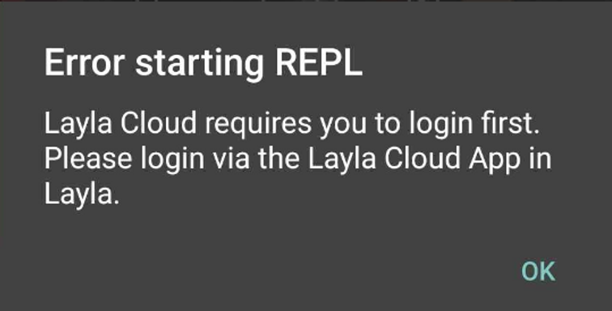

Gelegentlich wird möglicherweise dieser Fehler angezeigt:

Dieser Fehler tritt auf, wenn du Layla Cloud aktiviert hast.

**Wenn du Layla Lite verwendest**

Deinstalliere die Layla-Cloud-Mini-App in Layla, um wieder lokale LLMs zu verwenden, die auf deinem Gerät ausgeführt werden:

1. Öffne auf dem Hauptbildschirm mit dem großen Schmetterling den Bereich _Meine Apps_.
2. Tippe oben rechts im App-Bereich auf das Minussymbol.
3. Entferne die Layla-Cloud-App.

**Wenn du Layla (kostenpflichtig) verwendest**

1. Öffne die App „Inferenz-Einstellungen“.
2. Wähle ein lokales LLM-Modell aus.
