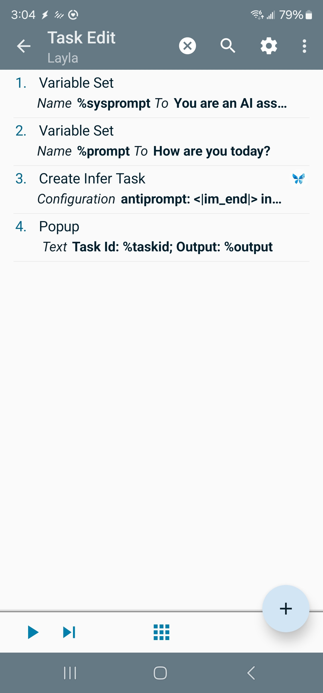

Layla ist in Tasker integriert. Dadurch kannst du Aufgaben mit einem LLM automatisieren.

**Was ist Tasker?**

Mit Tasker kannst du automatisierte Aufgaben erstellen, die durch Bedingungen auf deinem Gerät ausgelöst werden. Du kannst beispielsweise ein LLM bitten, den Inhalt einer neu eingegangenen E-Mail zusammenzufassen.

_Hinweis: Hierfür musst du [Tasker bei Google Play kaufen](https://play.google.com/store/apps/details?id=net.dinglisch.android.taskerm&hl=en)._

Layla ist nicht mit Tasker verbunden. Tasker ist eine beliebte App zur Android-Automatisierung.

**So erstellst du eine Layla-Tasker-Aufgabe**

Layla stellt zwei Hauptaufgaben bereit:

1. **Infer:** Sendet einen Prompt und eine Eingabe an Layla. Layla erstellt eine Inferenzaufgabe, die die Eingabe später durch ein LLM verarbeitet und die Ausgabe zurückgibt.
2. **Infer in Background:** Führt dieselbe Aktion aus, startet die Inferenz mit dem LLM aber sofort im Hintergrund.

Beide Aufgaben akzeptieren konfigurierbare Eingaben wie das LLM-Modell, System-Prompts und Roheingaben. Diese werden als Tasker-Variablen bereitgestellt, sodass du die Aufgaben leicht mit anderen verknüpfen kannst.

Das Bild oben zeigt ein Beispiel für die Konfiguration einer Aufgabe:

1. Die Aktion _Variable Set_ kann durch eine Ausgabe aus anderen Aufgaben ersetzt werden. Wenn du beispielsweise AutoNotification in Tasker verwendest, kannst du Eingaben aus deinen Benachrichtigungen abrufen und an das LLM übergeben.
2. _Create Infer Task_ ist die wichtigste von Layla bereitgestellte Aufgabe. Sie verarbeitet die zuvor festgelegten Variablen mit dem LLM. Eine mögliche Anweisung wäre, den zuvor bereitgestellten Benachrichtigungsinhalt zusammenzufassen.

Layla stellt außerdem ein _Task Completed_-Ereignis bereit:

Dieses Ereignis wird ausgelöst, sobald eine Inferenzaufgabe im Rahmen von Laylas Hintergrundverarbeitung abgeschlossen ist. Du kannst daran anknüpfen und anhand der Aufgabenausgabe weitere Aktionen ausführen.
