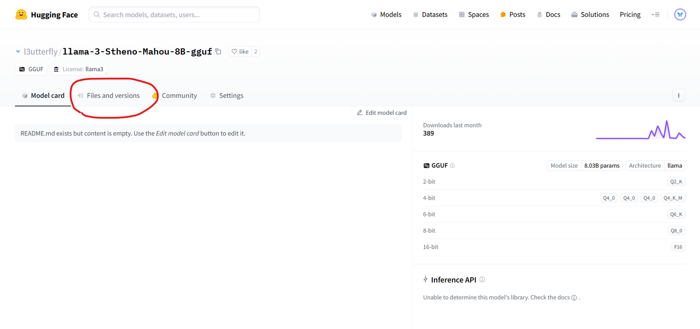
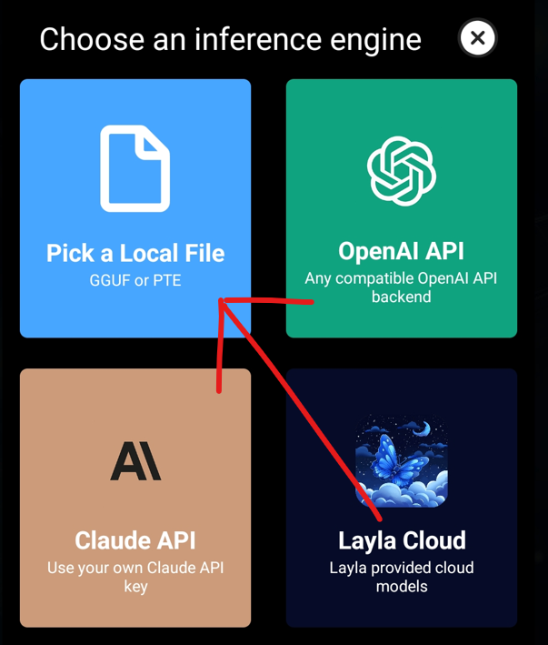
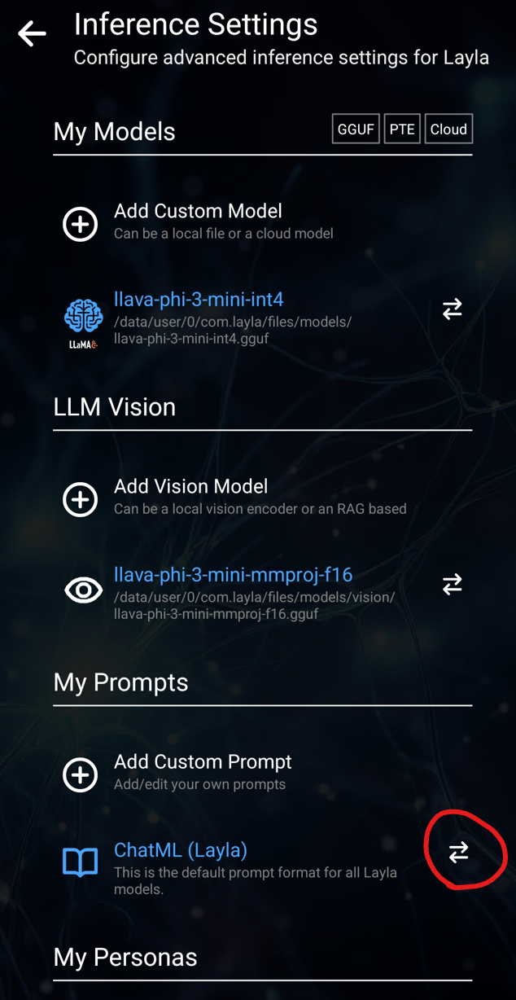

Wenn du lokale KI-Modelle auf Hugging Face erkundet hast, sind dir wahrscheinlich überall Dateien mit der Endung `.gguf` begegnet. Was ist ein GGUF-Modell, und warum verwenden fast alle Offline-KI-Apps — einschließlich Layla — dieses Format?

Dieser Leitfaden erklärt die Bedeutung und Funktionsweise von GGUF und zeigt anschließend, wie du ein beliebiges eigenes GGUF-Modell in Layla lädst. So kannst du unzensierte, auf Rollenspiele ausgerichtete oder spezialisierte KI-Modelle direkt auf deinem Android-Smartphone ausführen — ohne Internet, Abonnement oder Cloud-Dienst.

## Was ist GGUF?

**GGUF ist ein Dateiformat zur Ausführung großer Sprachmodelle auf Verbraucherhardware wie Laptops, Desktop-PCs und Smartphones.** Eine einzelne `.gguf`-Datei enthält alles, was zum Ausführen eines KI-Modells benötigt wird: Modellgewichte, Tokenizer, Prompt-Vorlage und Metadaten, verpackt in einer portablen Binärdatei für GGUF-kompatible Inferenz-Engines.

GGUF wurde im August 2023 vom Projekt [llama.cpp](https://github.com/ggerganov/llama.cpp) eingeführt, derselben Open-Source-Inferenz-Engine, die Layla antreibt. Zuvor verwendete das Projekt das ältere Format GGML. Für neue Modellarchitekturen waren damit Änderungen am Code notwendig. GGUF ersetzte es durch strukturierte Metadaten und wurde deshalb zum De-facto-Standard für lokal ausführbare LLMs.

Wenn du Ollama, LM Studio, GPT4All, Jan, koboldcpp oder Layla verwendet hast, hast du GGUF genutzt, auch wenn es dir nicht bewusst war.

## Wofür steht GGUF?

GGUF steht für **GGML Universal File**. GGML ist der Name der zugrunde liegenden Tensorbibliothek, benannt nach ihrem Entwickler Georgi Gerganov. Online findet man gelegentlich „GPT-Generated Unified Format“, doch das llama.cpp-Projekt verwendet „GGML Universal File“.

## Warum GGUF-Modelle für mobile Offline-KI wichtig sind

Die wichtigste GGUF-Funktion ist die **Quantisierung**. Sie verkleinert Modellgewichte von 16- oder 32-Bit-Zahlen auf 8, 4 oder sogar 2 Bit. Dadurch wird die Datei deutlich kleiner, ohne die Fähigkeiten des Modells zu zerstören, und ein Modell mit 7 oder 8 Milliarden Parametern kann auf einem Smartphone laufen.

In der Praxis ermöglicht GGUF:

- Einen leistungsfähigen KI-Assistenten vollständig **offline** und ohne Internet auszuführen.
- Unterhaltungen **privat** zu halten, weil nichts dein Gerät verlässt.
- Abonnements und Ratenbegrenzungen zu vermeiden.
- **Beliebige Community-Modelle** auszuwählen, darunter für besondere Stile abgestimmte Modelle oder Modelle ohne Inhaltsfilter.

## Eigene GGUF-Modelle in Layla verwenden

Die vorgefertigten Modelle, die Layla beim ersten Start herunterlädt, sind gute allgemeine Assistenten. Du kannst aber auch **jedes gewünschte GGUF-Modell** laden.

Die Open-Source-Community hat Tausende GGUF-Modelle für verschiedene Zwecke abgestimmt:

- **Unzensierte oder ungefilterte Chatmodelle**, die ohne die Schutzvorgaben gängiger Chatbots antworten
- **Rollenspiel- und Kreativschreibmodelle** wie Stheno, MythoMax und Mahou für lange, immersive Unterhaltungen
- **Programmiermodelle** mit Spezialisierung auf Programmiersprachen
- **Reasoning- und Mathematikmodelle** zur Problemlösung
- **Domänenspezifische Modelle** für Medizin, Recht, Sprachenlernen und mehr

Mit Layla getestete GGUF-Modelle findest du auf der [Hugging-Face-Seite von l3utterfly](https://huggingface.co/l3utterfly).

## Ein eigenes GGUF-Modell in Layla laden

Die folgende Anleitung verwendet das beliebte Rollenspielmodell Stheno-Mahou als Beispiel.

### Schritt 1 — Ein Modell auf Hugging Face auswählen

Wir verwenden [Stheno-Mahou](https://huggingface.co/l3utterfly/llama-3-Stheno-Mahou-8B-gguf), ein beliebtes, auf Rollenspiele abgestimmtes Llama-3-Modell.

### Schritt 2 — Den Tab Files and versions öffnen

Dort listet Hugging Face alle herunterladbaren Modellvarianten auf.

### Schritt 3 — Die passende Quantisierung auswählen

Jeder Dateiname enthält eine Q-Bezeichnung wie Q2_K, Q4_K_M, Q6_K oder Q8_0. Sie steht für die **Quantisierungsstufe**, also dafür, wie stark das Modell komprimiert wurde.

Die Regel ist einfach:

- **Höhere Q-Zahl = größere Datei = bessere Antwortqualität, aber mehr RAM und ein schnelleres Smartphone sind nötig.**
- **Niedrigere Q-Zahl = kleinere Datei = schneller auf schwächerer Hardware, aber etwas geringere Antwortqualität.**

Für die meisten Smartphones ist **Q4_K_M** ein sinnvoller Startpunkt. Reagiert das Modell schnell, probiere Q6 oder Q8 für mehr Qualität. Ist es langsam, wechsle zu Q3 oder Q2.

Außerdem gibt es Q4_0_4_4, Q4_0_4_8 und Q4_0_8_8. Diese besonderen Quants sind für neuere ARM-Smartphones mit **i8mm**-Hardwarebeschleunigung optimiert und können auf unterstützten Geräten merklich schneller laufen. Im Leitfaden zur [i8mm-Unterstützung von Layla](https://www.layla-network.ai/post/layla-supports-i8mm-hardware-for-running-llm-models) erfährst du, ob dein Gerät geeignet ist.

### Schritt 4 — Die Datei herunterladen

Tippe neben der ausgewählten Quantisierung auf den Downloadpfeil. Die `.gguf`-Datei wird im Downloadordner des Smartphones oder am Standardspeicherort deines Browsers gespeichert.

### Schritt 5 — Das Modell in Layla hinzufügen

Öffne Layla und gehe zu **Inference Settings** → **Add a custom model** → **Local file**. Suche mit der Dateiauswahl nach der heruntergeladenen `.gguf`-Datei.

Wähle in der Dateiauswahl das heruntergeladene Modell aus.

### Schritt 6 — Das richtige Prompt-Format festlegen

Dieser Schritt wird häufig vergessen. Jede Modellfamilie erwartet Prompts in einem bestimmten Format: Llama 3 verwendet eines, Mistral ein anderes, ChatML ein drittes. Auf der Hugging-Face-Seite steht, welches Format das Modell erwartet. Stelle es in Laylas Prompt-Format-Einstellungen ein. Danach läuft dein eigenes GGUF-Modell vollständig offline auf dem Smartphone.

## Häufig gestellte Fragen zu GGUF

### Was ist eine GGUF-Datei?

Eine `.gguf`-Datei ist eine einzelne Binärdatei, die Gewichte, Tokenizer und Konfiguration eines KI-Modells bündelt. llama.cpp und viele andere lokale KI-Tools verwenden dieses Format zum Laden und Ausführen von Sprachmodellen.

### Was bedeutet GGUF bei KI-Modellen?

Ist ein Modell auf Hugging Face als GGUF gekennzeichnet, wurde es in dieses Format konvertiert und kann mit Layla, llama.cpp, Ollama oder LM Studio lokal auf Verbraucherhardware ausgeführt werden — ohne GPU-Server oder Cloud-API.

### Ist GGUF besser als safetensors oder PyTorch?

Die Formate erfüllen unterschiedliche Zwecke. PyTorch und safetensors sind Trainings- und Forschungsformate: volle Präzision, groß und GPU-orientiert. GGUF ist ein **Inferenzformat**: quantisiert, kompakt und für CPUs, Smartphones sowie kleinere GPUs optimiert. Zum _Verwenden_ statt _Trainieren_ eines Modells ist GGUF besser geeignet.

### Kann ich GGUF-Modelle auf Android ausführen?

Ja. Genau das macht Layla. Layla bindet llama.cpp unter Android ein und kann GGUF-Modelle vom Gerät laden oder von Hugging Face herunterladen.

### Welche GGUF-Quantisierung sollte ich herunterladen?

Beginne mit **Q4_K_M**, einem verbreiteten Kompromiss aus Größe, Geschwindigkeit und Qualität. Wechsle zu Q6 oder Q8, wenn dein Smartphone damit zurechtkommt, andernfalls zu Q3 oder Q2.

### Wo finde ich GGUF-Modelle?

Die größte Sammlung gibt es auf [Hugging Face](https://huggingface.co). Suche nach einem Modellnamen mit dem Zusatz „GGUF“, um quantisierte Versionen zu finden. Mit Layla getestete Modelle stehen unter [huggingface.co/l3utterfly](https://huggingface.co/l3utterfly).
