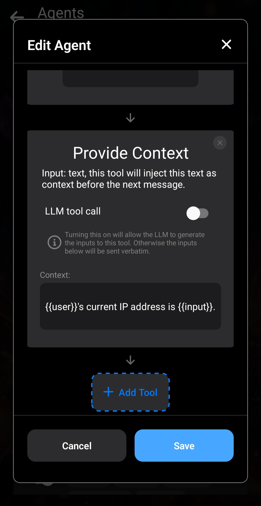

*If you haven't already, please read [a brief overview of how Agents work in Layla](/how-to-enable-agents-functions-and-tool-calling-in-layla/) first.*

This article will dive deeper into Layla's agentic features.

**Agent Internals**

Agents are self-contained workflows that execute when needed during chats with the LLM. Each Agent has a *trigger*, which activates under specific configurable conditions, and a list of tools that will be executed consecutively.

The Agent result is injected into the conversation as context, and the LLM will pick up on that and give you a contextualised response!

**Triggers**

There are many types of triggers in Layla. The following image shows a few:

- **Intent** — Layla runs intent classification on your input and triggers the Agent depending on what intent is detected. There are numerous intents built into the classifier, such as "search news", "query weather", "set alarm", and "set calendar". You can see the full list in the dropdown after adding an *Intent Trigger*.
- **Regex** — The Agent is triggered when your input regex is matched within the chat message. The matched string is the input of the first tool.
- **Phrase** — The Agent is triggered when the entered phrase is detected in the message, case-insensitively. The matched phrase is the input of the first tool.
- **Date/Time Detected** — The Agent is triggered if a date or time is detected within the message. The detected date or time is the input of the first tool.
- **MCP/Layla Tool Trigger** — This is a more advanced feature covered in the article about [full MCP support in Layla](/full-mcp-support-in-layla/).
- **Is Voice Mode** — A simple trigger that activates when Voice Mode is turned on.

These triggers are run on each input and output message in your chats. When a trigger is activated, the Agent will start, and the trigger condition is used as the input to the first tool.

**Tools**

The heart of Agents in Layla is *Tools*.

Tools perform functions, whether that means calling external services, operating your phone, or much more. Layla comes with numerous built-in tools, and more are being added constantly!

There are too many tools to go over in this article, but we will highlight some that are commonly used.

In the *Agents* mini-app, scroll down to see a list of available tools Layla can use. Tapping one will bring up a popup with more details. Let's take the *HTTP Request* tool as an example:

The *HTTP Request* tool has several parameters you can configure. These can be hard-coded—for example, by specifying a particular URL for this Agent to call—or they can be generated by the LLM, as explained below.

After adding a tool, you will be able to configure its parameters in the Edit Agent popup. As shown in the previous article, you can specify the URL by typing it into the input.

The output of each tool is used as the input for the next. This way, you can chain multiple tools together in one Agent. In the example above, the output of the *HTTP Request* tool is the raw string returned after calling the URL with the configured parameters.

As introduced in the previous article, the *Provide Context* tool is a critical tool that puts the final output of the Agent into the LLM's context. This is the tool that gives your LLM grounded results after Agent execution.

**Testing Agents**

After you've created your Agent, you may want to test it. It's easy to do so in Layla with the *Test Agent* button in the list of Agents. Testing also gives you visibility into the inputs and outputs of each step, so you can better understand how Agents work.

Let's use the "What's My IP?" Agent as an example:

You can see the tool first makes an HTTP request to [https://api.ipify.org](https://api.ipify.org).

The output of the HTTP Request is shown, which is your IP in plain text.

The output is then passed to the *Provide Context* tool, which formats it as a contextual message for the LLM.

The contextual message can be configured in the tool itself. In this example:

Note the use of templates here: the double curly brackets such as `{{input}}`. The `{{input}}` template is replaced with the input to this tool.

In the example above, the output of the HTTP request is the input of the *Provide Context* tool, so the output after replacement will be: `{{user}}'s current IP address is xx.xx.xx.xx`.

When injected into the conversation, the `{{user}}` template is further replaced by your selected persona. This operates in the same way as the placeholders described in [How to set up custom prompt templates for models in Layla](/how-to-set-up-custom-prompt-templates-for-models/).

**LLM Generated Parameters**

The more eagle-eyed among you may have noticed that, up until now, we have always hard-coded the parameters for each tool. The most we have done is use our matched inputs as parameters.

The true power of LLM-integrated Agents comes from the fact that we can ***ask the LLM to generate inputs for our tools***. This gives us flexibility while taking advantage of the natural-language capabilities of the LLM.

A common scenario is asking our LLM to "search the web" for something. We don't want to use the whole message as the search keywords. The LLM should be able to take your message and the contextual clues in your conversation to search the web with intelligent keywords.

Another scenario is asking the LLM to draft an email. You might say, "draft an email to my co-worker reminding him of our meeting." You would want the LLM to generate the email body and open your email app with the body pre-filled.

We can do this with Layla:

Take the "Send Email" Agent as an example. The "Send Email" tool has two parameters: "Subject" and "Message". You will notice that **LLM tool call** is turned **ON**.

This tells the LLM to generate the contents of these parameters. When this Agent is triggered, the LLM generates the email subject and body, then executes the tool, which opens your email client with the necessary information!

With the **LLM tool call** option **ON**, you can enter natural-language instructions in the parameter fields. This tells the LLM what each field is for. The LLM will understand your instructions and generate the appropriate inputs for each field based on your conversation context.

A more complicated example can be seen in the *Schedule Event* Agent: it has many parameters, and each parameter is explained to the LLM in detail.
