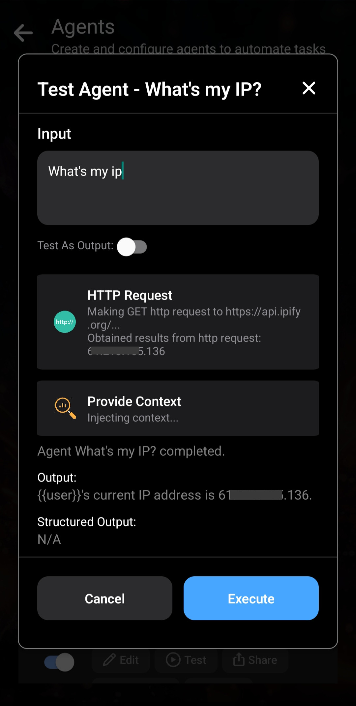

_Si ce n’est pas déjà fait, commencez par lire [la présentation rapide du fonctionnement des Agents dans Layla](/how-to-enable-agents-functions-and-tool-calling-in-layla/)._

Cet article examine plus en détail les fonctions agentiques de Layla.

**Fonctionnement interne des Agents**

Les Agents sont des flux de travail autonomes exécutés lorsque cela est nécessaire pendant les conversations avec le LLM. Chaque Agent possède un _déclencheur_, activé dans des conditions configurables précises, et une liste d’outils exécutés successivement.

Le résultat de l’Agent est injecté dans la conversation sous forme de contexte, que le LLM utilise pour fournir une réponse contextualisée.

**Déclencheurs**

Layla propose de nombreux types de déclencheurs. L’image suivante en montre quelques-uns :

- **Intent** — Layla classe l’intention de votre entrée et déclenche l’Agent selon l’intention détectée. Le classificateur en contient de nombreuses, comme « search news », « query weather », « set alarm » et « set calendar ». La liste complète apparaît dans le menu déroulant après l’ajout d’un _Intent Trigger_.
- **Regex** — L’Agent est déclenché lorsqu’une correspondance avec l’expression régulière est trouvée dans le message. Le texte correspondant devient l’entrée du premier outil.
- **Phrase** — L’Agent est déclenché lorsque la phrase saisie est détectée dans le message, sans distinction de casse. La phrase correspondante devient l’entrée du premier outil.
- **Date/Time Detected** — L’Agent est déclenché si une date ou une heure est détectée dans le message. Cette valeur devient l’entrée du premier outil.
- **MCP/Layla Tool Trigger** — Cette fonction avancée est présentée dans l’article sur [la prise en charge complète de MCP dans Layla](/full-mcp-support-in-layla/).
- **Is Voice Mode** — Un déclencheur simple qui s’active lorsque Voice Mode est actif.

Ces déclencheurs sont évalués sur chaque message d’entrée et de sortie de vos chats. Lorsqu’un déclencheur s’active, l’Agent démarre et sa condition devient l’entrée du premier outil.

**Outils**

Les _outils_ sont au cœur des Agents Layla.

Ils exécutent des fonctions : appeler des services externes, utiliser votre téléphone et bien davantage. Layla comprend de nombreux outils intégrés et de nouveaux sont ajoutés régulièrement.

Ils sont trop nombreux pour être tous présentés ici ; examinons quelques outils courants.

Dans la mini-application _Agents_, faites défiler la page pour voir les outils disponibles. Touchez-en un pour ouvrir une fenêtre d’informations. Prenons _HTTP Request_ comme exemple :

L’outil _HTTP Request_ possède plusieurs paramètres configurables. Ils peuvent être codés en dur — par exemple avec une URL précise à appeler — ou générés par le LLM comme expliqué plus loin.

Après avoir ajouté un outil, vous pouvez régler ses paramètres dans la fenêtre Edit Agent. Comme dans l’article précédent, vous pouvez saisir directement l’URL.

La sortie de chaque outil sert d’entrée au suivant. Vous pouvez ainsi enchaîner plusieurs outils dans un même Agent. Dans l’exemple, la sortie de _HTTP Request_ est la chaîne brute renvoyée par l’URL avec les paramètres configurés.

Comme indiqué précédemment, _Provide Context_ est un outil essentiel qui place la sortie finale de l’Agent dans le contexte du LLM. Il fournit au modèle les résultats fondés obtenus après l’exécution.

**Tester les Agents**

Après avoir créé un Agent, vous pouvez le tester avec le bouton _Test Agent_ de la liste. Le test affiche aussi les entrées et sorties de chaque étape afin de mieux comprendre le fonctionnement.

Prenons l’Agent « What's My IP? » comme exemple :

Le premier outil envoie une requête HTTP à [https://api.ipify.org](https://api.ipify.org).

La sortie de la requête HTTP, votre adresse IP en texte brut, est affichée.

Cette sortie est ensuite transmise à _Provide Context_, qui la met en forme comme message contextuel destiné au LLM.

Le message contextuel se configure dans l’outil. Dans cet exemple :

Remarquez les modèles entre doubles accolades, comme `{{input}}`. Le modèle `{{input}}` est remplacé par l’entrée reçue par cet outil.

Dans l’exemple, la sortie de la requête HTTP est l’entrée de _Provide Context_. Après substitution, la sortie devient : `{{user}}'s current IP address is xx.xx.xx.xx`.

Lors de l’injection dans la conversation, `{{user}}` est ensuite remplacé par la persona sélectionnée. Ce mécanisme fonctionne comme les prompts personnalisés.

**Paramètres générés par le LLM**

Vous avez peut-être remarqué que tous les paramètres des outils ont jusqu’ici été codés en dur. Nous avons tout au plus utilisé les entrées correspondantes comme paramètres.

L’intégration du LLM permet de _**lui demander de générer les entrées des outils**_. On gagne ainsi en flexibilité tout en exploitant ses capacités en langage naturel.

Un exemple courant consiste à demander au LLM de rechercher quelque chose sur le Web. Le message entier ne doit pas servir de mots-clés : le LLM peut utiliser votre message et les indices contextuels de la conversation pour produire des termes de recherche pertinents.

Autre exemple : demander au LLM de rédiger un e-mail. Vous pourriez dire « draft an email to my co-worker reminding him of our meeting ». Le LLM devrait générer le corps du message, puis ouvrir l’application de messagerie avec le contenu prérempli.

Layla permet de le faire :

Prenons l’Agent « Send Email ». L’outil contient deux paramètres : « Subject » et « Message ». L’option **LLM tool call** est réglée sur **ON**.

Elle indique au LLM de générer le contenu de ces paramètres. Lorsque l’Agent se déclenche, le LLM produit l’objet et le corps du message, puis exécute l’outil, qui ouvre votre client de messagerie avec les informations nécessaires.

Quand **LLM tool call** est sur **ON**, vous pouvez saisir des instructions en langage naturel dans les champs de paramètres. Le LLM comprend la fonction de chaque champ et génère les entrées adaptées selon le contexte de la conversation.

L’Agent _Schedule Event_ fournit un exemple plus complexe : il possède de nombreux paramètres, chacun étant expliqué en détail au LLM.
