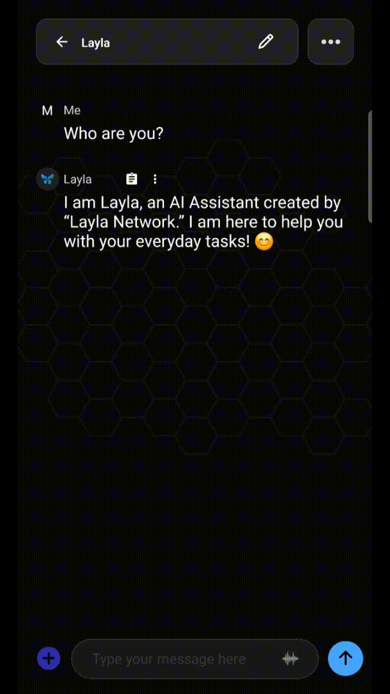

**Oui. Vous pouvez agir séparément sur chaque message d’un chat Layla : le modifier, le régénérer, le copier, le supprimer, le traduire, le lire à voix haute, etc. Appuyez longuement sur le message ou touchez son menu de débordement pour ouvrir le menu des actions.** Toutes les actions ne s’appliquent pas à tous les messages : certaines ne concernent que vos propres messages, d’autres uniquement les réponses de Layla.

Ce guide présente chaque action et les messages auxquels elle s’applique. Comme Layla fonctionne entièrement sur l’appareil, toutes ces opérations sont locales : aucun message n’est envoyé ailleurs pour être modifié ou régénéré.

## Ouvrir le menu des actions de message

Deux méthodes permettent d’accéder aux actions d’un message :

- **Appuyez longuement sur la bulle.** Maintenez votre doigt sur n’importe quel message — le vôtre ou celui de Layla — jusqu’à ce que le menu apparaisse. Ce geste principal fonctionne dans toute la vue du chat.
- **Touchez le menu de débordement.** Certains messages affichent une petite icône à trois points près de la bulle. Elle ouvre les mêmes actions sans appui long et permet de choisir précisément le message concerné.

Le menu dépend du contexte. Sur vos messages, il affiche les actions adaptées aux entrées, comme modifier, copier, supprimer, citer, épingler et créer une branche. Sur une réponse de Layla, il ajoute des actions de génération comme régénérer et réessayer. Une action absente n’est pas disponible pour ce type de message.

| Action     | Fonction                                                             | S’applique à                          |
| ---------- | -------------------------------------------------------------------- | ------------------------------------- |
| Edit       | Modifie le texte d’un message sur place                              | Vos messages et les réponses de Layla |
| Regenerate | Produit une nouvelle version d’une réponse                           | Réponses de Layla                     |
| Continue   | Poursuit un message éventuellement interrompu                        | Réponses de Layla                     |
| Copy       | Copie le texte du message dans le presse-papiers                     | Tous les messages                     |
| Delete     | Retire le message de la conversation                                 | Tous les messages                     |
| Speak      | Lit le message à voix haute avec la voix de synthèse vocale actuelle | Tous les messages                     |

## Modifier un message

La modification permet de changer le texte sans recommencer. Appuyez longuement sur le message, touchez **Edit**, modifiez le texte, puis confirmez.

Elle fonctionne des deux côtés de la conversation. Le cas le plus courant consiste à modifier **votre propre message** pour corriger une faute, préciser un prompt ou changer votre demande, puis à le renvoyer afin que Layla réponde à la version corrigée. Modifier **la réponse de Layla** est utile pour le jeu de rôle et l’écriture : conservez les parties qui vous plaisent et ajustez les autres manuellement au lieu de tout régénérer.

Lorsque vous modifiez et renvoyez un ancien message, les réponses suivantes restent fondées sur sa formulation d’origine. Selon l’ancienneté du message, régénérez la réponse suivante de Layla afin de préserver la cohérence.

## Régénérer et réessayer une réponse

**Regenerate** demande à Layla de produire une nouvelle version d’une réponse. Si elle ne convient pas, appuyez longuement dessus et touchez **Regenerate**. C’est le principal moyen d’améliorer le résultat sans réécrire le prompt.

Les réponses régénérées sont généralement conservées comme variantes entre lesquelles vous pouvez naviguer. Vous pouvez ainsi comparer la nouvelle version à la précédente et choisir celle que vous préférez sans perdre l’original.

Comme la génération s’effectue sur votre appareil, sa vitesse dépend du matériel du téléphone et de la taille du modèle chargé, et non d’une connexion réseau.

## Supprimer un message

La suppression retire un seul message de la conversation. Appuyez longuement dessus, touchez **Delete**, puis confirmez. Cette opération se distingue de l’effacement d’une conversation entière ou de tout l’historique : elle ne concerne que le message sélectionné.

Vous pouvez ainsi retirer un faux départ, une réponse dupliquée ou un message à exclure du contexte. Comme le modèle lit l’historique pour déterminer sa prochaine réponse, retirer un message parasite peut aussi nettoyer son contexte. La suppression est locale et définitive ; le message ne peut pas être récupéré.

> **Remarque :** supprimer un message ancien recharge le chat, et le modèle recommence son traitement depuis le message supprimé. Selon sa position, cela peut prendre un certain temps.

## Créer une branche de conversation

**Branch** crée une bifurcation à partir du message actuel afin d’explorer une autre suite sans perdre l’original. Vous obtenez un nouveau chemin pour essayer une direction, une formulation ou un résultat différent, tout en conservant la conversation initiale.

Les branches conviennent particulièrement au jeu de rôle et à l’écriture, lorsque vous souhaitez voir une scène évoluer de deux façons. Elles servent aussi aux tâches de productivité pour tester une autre approche sans abandonner la première. Au lieu d’écraser un chemin, vous conservez les deux.

## Questions fréquentes

### Puis-je modifier les réponses de Layla ou seulement mes messages ?

Les deux. Modifier vos messages est le cas le plus courant, mais vous pouvez aussi modifier les réponses de Layla sur place afin d’en conserver l’essentiel et d’ajuster une partie manuellement.

### La régénération supprime-t-elle l’ancienne réponse ?

Non. Les réponses régénérées sont conservées comme variantes entre lesquelles vous pouvez naviguer, comparer les versions et choisir celle que vous préférez.

### Puis-je récupérer un message supprimé ?

Non. La suppression est locale et définitive. Confirmez uniquement si vous êtes certain de ne plus avoir besoin du message.

### Puis-je créer une branche sans perdre la conversation d’origine ?

Oui. Une branche crée un chemin distinct depuis un message choisi et laisse intacte la conversation d’origine, à laquelle vous pouvez revenir.

### Les actions de message fonctionnent-elles hors ligne ?

Oui. Layla fonctionne sur votre appareil : modification, régénération, copie, suppression et toutes les autres actions ont lieu localement, sans connexion Internet.

Ces actions contribuent à rendre un assistant sur appareil pratique au quotidien : modifier un prompt, régénérer une réponse ou créer une branche s’effectue localement sur votre matériel, sans qu’aucune donnée ne quitte l’appareil.
