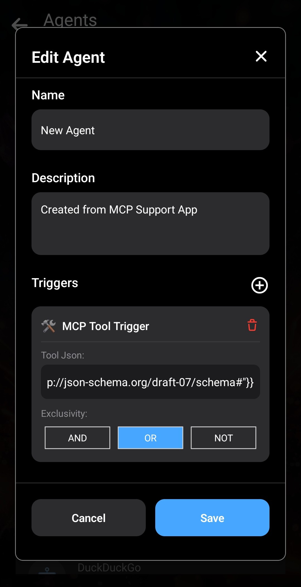

_Dans les deux articles précédents, nous avons [présenté les Agents dans Layla](/how-to-enable-agents-functions-and-tool-calling-in-layla/), puis [examiné leur fonctionnement en détail](/deep-dive-into-layla-agents/)._

Dans cet article, découvrons la dernière couche des Agents Layla : la prise en charge complète de MCP.

**MCP**

MCP signifie Model Context Protocol. Il permet aux LLM d’interagir avec des services externes selon un protocole prédéfini qui associe langage naturel et sorties structurées. Pour en savoir plus, consultez l’[introduction au Model Context Protocol](https://modelcontextprotocol.io/docs/getting-started/intro).

En général, MCP place la signature de chaque outil accessible à un LLM dans son prompt système. Le LLM doit déterminer intelligemment quel outil appeler au cours de la conversation, puis poursuivre celle-ci avec le résultat de l’appel.

**Agents Layla et MCP**

Par défaut, les Agents de Layla sont déclenchés par une combinaison de mots-clés et de techniques classiques d’apprentissage automatique, comme la détection d’intention. Le contexte est limité sur mobile : injecter tous les outils possibles dans le prompt système consomme une grande partie de ce contexte précieux. Les petits modèles mobiles ne choisissent pas non plus toujours le meilleur outil ; les techniques traditionnelles présentent donc ici un avantage.

Layla peut également laisser le LLM choisir entièrement l’outil à appeler. Voyons comment cela fonctionne.

L’Agent _Layla: Introspection_ montre comment utiliser l’appel d’outils MCP dans Layla. Recherchez d’abord le nom de l’outil dans la mini-application Agents, puis modifiez-le. La fenêtre d’édition qui s’ouvre permet d’en voir le fonctionnement interne.

Vous remarquerez surtout que tous les déclencheurs utilisent le « Layla Tool Trigger » spécial évoqué dans l’article précédent. Il indique à l’Agent d’injecter dans le prompt système les signatures de tous les outils possibles. Dans cet exemple, celles de _Layla Apps Info_, _Layla: Clear Caches_ et _Layla: Operating Stats_ sont injectées.

La section _Tools Flow_ contient un seul outil : _Layla Tool Call_, avec `{{match$1}}` comme entrée. Ne le modifiez pas : l’appel d’outil attend ce format. Aucun autre outil n’est nécessaire, car le LLM décide quand appeler chacun des outils répertoriés dans la section Triggers. Le résultat de chaque outil est automatiquement ajouté au contexte du LLM, qui peut enchaîner d’autres appels si nécessaire.

Pour changer la liste, modifiez l’Agent _Introspection_, retirez ses déclencheurs, puis ajoutez-en de nouveaux. La liste déroulante donne accès à tous les outils disponibles dans Layla.

_Remarque : choisissez les outils avec mesure. Une liste excessive risque d’empêcher le LLM de déterminer lequel appeler._

Nous conseillons de regrouper vos outils courants dans un même Agent, puis d’associer cet Agent à un nouveau personnage. Le personnage obtient ainsi un objectif clair et précis, ce qui réduit fortement les hallucinations.

**Connexion à des serveurs MCP externes**

Layla peut se connecter à des serveurs MCP externes, qu’ils soient proposés par des organisations connues ou exécutés sur votre propre PC.

La mini-application _MCP Support_ vous aide à détecter et configurer automatiquement ces serveurs.

Le [dépôt des serveurs Model Context Protocol](https://github.com/modelcontextprotocol/servers/tree/main) répertorie des serveurs MCP courants.

Il contient des serveurs de nombreuses organisations connues, ainsi que du code permettant d’héberger le vôtre.

Un serveur MCP bien conçu possède un point de terminaison de découverte des outils. Prenons comme exemple le serveur MCP public _Fetch_, qui extrait des pages Web afin que le LLM puisse en lire le contenu.

Ouvrez la mini-application _MCP Support_ dans Layla et saisissez l’URL du serveur MCP distant :

Appuyez sur _Discover Tools_. Layla se connecte au serveur MCP et demande la liste des outils disponibles. Dans cet exemple, le serveur n’en renvoie qu’un, nommé « fetch ».

Sélectionnez l’outil afin qu’il apparaisse en vert, puis appuyez sur _Create Agent_. Layla crée un nouvel Agent avec l’outil choisi.

La mini-application Agents s’ouvre sur un Agent nommé « New Agent ». Vous pouvez modifier son nom et sa description.

Ne modifiez aucun autre paramètre — Triggers, Tool Flow, etc. Ils sont déjà correctement configurés.

Pour activer l’Agent, créez un personnage et associez-le-lui. Nous utilisons un nouveau personnage pour éviter que cet Agent entre en conflit avec ceux qui existent déjà dans Layla. Vous pouvez aussi désactiver l’Agent Web Search existant.

Ouvrez l’onglet _Advanced_ du créateur de personnages.

Appuyez sur _Select Agents_ pour ouvrir la fenêtre.

Sélectionnez l’Agent _Fetch_. Il apparaît alors dans la liste.

Enregistrez ensuite votre personnage. Dans cet exemple, nous utilisons un double de _Kip_.

Kip déclenche l’appel d’outil MCP lorsque vous le lui demandez :

Après l’appel, _Kip_ répond à votre demande avec sa propre personnalité. C’est ce que nous entendons par **personnalisé** : vos personnages répondent aux demandes faisant intervenir des outils avec la personnalité que vous avez configurée.

Voici le fichier JSON de l’Agent MCP à télécharger et importer dans Layla :

[Télécharger fetch.json](/assets/articles/full-mcp-support-in-layla/fetch.json)
