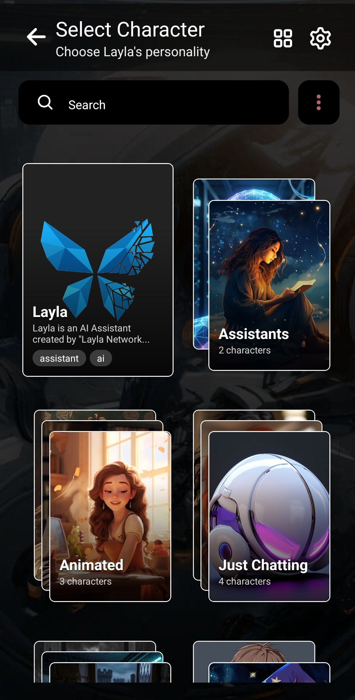
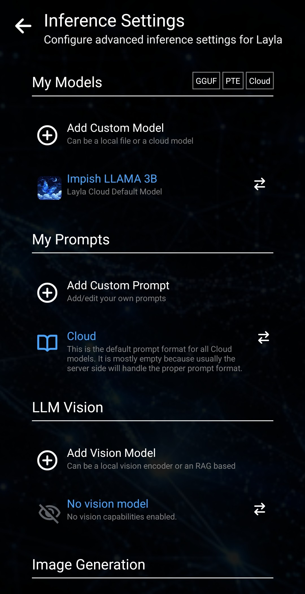
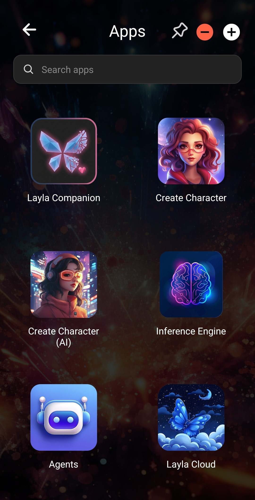

**Layla est un assistant IA pour Android ou iOS qui peut utiliser des modèles d'IA dans le cloud ou exécuter un LLM local directement sur votre téléphone.** Ce guide vous accompagne dans la configuration initiale, votre première conversation et le choix entre l'IA dans le cloud et l'IA hors ligne. Vous n'avez pas besoin de tout configurer immédiatement, et aucun des choix effectués lors de l'intégration n'est définitif.

## Choisissez comment vous souhaitez utiliser Layla

Lorsque vous ouvrez Layla pour la première fois, l'application vous demande comment vous souhaitez l'utiliser. Chaque option prépare une configuration de départ différente :

- **Basique :** commencez avec un chatbot hors ligne rapide et spécialisé, ainsi qu'un modèle local léger. Les fonctions supplémentaires restent désactivées. Cette option convient si vous souhaitez commencer par un chat IA simple et ajouter d'autres possibilités plus tard.
- **Assistant :** configurez Layla comme assistant personnel IA privé pour discuter, planifier et accomplir des tâches quotidiennes. Ce mode comprend des Agents exécutés sur l'appareil, capables d'utiliser des outils et de suivre des instructions en plusieurs étapes au lieu de produire uniquement une réponse conversationnelle.
- **Ami :** créez un compagnon IA personnel pour les conversations informelles, la réflexion ou simplement pour avoir quelqu'un à qui parler. La configuration recommandée privilégie les fonctions de compagnon telles que la mémoire, la voix et Dreams, afin de rendre les conversations plus continues et personnelles.
- **Jeu de rôle :** commencez avec les fonctions nécessaires pour créer des personnages, élaborer des scénarios et mener des conversations narratives. Vous pouvez participer vous-même ou laisser plusieurs personnages IA interagir, tandis que la mémoire aide à préserver le contexte de la scène.
- **Génération d'images :** préparez Layla à transformer des prompts en images sur votre appareil. Vous pouvez générer des images indépendantes ou les utiliser pour créer des personnages, des scènes et des histoires originales.
- **Cloud :** utilisez des modèles d'IA hébergés lorsque vous recherchez davantage de capacité sans dépendre du matériel de votre téléphone pour exécuter le modèle. Les requêtes cloud sont envoyées au fournisseur sélectionné. Cette option présente donc des exigences de confidentialité et de connexion différentes de celles d'un modèle local.
- **Expert :** importez votre propre modèle GGUF et choisissez précisément les fonctions, outils, prompts et paramètres avancés à activer. Cette option s'adresse aux utilisateurs de LLM locaux qui savent déjà comment ils souhaitent configurer leur environnement d'inférence.

Choisissez l'option qui correspond le mieux à ce que vous souhaitez essayer en premier. Layla se configurera avec les fonctions et les mini-apps recommandées pour ce cas d'usage. Vous disposez ainsi d'un point de départ utile sans devoir comprendre chaque paramètre avant de commencer.

Le cas d'usage choisi ne vous enferme pas dans une configuration. Vous pourrez à tout moment activer ou désactiver des fonctions, changer de mini-apps et modifier le fonctionnement de Layla.

<video controls playsinline src="/assets/articles/getting-started/use-cases.mp4"></video>

## Commencez votre première conversation

L'écran suivant dépend du cas d'usage sélectionné. Layla affiche soit l'écran d'accueil, soit l'écran de sélection des personnages.

### Depuis l'écran d'accueil

Si l'écran d'accueil de Layla s'affiche, appuyez sur le grand papillon sous **Appuyer pour discuter**. Une conversation avec Layla s'ouvre et vous pouvez envoyer votre premier message.

### Depuis l'écran de sélection des personnages

Certains cas d'usage ouvrent plutôt l'écran de sélection des personnages. Choisissez le personnage ou la personnalité avec qui vous souhaitez parler, puis commencez la conversation.

L'expérience de base du chat et des personnages vous semblera familière si vous avez déjà utilisé des applications de chat avec des personnages comme Character.AI : choisissez votre interlocuteur, saisissez un message et poursuivez la conversation. Layla vous offre aussi beaucoup plus de contrôle, mais vous pouvez laisser ces options de côté jusqu'à ce que vous soyez prêt à les découvrir.

## Choisissez entre Layla Cloud et un LLM local

Après quelques échanges, Layla vous demande comment vous souhaitez continuer. Deux possibilités s'offrent à vous :

- **Layla Cloud :** connectez-vous et poursuivez la conversation avec un modèle cloud. Vous n'avez pas besoin de télécharger de modèle sur votre téléphone.
- **Exécuter sur votre téléphone :** choisissez un modèle local et exécutez-le de manière privée sur votre appareil. Après la configuration, cette option ne nécessite ni connexion à un compte ni accès à Internet. L'IA locale fonctionne toutefois mieux sur un téléphone doté d'un matériel suffisamment performant et d'assez d'espace libre pour stocker le modèle.

Ce choix n'est pas définitif non plus. Vous pouvez commencer avec un modèle cloud pour une configuration plus rapide, passer ensuite à un LLM local pour bénéficier d'une IA privée hors ligne, ou alterner entre les modèles disponibles selon l'évolution de vos besoins.

## Changez de modèle ultérieurement

Vous pouvez revenir dans les **Paramètres d'inférence** à tout moment pour modifier la manière dont Layla génère ses réponses. Vous pouvez y gérer les modèles GGUF locaux, les modèles compatibles exécutés sur l'appareil, les modèles cloud, les prompts, les modèles de vision et les paramètres de génération d'images.

Si un modèle local est lent ou ne fonctionne pas correctement sur votre appareil, vous pouvez revenir à un modèle cloud. Si vous trouvez ensuite un modèle local adapté, vous pourrez le sélectionner sans recommencer le reste de la procédure d'intégration.

## Découvrez les fonctions et les mini-apps à votre rythme

Layla peut faire bien plus qu'assurer un simple chat IA, ce qui peut rendre l'application intimidante lors de la première ouverture. Vous n'avez pas besoin de tout apprendre immédiatement. Commencez par les conversations ou les personnages, puis activez progressivement les fonctions et les mini-apps dont vous avez besoin.

L'écran **Apps** permet de parcourir et de gérer les mini-apps consacrées aux personnages, au moteur d'inférence, aux Agents, à Layla Cloud et à d'autres fonctions. Pour obtenir des instructions détaillées, consultez [Comment activer ou désactiver les mini-apps dans Layla](/how-to-enable-disable-mini-apps-within-layla/).

Votre cas d'usage initial n'est qu'une configuration de départ. Vous pouvez faire de Layla un assistant IA simple, une application de chat avec des personnages, un outil de génération d'images, un chatbot IA privé exécuté sur votre téléphone, ou combiner ces usages selon vos besoins.

Prenez le temps de découvrir tout ce que Layla peut faire.
