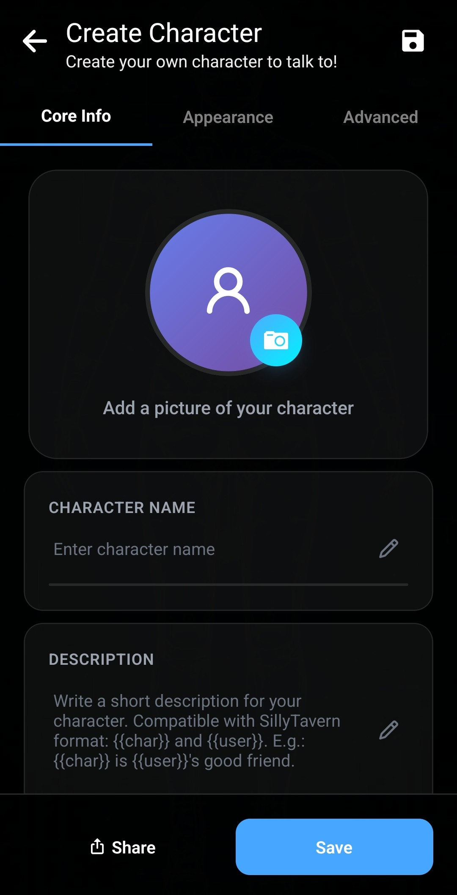

Pour commencer avec des personnages créés par d’autres personnes, consultez [l’importation depuis le Personalities Hub](/personality-hub-ai-characters/).

Le créateur de personnages de Layla permet de construire un personnage IA personnalisé pour des conversations privées sur votre appareil. Vous pouvez définir son identité, sa manière de parler, le sujet de vos échanges, son apparence et les fonctions facultatives qu’il peut utiliser.

Ce guide présente chaque onglet de l’éditeur, des informations de base aux voix, à la génération d’images et au partage.

## Ouvrir le créateur de personnages

Sur l’écran de sélection des personnages, touchez le grand bouton **+** sous votre liste. L’éditeur s’ouvre directement.

Vous pouvez aussi ouvrir **Apps** et choisir la mini-application **Create Character**. Les deux chemins mènent au même éditeur.

## Ajouter les informations de base

L’onglet **Core Info** contient les informations qui déterminent l’identité et le comportement du personnage.

Remplissez les champs comme suit :

- **Character picture :** choisissez l’image de profil qui identifie le personnage. Elle apparaît dans un petit cercle à côté de ses messages.

- **Character name :** saisissez le nom que Layla doit utiliser.

- **Description :** expliquez qui est le personnage. Incluez son histoire, son rôle, ses connaissances, ses relations ou d’autres faits qu’il doit retenir à propos de lui-même.

- **Personality :** décrivez son comportement et sa façon de communiquer : traits, valeurs, habitudes, tempérament, humour, vocabulaire et style d’expression.

- **Scenario :** définissez la situation de la conversation. Décrivez par exemple le lieu, la relation entre le personnage et l’utilisateur et ce qui se passe au début du chat.

- **Impression :** il s’agit de l’impression que le personnage a de vous. La mini-application Dream peut la générer à partir de vos anciens chats, avec un résumé de votre histoire commune et de la manière dont il vous perçoit. Vous pouvez aussi la modifier manuellement.

- **Greetings :** rédigez le message d’ouverture envoyé au début d’une nouvelle conversation. Vous pouvez en ajouter plusieurs ; Layla en choisira alors un au hasard pour chaque nouveau chat. Ajoutez un message vide si vous préférez parler en premier.

- **Tags :** ajoutez des étiquettes séparées par des virgules pour organiser les personnages. Si vous partagez ensuite le personnage, elles aideront aussi les autres utilisateurs à le trouver.

Les espaces réservés `{{char}}` et `{{user}}` peuvent être employés dans la description, la personnalité et le scénario. Layla les remplace par les noms actuels du personnage et de l’utilisateur lors de la préparation de la conversation.

Les champs sont séparés pour faciliter la rédaction. Ils ne constituent pas des instructions indépendantes envoyées à différentes parties de l’IA. Layla réunit la description, la personnalité et le scénario dans un long bloc du prompt système. Un message d’accueil sélectionné est ensuite ajouté au début d’un nouveau chat.

Le **Summary** en bas donne un aperçu de ce texte combiné. Layla estime également son temps de chargement, ce qui est utile pour les personnages très détaillés.

## Configurer l’apparence

Ouvrez l’onglet **Appearance** pour choisir les images du personnage et du chat.

La photo de profil choisie dans **Core Info** est le petit cercle affiché près des messages. Le **Character Background** est l’image statique principale du personnage, tandis que le **Chat Background** remplit l’arrière-plan de la conversation.

Vous pouvez aussi choisir un arrière-plan animé. Layla propose :

- **Rive :** un arrière-plan animé en 2D.
- **Live2D :** un modèle de personnage Live2D.
- **Mini-app :** une mini-application Layla personnalisée qui fournit l’arrière-plan.

Rive, Live2D et les mini-applications de personnage nécessitent leur propre configuration. Des guides ultérieurs les expliqueront en détail ; vous pouvez laisser l’arrière-plan animé vide pour votre premier personnage.

### Ajouter des images pour différentes expressions

Layla peut afficher une image différente selon l’émotion exprimée dans la réponse. Ouvrez le réglage des expressions et attribuez des images aux émotions comme l’admiration, l’amusement, la colère ou l’agacement.

Pendant la conversation, Layla détecte l’expression associée à la réponse et change l’image. Une expression sans image utilise l’arrière-plan par défaut. Vous pouvez ajouter les images séparément ou importer un fichier ZIP préparé.

## Choisir les voix, la génération d’images, les références et les Agents

L’onglet **Advanced** contient les intégrations facultatives et la commande d’importation d’une fiche TavernPNG existante.

### Importer un personnage TavernPNG

Un TavernPNG est un fichier image qui contient également des données de fiche de personnage. Son importation remplit automatiquement les champs et l’image compatibles. Consultez [comment importer des personnages TavernPNG dans Layla](/how-to-import-tavernpng-characters-in-layla/) pour la procédure complète.

### Donner une voix unique au personnage

Touchez **Voice** pour parcourir les voix du téléphone et des mini-applications de synthèse vocale installées dans Layla. Recherchez par nom ou étiquette et écoutez un aperçu avant de choisir.

Après la sélection, vous pouvez démarrer un chat vocal et entendre le personnage répondre avec cette voix. Consultez [comment ajouter des voix de synthèse vocale multilingues](/how-to-add-multilingual-text-to-speech-for-your-characters-in-layla/) ou [comment démarrer un chat vocal](/how-to-hear-your-characters-speak-in-layla/).

### Permettre au personnage de générer des images

Choisissez un modèle de génération d’images si vous voulez que le personnage en envoie sur demande. Le sélecteur affiche les options disponibles sur l’appareil ou via vos services configurés.

Cette fonction est facultative. Laissez **No Image Generation** sélectionné si vous n’en avez pas besoin. Pour configurer d’abord un modèle, lisez [comment activer la génération d’images dans Layla](/how-to-enable-image-generation-in-layla/).

### Références et Agents

Les documents de référence donnent accès à des informations sélectionnées. Les Agents permettent d’utiliser des outils ou flux de travail configurés. Ces fonctions avancées peuvent rester vides au début.

Pour découvrir les Agents, commencez par [comment activer les Agents, Functions et l’appel d’outils dans Layla](/how-to-enable-agents-functions-and-tool-calling-in-layla/).

## Partager ou exporter le personnage

Le partage est facultatif. Touchez **Share** pour envoyer le personnage au Personalities Hub ou le télécharger comme TavernPNG.

Les personnages partagés sur le Personalities Hub sont envoyés anonymement. Vous pouvez afficher n’importe quel nom de créateur et indiquer la source si le personnage vient d’une série, d’un film, d’un anime, d’un livre ou d’une autre œuvre. Laissez la source vide pour une création originale.

Choisissez **Download as TavernPNG** pour obtenir une fiche portable à envoyer à des amis ou importer dans une application compatible.

## Enregistrer et commencer à discuter

Touchez **Save** lorsque vous avez terminé. Le nouveau personnage apparaît dans votre liste sur l’écran de sélection. Touchez-le pour commencer un chat.

Vous pourrez revenir dans l’éditeur pour affiner la personnalité, changer l’apparence ou la voix et ajouter des fonctions. Avec les modèles hors ligne de Layla, les conversations peuvent s’exécuter localement sur l’appareil.

## Questions fréquentes

### Dois-je remplir tous les champs ?

Non. Commencez par un nom et suffisamment de texte de description, personnalité, scénario et accueil pour établir le personnage. Images, expressions, voix, génération d’images, références et Agents sont facultatifs.

### Quelle différence entre la photo de profil et l’arrière-plan du chat ?

La photo de profil est le petit cercle affiché près des messages. L’arrière-plan du chat est l’image principale derrière la conversation.

### Un personnage Layla peut-il utiliser un arrière-plan animé ?

Oui. Il peut utiliser une animation Rive, un modèle Live2D ou une mini-application Layla personnalisée.

### Puis-je partager un personnage Layla en privé ?

Oui. Téléchargez-le comme TavernPNG et envoyez directement le fichier à un ami. Vous pouvez aussi le partager anonymement sur le Personalities Hub.
