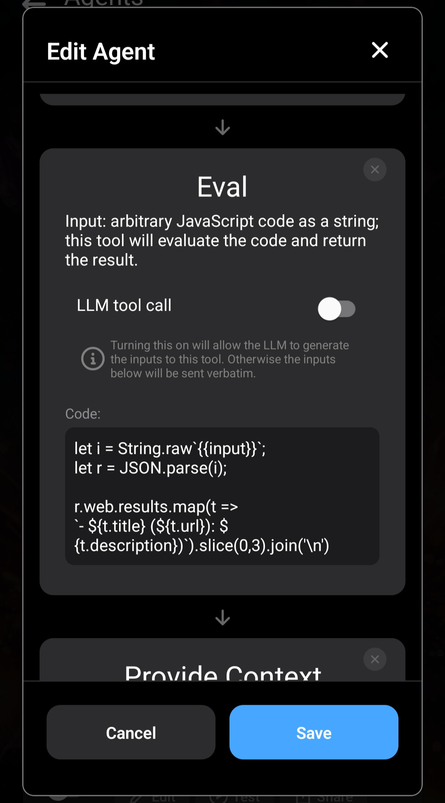

Brave propose une alternative à la recherche Google davantage axée sur la confidentialité.

Brave fournit une API : [Brave Search API](https://brave.com/search/api/).

Si vous souhaitez utiliser Brave Search plutôt que DuckDuckGo dans Layla, cet article explique comment créer votre propre Agent Brave Search avec votre clé API afin de remplacer l'Agent DuckDuckGo.

_Ce tutoriel est avancé. Vous découvrirez plusieurs méthodes pour obtenir et analyser les résultats de requêtes HTTP, que vous pourrez réutiliser dans vos futurs Agents._

**Enregistrer une clé API**

Commencez par vous inscrire sur [Brave](https://brave.com/) et obtenir une clé API en suivant les instructions du site. Nous supposerons ensuite que vous avez obtenu cette clé et que vous l'avez enregistrée.

Consultez la [documentation de l'API Brave Search](https://api-dashboard.search.brave.com/app/documentation/web-search/get-started). Elle servira à créer notre Agent.

**Dupliquer l'Agent DuckDuckGo dans Layla**

La méthode la plus simple consiste à dupliquer l'Agent DuckDuckGo dans Layla. Une grande partie de la configuration sera déjà prête.


Après avoir dupliqué l'Agent, supprimez tous les outils, mais conservez les déclencheurs. Le nouvel Agent doit lui aussi être déclenché par une requête de recherche Web, et l'Agent DuckDuckGo par défaut possède déjà cette configuration.

Ajoutez quatre outils dans cet ordre :

1. Eval
2. HTTP Request
3. Eval
4. Provide Context

Nous allons examiner leur fonction et la manière dont ils s'enchaînent.

**Eval (1)**


Le premier outil est simple : nous devons encoder l'entrée comme composant URI avant de l'envoyer à l'API. Voici la fonction JavaScript :

```js
encodeURIComponent;
```

Eval traite l'entrée de l'outil et son résultat devient la sortie. `{{input}}` représente le texte brut de votre message d'entrée.

**HTTP Request (2)**

Le deuxième outil est HTTP Request, qui appelle l'API Brave Search. Consultez la [documentation de l'API Brave Search](https://api-dashboard.search.brave.com/app/documentation/web-search/get-started).


Observez l'URL et les en-têtes. L'en-tête `X-Subscription-Token` contient notre clé API.

La chaîne de requête de l'URL contient `{{input}}`, qui sera envoyé à l'API.

**Eval (3)**

Il s'agit de l'appel d'outil le plus complexe jusqu'ici.

Cet outil reçoit la sortie de l'appel précédent, HTTP Request, qui doit être au format JSON selon la documentation de l'API Brave. Il analyse le JSON et le convertit en texte brut prêt à être transmis au LLM.



L'outil reçoit `{{input}}` sous forme de chaîne brute et l'affecte à la variable `i`. Il appelle `JSON.parse` et transforme les résultats en une liste à puces standard, qui devient la sortie de l'outil.

Il s'agit simplement de JavaScript ; les personnes familiarisées avec la programmation devraient reconnaître son fonctionnement.

**Provide Context (4)**

La dernière étape consiste à transmettre notre sortie au LLM en tant que contexte.


Cet outil indique que les résultats proviennent de l'API Brave et demande à votre personnage de vous les présenter.

Avec ces quatre outils, votre Agent est terminé.

Il est recommandé de désactiver l'Agent DuckDuckGo d'origine afin d'éviter les conflits.

Voici le fichier JSON de l'Agent à importer directement :

[Télécharger brave-search.json](/assets/articles/how-to-create-a-brave-search-agent/brave-search.json)
