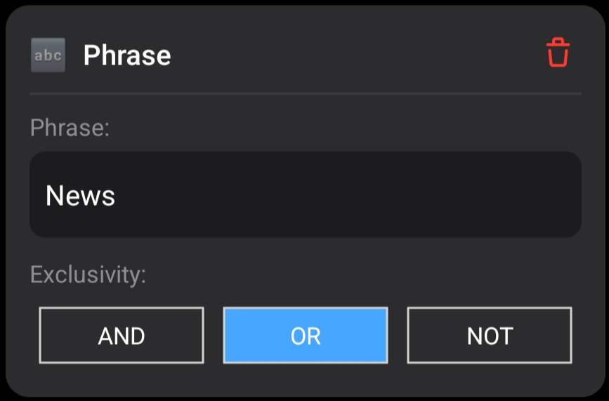

Dans cet article, nous allons créer un Agent de recherche d'actualités DuckDuckGo exécuté en Python à l'aide de la mini-application Agents de Layla. Vérifiez que [Python est activé dans Layla](/how-to-enable-python-support-in-layla/).

**Étape 1 : dupliquer un Agent existant**

La méthode la plus simple consiste à dupliquer un Agent existant, puis à modifier la copie. Changez son nom et sa description.

**Étape 2 : ajouter des déclencheurs**

Ajoutons quelques déclencheurs à cet Agent.

Nous allons ajouter l'intention **News Search** et une expression **news** codée en dur. Vous pouvez ajouter vos propres déclencheurs selon la manière dont vous souhaitez appeler cet Agent.

**Étape 3 : ajouter l'outil Python**

Ajoutons ensuite l'outil Exécuter Python. Cette section contient le code Python qui exécutera la logique d'interrogation de DuckDuckGo. Une certaine connaissance de Python est nécessaire pour comprendre cette partie.

Examinons le [code Python dans ce Gist GitHub](https://gist.github.com/l3utterfly/bf9f703c09932fd87dbf68f2118e5ab4).

En haut du fichier, notez que la bibliothèque _requests_ est nécessaire (`re` et `html` font partie de Python) :

Ouvrez la mini-application Python et ajoutez le paquet `requests`. Consultez [Comment activer la prise en charge de Python dans Layla](/how-to-enable-python-support-in-layla/) pour connaître la procédure d'installation.

La partie suivante concerne `QUERY` :

Layla injecte l'entrée — votre message ou la sortie de l'outil précédent — dans un modèle spécial, `{{input}}`. Il s'agit d'un simple remplacement de texte ; votre entrée n'est pas modifiée davantage.

Vous pouvez utiliser ce modèle pour recevoir différents types d'entrées dans votre script Python.

Pour cet Agent, nous transmettons simplement l'intégralité de la requête de l'utilisateur au script Python.

Le script effectue ensuite une requête HTTP standard et analyse la réponse avec l'analyseur HTML intégré.

Voyons maintenant comment le script Python transmet les informations au LLM. Il utilise simplement des instructions `print`.

Cette méthode est très souple. Vous pouvez afficher tout ce que le LLM doit recevoir : des résultats, des instructions ou les deux.

Copiez et collez l'intégralité du script Python dans l'entrée de l'outil Python :

Votre Agent est prêt.

**Dernière étape : tester l'Agent**

Testez l'Agent. Pensez à l'activer pour le personnage par défaut, Layla, ou à l'associer à votre personnage existant.

L'Agent commence à exécuter votre code Python lorsque le mot-clé **news** est détecté ; vous avez configuré ce déclencheur lors de la première étape.

Layla lit la sortie du code Python et l'utilise comme contexte pour répondre à votre question.

Vous disposez maintenant d'un Agent simple de recherche d'actualités DuckDuckGo. De prochains articles présenteront des Agents plus complexes.
