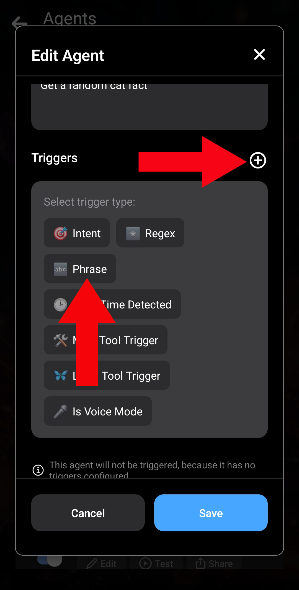
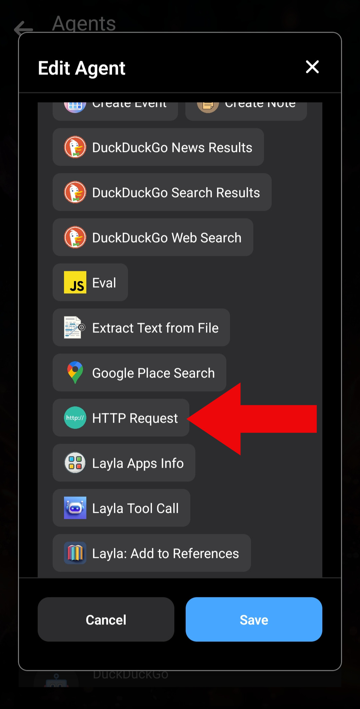
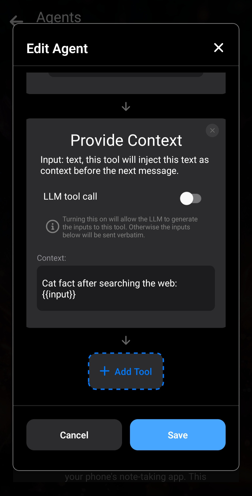

Layla vous permet de créer et de personnaliser vos propres Agents afin d’ajouter vos propres fonctionnalités.

Cet article explique d’abord comment créer un Agent simple et comment fonctionnent les Agents dans Layla, puis présente un Agent légèrement plus complexe.

Pour commencer par une présentation générale, lisez [Comment activer les Agents, les Functions et l’appel d’outils dans Layla](/how-to-enable-agents-functions-and-tool-calling-in-layla/).

**Créer un Agent**

Commençons immédiatement, sans entrer dans les détails du fonctionnement des Agents.

Ouvrez la mini-application _Agents_ dans Layla :

Le moyen le plus simple de créer un Agent consiste à en dupliquer un qui existe déjà. _Ne vous occupez pas encore du bouton **Add New Agent** ; il est destiné aux utilisateurs avancés._

Après avoir dupliqué un Agent, modifiez la nouvelle copie avec le bouton _Edit_.

Le bouton _Edit_ ouvre une fenêtre contenant les informations de l’Agent. Nous allons créer un Agent simple qui récupère une anecdote aléatoire sur les chats depuis une API publique.

Étape 1 : ouvrez la fenêtre Edit Agent.

Étape 2 : supprimez les déclencheurs et les outils existants.

Étape 3 : modifiez le nom et la description.

Le nom et la description servent uniquement de repères et ne sont pas utilisés pour le moment. _Dans les Agents plus complexes, ils deviennent importants._

Ajoutez ensuite un _déclencheur_. Appuyez sur le signe plus à côté de « Triggers » et choisissez le déclencheur « Phrase ». Ce déclencheur simple active l’Agent lorsque vous saisissez une expression donnée dans le chat. Ne vous occupez pas encore des autres options.

Nous allons déclencher cet Agent chaque fois que les mots « **cat fact** » sont envoyés. Cela comprend des messages comme « send me a **cat fact** » et « what's a cool **cat fact**? ».

La _phrase de déclenchement_ est « cat fact ». Elle n’est pas sensible à la casse : « cat fact » et « Cat fact » fonctionnent de la même manière. Comme il n’y a qu’un déclencheur, l’option _exclusivity_ n’a aucun effet ; laissez-la sur _OR_.

Ajoutez maintenant un outil à l’Agent. Nous utiliserons _HTTP Request_. L’API publique d’anecdotes sur les chats est documentée ici : [MeowFacts sur GitHub](https://github.com/wh-iterabb-it/meowfacts).

Ajoutez l’outil _HTTP Request_ et configurez-le comme ci-dessous :

Le champ _URL_ contient simplement l’URL indiquée dans la documentation de l’API. La requête utilise la méthode GET. Les deux autres champs peuvent rester vides.

Le premier outil est ajouté.

Cet outil envoie la requête GET à l’API et récupère le résultat. Il faut ensuite _indiquer_ à Layla comment utiliser ce résultat. La méthode la plus simple consiste à utiliser _Provide Context_. Cet outil reçoit une entrée et l’injecte dans le contexte de la conversation. Layla utilisera alors ce contexte pour répondre.

Faites défiler l’outil jusqu’en bas et appuyez à nouveau sur _Add Tool_. Choisissez cette fois _Provide Context_. Il sera enchaîné après l’outil _HTTP Request_ que vous venez d’ajouter.

Nous indiquons au LLM que l’anecdote sur les chats provient d’une recherche sur le Web :

Nous utilisons le modèle spécial `{{input}}`. Il est remplacé par la _sortie_ de l’outil précédent : la sortie du précédent devient l’entrée de l’outil actuel. Ne vous occupez pas encore des autres options, comme _LLM tool call_.

L’Agent est terminé. Enregistrez-le, puis revenez au chat avec Layla.

Vous pouvez voir le nouvel Agent en action : il envoie une requête HTTP à votre URL, puis injecte le résultat et les instructions dans le contexte.

**Conclusion**

Vous connaissez maintenant le fonctionnement général des Agents dans Layla. Chaque Agent est _déclenché_ dans certaines conditions : phrases, expressions régulières ou conditions plus complexes. Il appelle ensuite les outils configurés dans l’ordre, en transmettant la sortie de chacun comme entrée du suivant.

L’outil _Provide Context_ est essentiel. Il s’agit généralement du dernier outil ajouté, car il transmet au LLM — Layla dans ce cas — les résultats de l’exécution. Sans lui, l’Agent s’exécute silencieusement et Layla n’en sait rien. Vous l’utiliserez presque toujours lors de la création de vos propres Agents.

**Un Agent légèrement plus complexe**

Voici un exemple d’Agent un peu plus complexe qui utilise le « cerveau » de votre LLM.

Nous envoyons une nouvelle requête _HTTP Request_ à une API. Celle-ci renvoie une image aléatoire de chien : [https://random.dog/woof.json](https://random.dog/woof.json).

Cette fois, l’API renvoie l’URL d’une image. Nous demandons ensuite au LLM de la mettre correctement en forme et de l’afficher.

Étape 1 : l’outil HTTP Request fonctionne comme précédemment, mais avec une autre URL d’API. La différence se trouve dans l’instruction de _Provide Context_. Nous indiquons au LLM que le résultat est du JSON contenant un champ `url`, à utiliser pour afficher l’image au format Markdown.

Étape 2 : voici le résultat de l’exécution de l’Agent.

Cet Agent plus complexe fonctionne mieux avec un modèle plus grand, d’environ 8 milliards de paramètres ou davantage. Il est encore possible que le LLM ne mette pas parfaitement l’image en forme.

Cet exemple montre les fonctions que vous pouvez créer avec les Agents Layla.

Vous pouvez maintenant apprendre à créer des Agents **véritablement utiles** dans les articles suivants :

- [Créer un Agent de jeu de rôle](/how-to-create-a-roleplay-agent/)
- [Créer un Agent de génération d’images](/creating-an-image-generation-agent/)
