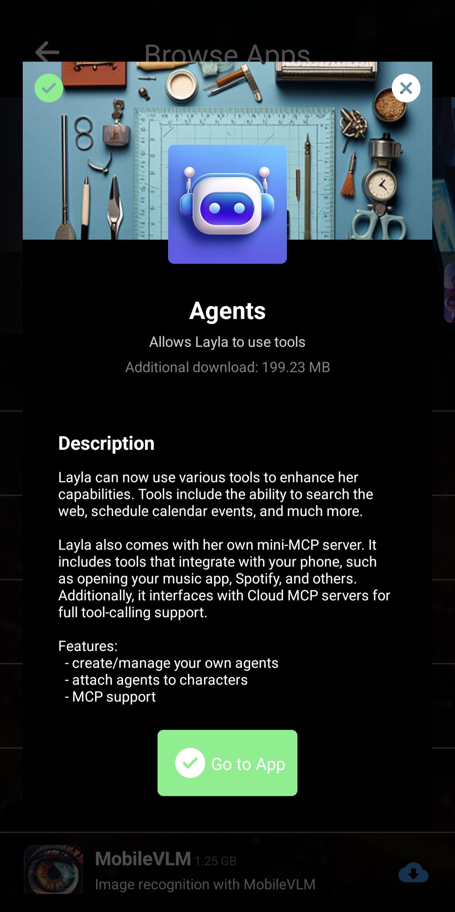

Layla v6 prend en charge des _Agents_ locaux exécutés sur votre appareil, ce qui permet à Layla d'utiliser des outils et de communiquer avec des services externes.

Cet article présente le fonctionnement des Agents dans Layla et ce que vous pouvez accomplir avec eux.

**La mini-application Agents**

Pour déverrouiller les fonctions agentiques de Layla, installez la mini-application **Agents** depuis l'écran Parcourir les applications.

Téléchargez et installez la mini-application **Agents** dans Layla. Lorsque vous ouvrez l'application, un grand choix d'Agents déjà créés et immédiatement utilisables s'affiche.

_Ces outils sont déjà créés et fonctionnels. Vous n'avez pas besoin de les modifier._ Vous pouvez revenir en arrière et démarrer un nouveau chat avec Layla ; ils fonctionneront automatiquement.

Dans l'écran ci-dessus, les Agents _Web Reader_ et _DuckDuckGo News Results_ sont activés et permettent d'obtenir les dernières actualités sur Internet.

Les Agents de Layla peuvent accomplir de nombreuses autres tâches : programmer un événement dans votre calendrier, créer des alarmes et des rappels, envoyer des e-mails ou des SMS, et bien plus encore. Parcourez la mini-application Agents pour consulter tous les Agents disponibles.

**Activer et désactiver des Agents**

Par défaut, tous les Agents activés dans la _mini-application Agents_ sont disponibles pour Layla, le personnage. Si vous ne souhaitez pas que Layla accède à un Agent, désactivez le commutateur situé sous son icône.

Vous pouvez également associer des Agents à vos personnages personnalisés. Pour cela, ouvrez l'onglet _Avancé_ dans l'éditeur de personnage :

Appuyez sur _Sélectionner des Agents_ pour afficher la liste des Agents disponibles. Sélectionnez ceux que vous souhaitez associer à votre personnage. Seuls les Agents sélectionnés seront activés.

Il n'est pas toujours souhaitable que vos personnages accèdent à tous les Agents. Un nombre excessif d'Agents peut les perturber. Vous pouvez aussi avoir créé un personnage uniquement destiné au jeu de rôle et ne pas vouloir rompre l'immersion en le laissant « rechercher sur le Web » pendant une session. Layla vous permet de personnaliser librement l'utilisation des Agents.

_Remarque : le nom Layla désigne à la fois l'application dans son ensemble et « Layla », le personnage par défaut identifié par le logo en forme de papillon. Ce personnage est utilisé si vous ne créez aucun personnage personnalisé._

**Créer vos propres Agents**

Layla permet de créer vos propres outils et Agents. Vous pouvez les personnaliser selon vos besoins ou les intégrer à vos propres services.

Pour approfondir la création d'Agents et d'outils ainsi que leur fonctionnement interne, consultez ces articles :

- [Créez rapidement votre premier Agent](/how-to-create-agents-in-layla/)
- [Fonctionnement détaillé des Agents](/deep-dive-into-layla-agents/)
- [Prise en charge de MCP dans Layla](/full-mcp-support-in-layla/)
