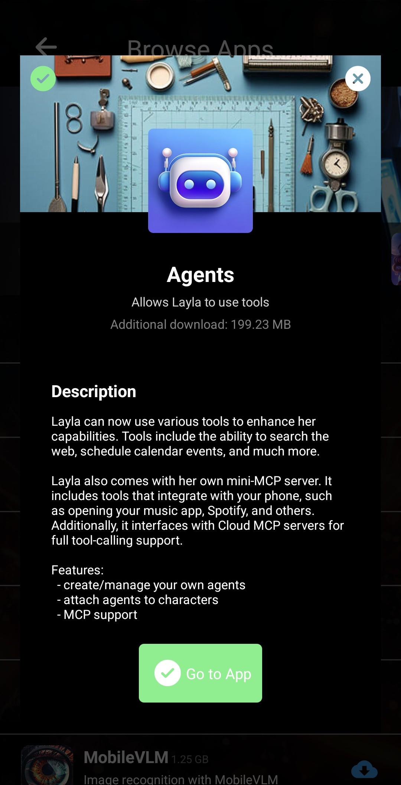
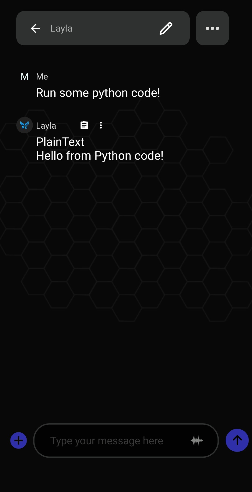

Les Agents Layla peuvent exécuter du code Python depuis la mise à jour v6.7.0 : [Layla v6.7.0 a été publiée](https://www.layla-network.ai/post/layla-v6-7-0-has-been-published).

Pour activer l'exécution de code Python, nous devons installer quelques mini-applications. Si nécessaire, consultez [Comment ajouter des fonctionnalités (mini-applications) dans Layla](/how-to-add-features-mini-apps-in-layla/).

**Étape 1 : installer les mini-applications _Agents_ et _Interpréteur Python_**

Ouvrez vos applications, appuyez sur le signe plus et parcourez les mini-applications. Recherchez _Agents_ et _Interpréteur Python_. Appuyez sur **Télécharger** pour les ajouter à Layla.

**Étape 2 : tester l'_Interpréteur Python_**

Après avoir installé ces deux mini-applications, ouvrez l'Interpréteur Python pour le tester.

Essayez d'exécuter un script « Hello Layla » simple en appuyant sur le bouton **Exécuter** en haut à droite.

Le texte vert « Hello Layla! » doit s'afficher dans la sortie de la console. Cela confirme que Python fonctionne dans Layla.

**Étape 3 (facultative) : installer des dépendances**

Les scripts Python sont bien plus utiles lorsqu'ils peuvent utiliser des bibliothèques et des dépendances. Layla permet de les installer.

Le **Gestionnaire de paquets** situé sous la sortie permet d'installer des paquets Python avec `pip`, comme sur un PC.

Installons `requests`, une bibliothèque courante pour effectuer des requêtes réseau que vous utiliserez souvent.

Saisissez `requests` dans le champ du Gestionnaire de paquets et appuyez sur **Ajouter**.

Conseil : ce champ fonctionne comme une ligne de commande. Vous pouvez ajouter des arguments tels que `--upgrade` pour remplacer les paquets déjà installés, fixer une version avec `[nom du paquet]==[version]` ou installer plusieurs paquets en séparant leurs noms par des espaces.

Un texte vert détaillant la progression de l'installation doit ensuite s'afficher.

**Étape 3 : créer un Agent de test**

Les scripts Python deviennent beaucoup plus utiles lorsque des Agents peuvent les exécuter, ce que Layla prend en charge.

Nous allons créer un Agent de test simple qui affiche un texte destiné au LLM. De prochains articles présenteront des Agents plus complexes.

Revenez dans la mini-application Agents. Le moyen le plus simple consiste à dupliquer un Agent existant.

Modifiez son nom et sa description pour pouvoir le reconnaître.

Modifiez ce nouvel Agent :

Pour le moment, nous utiliserons simplement l'expression **Python**. Chaque fois que vous mentionnerez « Python » dans vos messages à Layla, cet Agent sera déclenché. Des Agents plus complexes nécessiteront naturellement des déclencheurs plus élaborés.

Ajoutez l'outil **Exécuter du code Python** :

Dans l'outil de code Python, vous pouvez modifier le script à exécuter et ajouter les dépendances nécessaires. Pour ce test, une simple instruction `print` suffit :

Comme ce code `print` ne nécessite aucune dépendance, laissez cette section vide.

Votre Agent est créé.

Revenez en arrière et démarrez un chat avec Layla. Vérifiez que votre Agent est activé en contrôlant son interrupteur dans la liste des Agents.

Lorsque vous mentionnez « Python », le code est exécuté et sa sortie est envoyée au LLM.

