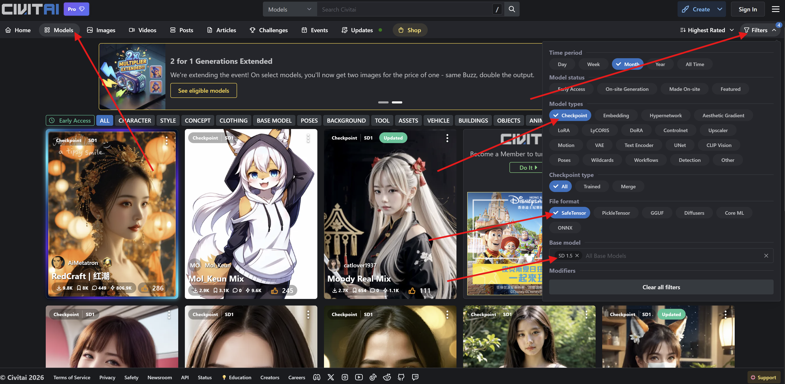

Layla prend en charge les modèles Safetensor pour la génération d'images. La plupart des fichiers Safetensor de génération d'images sont disponibles sur [Civitai](https://civitai.com/).

Ce tutoriel vous accompagne dans l'importation de fichiers Safetensor de Civitai vers Layla.

**Étape 1 : ouvrir [Civitai](https://civitai.com/)**

Ouvrez la section **Modèles**. Dans les filtres situés en haut à droite, sélectionnez **Checkpoint** sous **Type de modèle**. Sous **Format de fichier**, sélectionnez **SafeTensor**, puis sous **Modèle de base**, sélectionnez **SD 1.5**.

Vous obtiendrez une liste de tous les modèles d'images pris en charge par Layla.

**Étape 2 : télécharger le fichier Safetensor**

Téléchargez le fichier Safetensor depuis la page de téléchargement. _Vérifiez que sa taille est d'environ 2 Go. Cela indique que le fichier est correctement formaté._

**Étape 3 : importer le fichier dans Layla**

Ouvrez **Paramètres** → **Paramètres d'inférence**.

Faites défiler jusqu'aux paramètres de **Génération d'images**, puis appuyez sur **Ajouter un modèle personnalisé**.

Sélectionnez le fichier Safetensor que vous venez de télécharger. Layla commencera à l'importer.

**Étape 4 : générer une image**

Une fois votre modèle d'images importé, ouvrez la mini-application Local Dream et utilisez-la pour générer une image.

