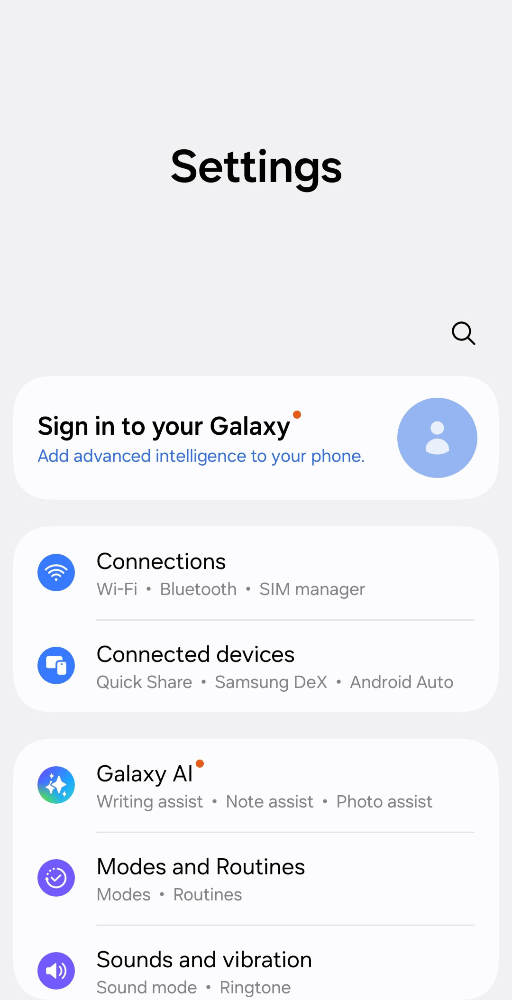

Depuis la version v6.1.0, Layla peut devenir l'assistant par défaut de votre téléphone.

Voici le tutoriel de Samsung expliquant [comment modifier l'assistant par défaut sur votre téléphone Samsung](https://www.samsung.com/us/support/answer/ANS10001575/).

Voilà ! Lorsque vous maintenez le bouton d'alimentation enfoncé, Layla s'ouvre comme assistant par défaut.

Vous pouvez définir un personnage par défaut dans Layla afin que l'assistant lancé soit votre propre personnage. Votre assistant personnel sur le téléphone peut ainsi adopter le personnage de votre choix.

Voici une démonstration :

<video controls playsinline src="/assets/articles/how-to-replace-google-gemini-with-layla-as-your-phone-s-default-assistant/layla-default-assistant-demo.mp4"></video>
