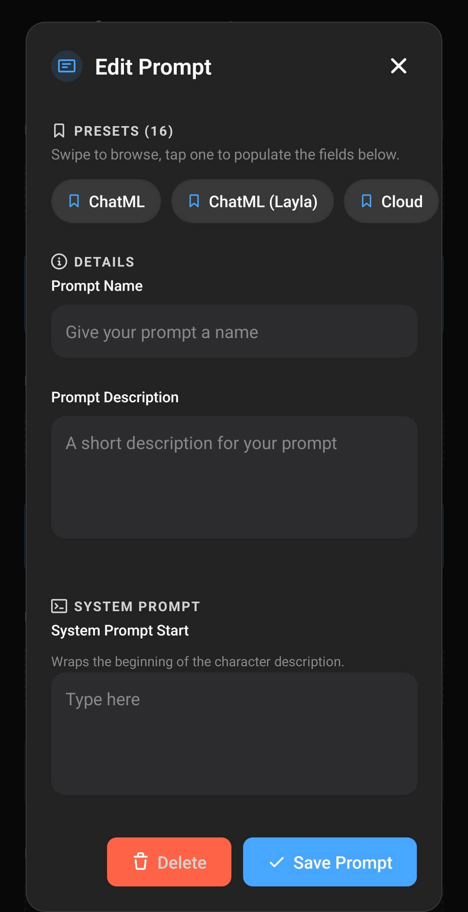

Un modèle de prompt personnalisé indique à Layla comment organiser la description du personnage, les instructions, l’historique de la conversation, les messages de l’utilisateur et les réponses du modèle avant de les envoyer à un modèle d’IA. Il ne modifie pas le modèle lui-même. Il traduit une conversation Layla dans la structure exacte apprise par le modèle pendant son entraînement.

Les modèles inclus avec Layla disposent déjà de paramètres de prompt adaptés. Vous les modifiez généralement lorsque vous ajoutez un modèle personnalisé ou lorsque vous souhaitez délibérément changer la manière dont Layla donne ses instructions au modèle. Si vous n’avez pas encore importé de modèle, commencez par [Comment ajouter un modèle d’IA personnalisé à Layla](/fr/how-to-add-custom-models-to-layla/).

## Pourquoi le modèle de prompt doit correspondre au modèle

Chaque modèle de conversation attend un format de prompt particulier. Un modèle peut par exemple utiliser ChatML, Llama, Gemma, Mistral ou un autre format propre à sa famille. Ces formats emploient des marqueurs différents pour identifier le message système, l’utilisateur, l’assistant et la fin de chaque tour.

Le bon format est déterminé par le modèle ou son fine-tune, et pas seulement par le type de fichier GGUF. Deux modèles GGUF peuvent nécessiter des modèles de prompt différents, et même des modèles reposant sur la même architecture peuvent avoir été entraînés avec des formats de conversation différents.

Lorsque vous sélectionnez un modèle local, Layla peut choisir un preset de prompt probable à partir du nom du fichier. Considérez-le comme un point de départ. Recherchez des termes tels que **format de prompt**, **chat template** ou **instruct template** sur la fiche du modèle ou sa page de téléchargement, puis vérifiez que le preset sélectionné dans Layla correspond bien.

Un mauvais modèle de prompt peut amener le modèle à :

- ignorer la description du personnage ou les instructions système ;
- afficher des marqueurs spéciaux dans sa réponse ;
- poursuivre la conversation à la place de l’utilisateur au lieu de s’arrêter ;
- confondre les messages de l’utilisateur et de l’assistant ;
- produire des réponses courtes, répétitives ou mal structurées.

Pour en savoir plus sur les modèles, les quants et les fiches de modèle, consultez [Qu’est-ce que GGUF ? Guide des modèles GGUF en termes simples](/fr/what-are-gguf-models-what-are-model-quants/).

## Ouvrir Mes prompts et vérifier le format sélectionné

Ouvrez **Paramètres d’inférence** depuis la page **Paramètres** de Layla, ou ouvrez la mini-application **Paramètres d’inférence**. Le modèle sélectionné apparaît dans **Mes modèles** et son format de prompt actif juste en dessous, dans **Mes prompts**.

Dans l’exemple ci-dessous, un modèle Gemma 4 est sélectionné et **Gemma 4** est le prompt actif. La carte **Ajouter un prompt personnalisé** crée un nouveau format, tandis que le bouton de changement du prompt actif ouvre la liste des formats disponibles.

Appuyez sur le bouton de changement du prompt actif pour ouvrir **Sélectionner un prompt**. Les formats intégrés, notamment ChatML, Llama 3, Phi, OpenELM et Gemma, apparaissent avec les prompts personnalisés que vous avez enregistrés. Le format actif est surligné en bleu.

Si la documentation du modèle mentionne l’un de ces formats, appuyez dessus pour utiliser le preset sans rien créer. Créez un prompt personnalisé lorsque le modèle nécessite une variante absente de la liste ou lorsque vous souhaitez ajouter vos propres instructions tout en conservant le format exigé par le modèle.

## Créer un prompt personnalisé

Appuyez sur **Ajouter un prompt personnalisé** dans **Mes prompts** pour ouvrir l’éditeur. Sa partie supérieure contient une rangée horizontale de **Presets**. Lorsque vous appuyez sur un preset, Layla copie ce format dans les champs inférieurs. Cette méthode offre un point de départ plus sûr que la saisie manuelle de chaque délimiteur.

1. Dans **Presets**, choisissez le format le plus proche de celui requis par votre modèle.
2. Saisissez un **Nom du prompt** et une **Description du prompt** explicites. Ces libellés vous aideront ensuite à distinguer des formats personnalisés similaires dans **Sélectionner un prompt**.
3. Parcourez les sections **Prompt système** et **Mise en forme**, puis ajustez les champs décrits dans la section suivante. Conservez tous les marqueurs spéciaux, sauts de ligne et espaces exigés par le modèle.
4. Continuez jusqu’à **Modèles disponibles** et **Aperçu en direct** afin de vérifier comment le format complet est assemblé.
5. Appuyez sur **Enregistrer le prompt**. Le prompt enregistré devient immédiatement actif pour les paramètres d’inférence actuels et reste disponible pour une utilisation ultérieure.

## Configurer les champs système et de mise en forme

Sous **Début du prompt système** et **Fin du prompt système**, l’éditeur affiche la commande rouge **Désactiver le prompt système**, suivie de **Phrase d’arrêt**, **Préfixe d’entrée**, **Suffixe d’entrée** et **Préfixe de contexte**. Laissez **Désactiver le prompt système** désactivé lors de la configuration d’un modèle de conversation ordinaire.

Layla utilise ces champs pour assembler la conversation en plusieurs sections. Pour simplifier, elle commence par les informations du personnage dans le bloc système, puis ajoute le message d’accueil, l’historique de la conversation, le contexte fourni par les applications, le dernier message de l’utilisateur et le marqueur qui indique au modèle de commencer sa réponse.

| Paramètre                   | Fonction                                                                                                                                                                                 |
| --------------------------- | ---------------------------------------------------------------------------------------------------------------------------------------------------------------------------------------- |
| **Début du prompt système** | Ouvre la section système juste avant la description, la personnalité, le scénario et les autres informations système du personnage dans Layla.                                           |
| **Fin du prompt système**   | Termine la section système avant le début de la conversation. La plupart des presets y incluent également `{{instruction}}`.                                                             |
| **Phrase d’arrêt**          | Marque la fin du tour de l’assistant. Layla l’utilise pour arrêter la génération et séparer les messages terminés. Elle est parfois appelée anti-prompt ou prompt inverse.               |
| **Préfixe d’entrée**        | Apparaît avant chaque message de l’utilisateur et identifie le début d’un tour utilisateur.                                                                                              |
| **Suffixe d’entrée**        | Apparaît après un message de l’utilisateur. Il ferme généralement le tour utilisateur et ouvre celui de l’assistant afin que le modèle sache qu’il doit répondre.                        |
| **Préfixe de contexte**     | Introduit le contexte supplémentaire inséré par les fonctions de Layla, comme des informations rappelées ou les résultats d’un Agent, afin de le distinguer du message de l’utilisateur. |

Les champs de début et de fin encadrent le contenu fourni par Layla. N’y collez pas la description complète du personnage. Les informations du personnage se configurent dans l’éditeur de personnages ; les champs du prompt définissent la manière dont ces informations sont présentées au modèle. Consultez [Comment créer des personnages personnalisés ?](/fr/how-do-i-create-custom-characters/) pour configurer un personnage.

La **Phrase d’arrêt** et le **Suffixe d’entrée** sont liés, mais ne sont pas interchangeables. La phrase d’arrêt indique à Layla où se termine la réponse de l’assistant. Le suffixe d’entrée indique au modèle que l’utilisateur a fini et qu’une réponse de l’assistant doit commencer. Dans certains formats, ils partagent une partie du même délimiteur, mais chaque champ doit néanmoins respecter le modèle de prompt documenté.

### Quand désactiver le prompt système

**Désactiver le prompt système** empêche Layla d’envoyer la description du personnage et les autres éléments du prompt système. Il s’agit d’une option de compatibilité avancée, et non d’un moyen général de raccourcir un prompt.

Activez-la uniquement si le modèle ou le service ne prend pas en charge les prompts système, ou si sa documentation exige explicitement de placer les instructions ailleurs. La désactivation peut supprimer l’identité du personnage et perturber les applications qui dépendent des instructions système.

Pour les modèles cloud et les API, commencez par le prompt **Cloud** de Layla, sauf si le fournisseur indique une autre configuration. Les services cloud gèrent généralement eux-mêmes la mise en forme des rôles ; il ne faut donc pas ajouter les délimiteurs d’un modèle local à une connexion API sans instruction contraire.

## Utiliser les espaces réservés et vérifier l’Aperçu en direct

Continuez à faire défiler l’écran jusqu’à **Modèles disponibles**. Cette partie de l’éditeur répertorie les espaces réservés que Layla peut remplacer lors de l’exécution. Juste en dessous, **Aperçu en direct** combine un exemple de personnage, de message utilisateur, de réponse et de délimiteurs afin de vérifier que chaque partie du prompt apparaît dans le bon ordre.

L’aperçu affiche les informations du personnage en bleu, le message de l’utilisateur en blanc, la réponse en vert et les délimiteurs du modèle en gris. Il permet de repérer un marqueur de rôle manquant ou un préfixe ou suffixe mal placé. Il montre comment Layla assemble les sections, mais vous devez toujours comparer le format requis avec la fiche du modèle.

### Fonctionnement de `{{instruction}}`

Avant l’inférence, `{{instruction}}` est remplacé par l’instruction adaptée à la tâche en cours. Dans une conversation normale avec un personnage, cette instruction identifie le persona utilisateur et le personnage sélectionnés, puis demande au modèle d’incarner le personnage. D’autres fonctions de Layla peuvent fournir des instructions propres à leur tâche. La mémoire à long terme, Dreams, les Lorebooks et d’autres applications peuvent utiliser ces instructions pour préparer un prompt.

Vous pouvez gérer `{{instruction}}` de trois façons :

- **Conserver l’instruction de Layla :** laissez `{{instruction}}` dans le modèle. C’est l’option la plus sûre, car elle maintient la compatibilité avec les fonctions qui fournissent leurs propres instructions.
- **Ajouter du texte à l’instruction de Layla :** placez vos consignes en langage naturel avant ou après `{{instruction}}`. Layla insérera son instruction propre à la tâche en plus de vos règles.
- **La remplacer entièrement :** supprimez `{{instruction}}` et écrivez votre propre instruction à sa place. Layla utilisera votre texte, mais les instructions propres aux fonctions qui occupent normalement cet espace réservé ne seront plus incluses.

Vous pouvez par exemple ajouter une brève règle de style après `{{instruction}}` tout en conservant les instructions de Layla concernant le personnage et les applications. Si vous supprimez complètement l’espace réservé, testez toutes les fonctions que vous utilisez, et pas seulement les conversations ordinaires.

Ne confondez pas `{{instruction}}` avec le texte saisi par l’utilisateur. Layla le résout lors de la construction du prompt ; il n’apparaît pas comme un message de conversation distinct.

### Autres espaces réservés disponibles

La même zone **Modèles disponibles** répertorie trois autres espaces réservés :

- `{{user}}` devient le nom du persona sélectionné.
- `{{char}}` devient le nom du personnage.
- `{{time}}` devient la date et l’heure actuelles de l’appareil.

Les espaces réservés ne sont pas des jetons de contrôle du modèle. Layla remplace les espaces réservés par les informations actuelles, tandis que les jetons de contrôle sont les marqueurs spéciaux exacts exigés par le format de conversation du modèle. Les noms des espaces réservés ne tiennent pas compte de la casse, mais les jetons de contrôle du modèle peuvent être sensibles à la casse.

L’utilisation de `{{user}}` et `{{char}}` peut être utile avec les fine-tunes orientés jeu de rôle qui ont été entraînés avec des noms de locuteurs. Pour les modèles instruct généralistes, des rôles fixes comme « user » et « assistant » peuvent mieux correspondre au format d’entraînement. Suivez la fiche du modèle plutôt que de changer les noms de rôles selon vos préférences.

## Tester le modèle de prompt

Après avoir enregistré le prompt, démarrez une nouvelle conversation et effectuez quelques vérifications simples :

1. Demandez au personnage de s’identifier. Vous vérifierez ainsi si les informations système et celles du personnage ont été comprises.
2. Envoyez deux ou trois messages et assurez-vous que le modèle maintient des rôles distincts pour l’utilisateur et l’assistant.
3. Vérifiez que les réponses se terminent normalement et ne contiennent pas de jetons de contrôle bruts.
4. Déclenchez les fonctions de Layla que vous utilisez régulièrement, en particulier la mémoire, les Lorebooks, Dreams, le jeu de rôle ou les Agents.

Si le modèle se comporte mal, comparez chaque champ au modèle de prompt publié pour ce modèle précis. Portez une attention particulière aux sauts de ligne autour des jetons de contrôle : des différences de mise en forme invisibles peuvent modifier l’interprétation du prompt.

## Problèmes fréquents

### Le modèle parle à ma place

La phrase d’arrêt, le préfixe d’entrée ou le suffixe d’entrée ne correspond probablement pas au modèle. Sélectionnez à nouveau le bon preset et comparez-le à la fiche du modèle.

### La réponse contient des marqueurs comme des noms de rôles ou des jetons entre chevrons

Le modèle reçoit un format qu’il ne reconnaît pas, ou la phrase d’arrêt est incomplète. Vérifiez le modèle de conversation exact utilisé par le fine-tune.

### La personnalité du personnage est ignorée

Vérifiez que **Désactiver le prompt système** est désactivé et que les marqueurs de début et de fin du prompt système sont corrects. Vérifiez également que le modèle accepte les instructions système.

### La mémoire, les Lorebooks ou une autre application n’influencent plus les réponses

Restaurez `{{instruction}}` ou ajoutez-le à côté de votre instruction personnalisée. Vérifiez également que le préfixe de contexte convient au modèle sélectionné.

### Un prompt fonctionne avec un modèle, mais pas avec un autre

C’est normal lorsque les modèles utilisent des modèles de conversation différents. Enregistrez un prompt nommé distinct pour chaque format et changez de prompt lorsque vous changez de modèle.
