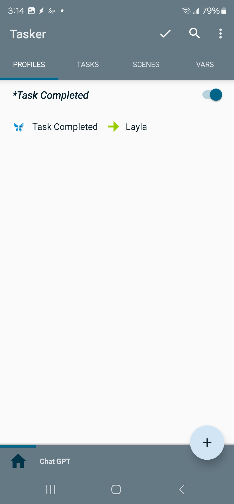

Layla est intégrée à Tasker. Vous pouvez automatiser des tâches à l'aide d'un LLM.

**Qu'est-ce que Tasker ?**

Tasker permet de créer des tâches automatisées en fonction de conditions de déclenchement sur votre appareil. Vous pouvez par exemple demander à un LLM de résumer le contenu d'un nouvel e-mail dès sa réception.

_Remarque : cette fonctionnalité nécessite l'achat de [Tasker sur Google Play](https://play.google.com/store/apps/details?id=net.dinglisch.android.taskerm&hl=en)._

Layla n'est pas affiliée à Tasker. Tasker est une application populaire d'automatisation Android.

**Comment créer une tâche Tasker avec Layla**

Layla propose deux tâches principales :

1. **Infer:** envoie une invite et une entrée à Layla. Layla crée une tâche d'inférence qui transmettra ensuite l'entrée à un LLM et renverra la sortie.
2. **Infer in Background:** effectue la même opération, mais exécute immédiatement l'inférence avec le LLM en arrière-plan.

Les deux tâches acceptent des entrées configurables, telles que le modèle LLM, les invites système et l'entrée brute. Celles-ci sont fournies sous forme de variables Tasker, ce qui permet d'enchaîner facilement les tâches avec d'autres actions.

L'image ci-dessus montre un exemple de configuration d'une tâche :

1. L'action _Variable Set_ peut être remplacée par une sortie obtenue à partir d'autres tâches. Par exemple, si vous utilisez AutoNotification dans Tasker, vous pouvez récupérer les données de vos notifications et les transmettre au LLM.
2. _Create Infer Task_ est la tâche principale exposée par Layla. Elle transmet au LLM les variables définies avant son exécution. Vous pouvez par exemple lui demander de résumer le contenu de la notification fournie précédemment.

Layla expose également un événement _Task Completed_ :

Cet événement est déclenché chaque fois qu'une tâche d'inférence se termine dans le cadre du traitement en arrière-plan de Layla. Vous pouvez ainsi l'intercepter et exécuter d'autres actions à partir de la sortie de la tâche.
