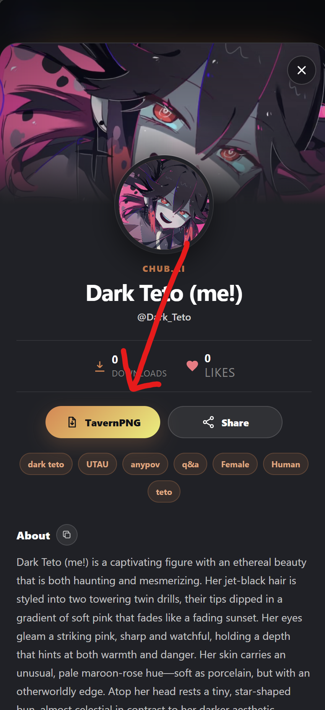

**Le Personality Hub est une fonctionnalité intégrée à Layla qui permet de parcourir et de télécharger des personnages IA que l'assistant peut interpréter pendant vos chats. Tout fonctionne hors ligne, sans compte ni informations personnelles.**

> **Parcourir et télécharger des personnages :** [Ouvrir le Personality Hub sur chat.layla-cloud.com →](https://chat.layla-cloud.com/)

Les personnages proviennent d'univers variés, notamment de séries télévisées, de livres et de films. Vous pouvez en ajouter autant que vous le souhaitez à votre liste.

Cet article explique ce qu'est le Personality Hub, ses différences avec les applications de personnages dans le cloud, comment l'ouvrir et télécharger des personnages, et comment partager vos propres créations.

## Qu'est-ce que le Personality Hub ?

Le Personality Hub est une collection partagée de personnages, ou personnalités, que Layla peut incarner. Chacun modifie la manière dont l'IA parle, ce qu'elle sait d'elle-même et son comportement dans la conversation. Le téléchargement d'un personnage l'ajoute à votre liste personnelle afin que vous puissiez le sélectionner lorsque vous souhaitez un type de chat particulier.

Comme Layla fonctionne sur l'appareil, les personnages téléchargés discutent avec vous hors ligne. Une fois la personnalité enregistrée sur votre téléphone, aucune connexion Internet n'est nécessaire pour parler.

## Une alternative privée et hors ligne à Character.AI

La plupart des applications de chat avec des personnages utilisent des services dans le cloud comme [Character.AI](https://character.ai) ou [Chub](https://chub.ai), qui nécessitent un compte et traitent vos conversations sur les serveurs d'un tiers. Le Personality Hub adopte une autre approche. Les téléchargements comme les mises en ligne sont anonymes : aucune inscription, adresse e-mail ou information personnelle n'est demandée.

Pour les personnes qui recherchent une alternative à Character.AI conservant les conversations sur leur appareil, il s'agit de la principale différence. Vos chats avec un personnage téléchargé restent locaux, le catalogue est partagé par la communauté plutôt que limité à un seul fournisseur, et son utilisation ne nécessite aucun abonnement.

## Comment ouvrir le Personality Hub

Le Personality Hub se trouve dans la section Applications de Layla. Pour l'ouvrir :

1. Dans l'écran de sélection des personnages, appuyez sur l'icône **Applications** dans le coin supérieur droit.
2. Choisissez l'application **Personality Hub**.
3. Parcourez le catalogue et ouvrez le personnage qui vous intéresse.
4. Appuyez sur **Télécharger** pour l'ajouter à Layla.

Après son téléchargement, le personnage apparaît dans votre liste et vous pouvez commencer un chat à tout moment.

Vous pouvez également utiliser la version Web sur [chat.layla-cloud.com](https://chat.layla-cloud.com).

## Partager vos propres personnages

Si vous avez créé un personnage, vous pouvez le publier dans le Personality Hub afin que d'autres personnes le téléchargent. Comme le téléchargement, la mise en ligne est anonyme : aucun compte ni renseignement personnel n'est nécessaire. Votre personnage rejoint le catalogue partagé et devient accessible à la communauté, sans information permettant de vous identifier.

## Questions fréquentes

### Qu'est-ce que le Personality Hub dans Layla ?

Il s'agit d'un catalogue intégré de personnages IA à télécharger dans Layla. Chaque personnage donne à l'assistant une personnalité distincte, et tous fonctionnent hors ligne après leur téléchargement.

### Le Personality Hub est-il une alternative à Character.AI ?

Oui. Il remplit une fonction similaire — parcourir différents personnages et discuter avec eux — mais fonctionne sur l'appareil, ne nécessite aucun compte et n'envoie pas vos conversations à un service dans le cloud.

### Ai-je besoin d'un compte pour télécharger des personnages ?

Non. Le téléchargement et la mise en ligne sont anonymes. Aucune inscription ni information personnelle n'est nécessaire.

### Les personnages téléchargés fonctionnent-ils hors ligne ?

Oui. Layla fonctionne sur l'appareil ; après son téléchargement, un personnage peut discuter avec vous sans connexion Internet.

### Où apparaissent les personnages téléchargés ?

Ils apparaissent dans votre liste de personnages. Une fois le téléchargement terminé, vous pouvez commencer un chat comme avec toute autre personnalité.

### Puis-je partager un personnage que j'ai créé ?

Oui. Vous pouvez mettre vos créations en ligne anonymement dans le Personality Hub afin que d'autres utilisateurs les téléchargent.

## En résumé

Le Personality Hub propose à Layla une bibliothèque de personnages qui s'enrichit progressivement grâce à la communauté et que vous pouvez télécharger sur votre téléphone en un geste. Tout fonctionnant sur l'appareil, vos personnages restent disponibles hors ligne sur Android, sans compte ni abonnement.
