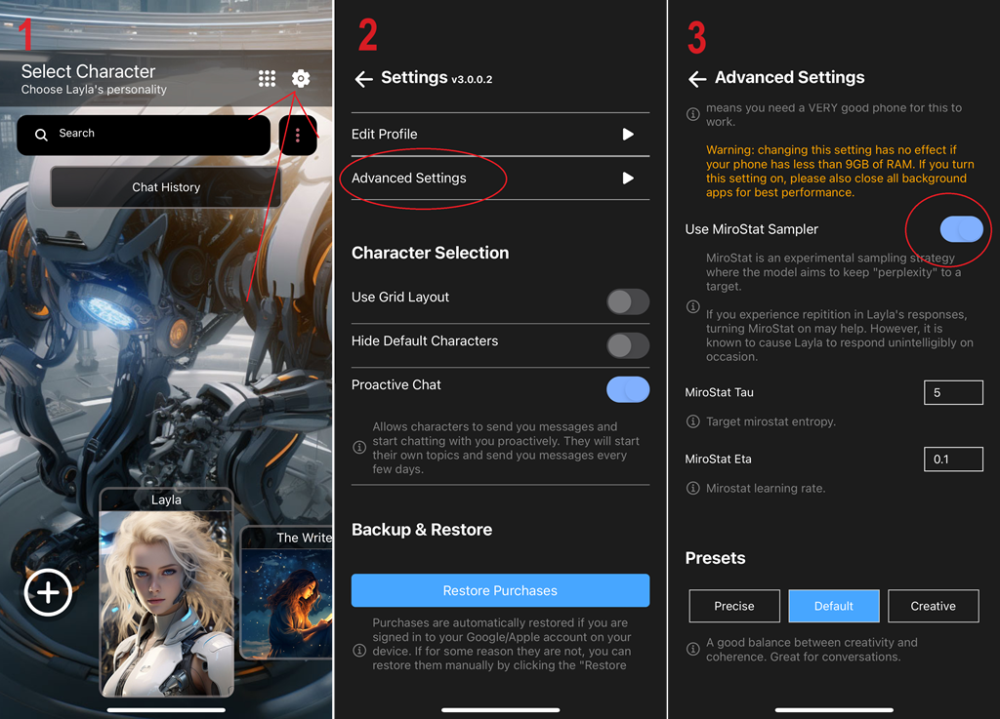

Si Layla répète sans cesse la même fin de message, l'une des solutions consiste à activer l'échantillonneur Mirostat :

1. Ouvrez la page _Paramètres_.
2. Appuyez sur _Paramètres avancés_.
3. Faites défiler vers le bas et activez l'_Échantillonneur MiroStat_.

**Qu'est-ce que l'échantillonneur Mirostat ?**

L'échantillonneur Mirostat est un algorithme neuronal de décodage de texte conçu pour les modèles de langage. Il vise en particulier à contrôler directement la perplexité lors de la génération de texte. La perplexité mesure l'incertitude lors de la prédiction du prochain token d'une séquence ; une faible perplexité indique généralement un texte plus prévisible.

Mirostat est conçu pour maintenir la qualité du texte généré dans une plage souhaitée en équilibrant cohérence et diversité. Il contribue à éviter deux problèmes courants de la génération de texte : le « piège de l'ennui », caractérisé par des répétitions excessives, et le « piège de la confusion », caractérisé par un manque de cohérence. En définissant une perplexité cible et en utilisant une approche adaptative basée sur le retour, Mirostat peut générer un texte de n'importe quelle longueur avec un niveau de perplexité prédéterminé, sans réglage ponctuel des paramètres.

Des expériences menées avec des évaluateurs humains ont montré que l'algorithme réduisait les répétitions au niveau des phrases et améliorait la fluidité, la cohérence et la qualité globale du texte. Le contrôle de la perplexité peut influer sur des caractéristiques importantes du texte généré, notamment la quantité de répétitions.

Mirostat va au-delà des méthodes d'échantillonnage traditionnelles telles que top-k, top-p ou nucleus sampling, ainsi que l'échantillonnage basé sur la température. Ces méthodes nécessitent souvent un réglage minutieux et peuvent malgré tout produire des répétitions excessives ou du texte incohérent. Grâce à une approche mieux contrôlée, Mirostat contribue à produire des sorties de modèles de langage plus fiables.

Pour en savoir plus, consultez l'article [Mirostat: A Neural Text Decoding Algorithm that Directly Controls Perplexity](https://ar5iv.labs.arxiv.org/html/2007.14966).
