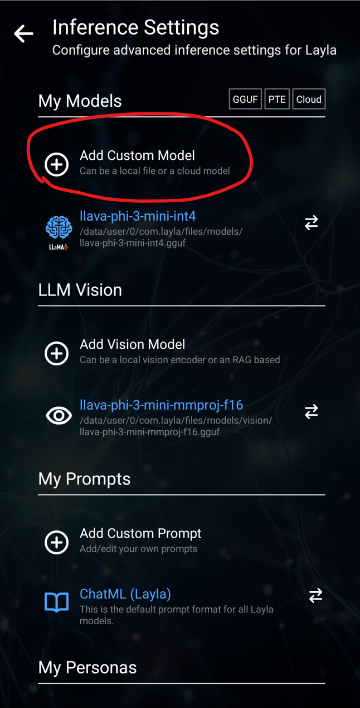

Si vous avez exploré des modèles d’IA locaux sur Hugging Face, vous avez probablement remarqué de nombreux fichiers dont le nom se termine par `.gguf`. Qu’est-ce qu’un modèle GGUF, et pourquoi presque toutes les applications d’IA hors ligne — dont Layla — utilisent-elles ce format ?

Ce guide explique ce que signifie GGUF et comment ce format fonctionne, puis montre comment charger n’importe quel modèle GGUF personnalisé dans Layla. Vous pouvez ainsi exécuter directement sur votre téléphone Android des modèles d’IA sans filtre, de jeu de rôle ou spécialisés, sans Internet, abonnement ni service cloud.

## Qu’est-ce que GGUF ?

**GGUF est un format de fichier conçu pour exécuter de grands modèles de langage sur du matériel grand public comme les ordinateurs portables, les PC et les téléphones.** Un seul fichier `.gguf` contient tout ce qui est nécessaire au modèle — poids, tokenizer, modèle de prompt et métadonnées — dans un binaire portable qu’un moteur d’inférence compatible GGUF peut charger.

GGUF a été introduit en août 2023 par le projet [llama.cpp](https://github.com/ggerganov/llama.cpp), le moteur d’inférence open source qui alimente également Layla. Auparavant, le projet utilisait l’ancien format GGML, qui nécessitait des modifications du code pour ajouter une nouvelle architecture de modèle. GGUF l’a remplacé par un système de métadonnées structurées et est ainsi devenu la norme de fait pour distribuer les LLM exécutés localement.

Si vous avez utilisé Ollama, LM Studio, GPT4All, Jan, koboldcpp ou Layla, vous avez utilisé GGUF, même sans le savoir.

## Que signifie GGUF ?

GGUF signifie **GGML Universal File**. GGML est le nom de la bibliothèque de tenseurs sous-jacente, nommée d’après son créateur, Georgi Gerganov. L’expansion « GPT-Generated Unified Format » apparaît parfois en ligne, mais le projet llama.cpp utilise « GGML Universal File ».

## Pourquoi les modèles GGUF sont importants pour l’IA hors ligne sur mobile

La fonction essentielle de GGUF est la **quantification** : une technique qui réduit les poids d’un modèle de nombres de 16 ou 32 bits à 8, 4, voire 2 bits. Le fichier devient beaucoup plus petit sans détruire les capacités du modèle, ce qui permet d’exécuter un modèle de 7 ou 8 milliards de paramètres sur un téléphone.

Concrètement, GGUF vous permet de :

- Exécuter un assistant IA performant entièrement **hors ligne**, sans connexion Internet.
- Garder vos conversations **privées**, car rien ne quitte l’appareil.
- Éviter les abonnements et les limites de requêtes.
- Choisir **n’importe quel modèle communautaire**, y compris des modèles affinés pour certains styles ou dont les filtres de contenu ont été retirés.

## Ce que permettent les modèles GGUF personnalisés dans Layla

Les modèles préconfigurés téléchargés par Layla au premier démarrage conviennent aux usages généraux. Layla permet aussi de charger **le modèle GGUF de votre choix**.

La communauté open source a affiné des milliers de modèles GGUF pour de nombreux usages :

- **Modèles de chat sans censure ou sans filtre**, qui répondent sans les garde-fous des chatbots grand public
- **Modèles de jeu de rôle et d’écriture créative** comme Stheno, MythoMax et Mahou, conçus pour les longues conversations immersives
- **Modèles de programmation** spécialisés dans les langages informatiques
- **Modèles de raisonnement et de mathématiques** pour résoudre des problèmes
- **Modèles spécialisés par domaine** pour la médecine, le droit, l’apprentissage des langues, etc.

Vous trouverez des modèles GGUF testés avec Layla sur la [page Hugging Face de l3utterfly](https://huggingface.co/l3utterfly).

## Charger un modèle GGUF personnalisé dans Layla

Voici la procédure complète, avec le modèle de jeu de rôle Stheno-Mahou comme exemple.

### Étape 1 — Choisir un modèle sur Hugging Face

Nous utiliserons [Stheno-Mahou](https://huggingface.co/l3utterfly/llama-3-Stheno-Mahou-8B-gguf), un modèle Llama 3 affiné pour le jeu de rôle.

### Étape 2 — Ouvrir l’onglet Files and versions

Hugging Face y répertorie toutes les variantes téléchargeables du modèle.

### Étape 3 — Choisir la bonne quantification pour le téléphone

Chaque nom de fichier comporte un identifiant Q, comme Q2_K, Q4_K_M, Q6_K ou Q8_0. Il s’agit du **niveau de quantification**, qui indique le degré de compression du modèle.

La règle est simple :

- **Nombre Q plus élevé = fichier plus grand = meilleure qualité de réponse, mais davantage de RAM et un téléphone plus rapide sont nécessaires.**
- **Nombre Q plus faible = fichier plus petit = plus rapide sur un matériel modeste, mais réponses légèrement moins bonnes.**

**Q4_K_M** constitue un bon point de départ pour la plupart des téléphones. Si le modèle est rapide et réactif, essayez Q6 ou Q8 pour améliorer la qualité. S’il est lent, passez à Q3 ou Q2.

Vous pouvez également voir trois quantifications particulières : Q4_0_4_4, Q4_0_4_8 et Q4_0_8_8. Elles sont optimisées pour les téléphones ARM récents avec accélération matérielle **i8mm** et peuvent être sensiblement plus rapides sur les appareils compatibles. Consultez le guide sur [la prise en charge matérielle i8mm de Layla](https://www.layla-network.ai/post/layla-supports-i8mm-hardware-for-running-llm-models) pour vérifier votre téléphone.

### Étape 4 — Télécharger le fichier

Touchez la flèche de téléchargement à côté de la quantification choisie. Le fichier `.gguf` est enregistré dans le dossier Téléchargements du téléphone ou dans l’emplacement utilisé par votre navigateur.

### Étape 5 — Ajouter le modèle dans Layla

Ouvrez Layla et accédez à **Inference Settings** → **Add a custom model** → **Local file**. Utilisez le sélecteur pour retrouver le fichier `.gguf` téléchargé.

Dans le sélecteur de fichiers, choisissez le modèle téléchargé.

### Étape 6 — Définir le bon format de prompt

Cette étape est souvent oubliée. Chaque famille de modèles attend un format de prompt précis : Llama 3 en utilise un, Mistral un autre, ChatML un troisième, etc. La page Hugging Face du modèle indique le format attendu. Sélectionnez-le dans les paramètres de format de prompt de Layla. Votre modèle GGUF personnalisé fonctionne maintenant entièrement hors ligne sur le téléphone.

## Questions fréquentes sur GGUF

### Qu’est-ce qu’un fichier GGUF ?

Un fichier `.gguf` est un binaire unique regroupant les poids, le tokenizer et la configuration d’un modèle d’IA. llama.cpp et de nombreux outils d’IA locale utilisent ce format pour charger et exécuter des modèles de langage.

### Que signifie GGUF pour un modèle d’IA ?

Lorsqu’un modèle est indiqué comme GGUF sur Hugging Face, il a été converti dans ce format et peut être exécuté localement sur du matériel grand public avec Layla, llama.cpp, Ollama ou LM Studio, sans serveur GPU ni API cloud.

### GGUF est-il meilleur que safetensors ou PyTorch ?

Ces formats ont des objectifs différents. PyTorch et safetensors servent à l’entraînement et à la recherche : ils sont en pleine précision, volumineux et orientés GPU. GGUF est un format d’**inférence** quantifié, compact et optimisé pour les processeurs, les téléphones et les GPU modestes. Pour _utiliser_ un modèle plutôt que l’_entraîner_, GGUF est plus approprié.

### Puis-je exécuter des modèles GGUF sur Android ?

Oui. C’est précisément ce que fait Layla. Layla intègre llama.cpp sur Android et permet de charger un modèle GGUF depuis l’appareil ou d’en télécharger un sur Hugging Face.

### Quelle quantification GGUF dois-je télécharger ?

Commencez par **Q4_K_M**, qui offre un bon équilibre entre taille, vitesse et qualité. Passez à Q6 ou Q8 si votre téléphone le permet, ou à Q3 ou Q2 dans le cas contraire.

### Où trouver des modèles GGUF ?

La plus grande collection se trouve sur [Hugging Face](https://huggingface.co). Recherchez le nom d’un modèle suivi de « GGUF » pour trouver les versions quantifiées. Pour des modèles testés avec Layla, consultez [huggingface.co/l3utterfly](https://huggingface.co/l3utterfly).
