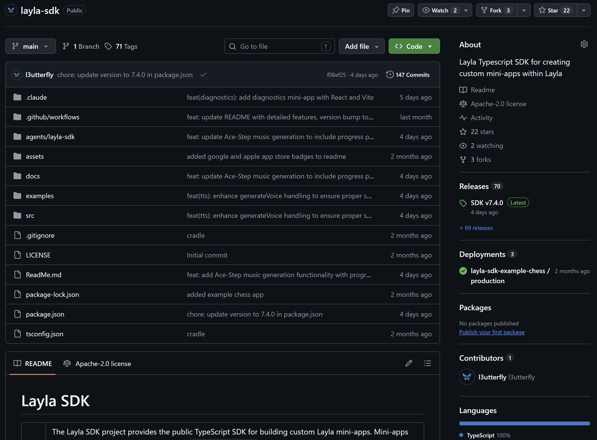

**The Layla SDK is a TypeScript and JavaScript library for building mini-apps that use the AI features available inside Layla.** A mini-app can stream chat from the active model, work with characters and memories, generate images or music, use speech, and store private app data without configuring an API key or running an AI server.

This guide covers where to get the SDK, how to give its agent skill to a coding agent, and how to build a small HTML mini-app that streams a response from Layla.

## Browse existing mini-apps

If you want to see what other people have built before starting your own project, browse [Layla Cloud Apps](https://apps.layla-cloud.com/). Looking through existing mini-apps is a useful way to understand the kinds of interfaces and workflows that fit inside Layla, then choose one small idea for your first build.

## How the Layla SDK works

A Layla mini-app is a web app running inside Layla's React Native WebView. When your code calls an SDK method, the SDK sends a message across the WebView bridge. The Layla host performs the work on the device and sends the result back.

```text
Mini-app -> Layla SDK -> WebView bridge -> Layla host -> on-device model
```

The SDK is therefore not a conventional cloud API client:

- There is no API key, base URL, or HTTP endpoint to configure.
- The Layla host chooses the active model and inference engine.
- Real SDK calls work inside Layla, where the host bridge is available.
- During ordinary browser development, you install the SDK's mock host instead.

Local model generation can take time on a phone. For interactive features, use streaming, show a clear working state, and give the user a way to stop generation.

If you want more background before writing code, read [What are Layla mini-apps?](/post-what-are-layla-mini-apps-codekitty/).

## Where to get the SDK

The SDK is published as [`@layla-network/sdk` on npm](https://www.npmjs.com/package/@layla-network/sdk). Install it in an existing JavaScript or TypeScript project with:

```bash
npm install @layla-network/sdk
```

The [Layla SDK repository](https://github.com/l3utterfly/layla-sdk) contains the source, API reference, packaging notes, and example mini-apps.



There is also an official [React, TypeScript, and Vite starter project](https://github.com/l3utterfly/layla-miniapp-template) for apps that need components, multiple source files, and more application state.

For a small app, the important import is:

```js
import { LaylaSDK } from "@layla-network/sdk";

const layla = new LaylaSDK();
```

Create one client and reuse it throughout the app.

## Use the Layla SDK agent skill

The SDK project also publishes an agent skill. This is a documentation bundle for coding agents such as Codex, Claude Code, and OpenCode. It teaches the agent the SDK's public methods, WebView runtime, local mock, packaging rules, and common errors.

The skill and the npm package have different jobs: the skill helps your coding agent write the app, while `@layla-network/sdk` is the library included in the app itself.

To use the skill:

1. Open the [Layla SDK agent skill releases](https://github.com/l3utterfly/layla-sdk/releases?q=agent+skill&expanded=true).
2. Download the agent-skill ZIP from the latest matching release.
3. Import or install that ZIP using your coding agent's skill workflow.
4. Open your mini-app project in the coding agent.
5. Name the skill in your prompt and describe the app's behaviour.

For example:

```text
Use the layla-sdk skill to build a self-contained Layla mini-app.
Create a simple writing prompt generator that streams its response,
shows a working state, has a Stop button, uses the Layla mock during
local development, and builds to an index.html with app.json at the
root of the output.
```

Be specific about the user experience rather than asking the agent to demonstrate every SDK method. A focused first version is easier to test on a phone. You can add characters, images, speech, storage, or contextual chat in later iterations.

## Build a small HTML mini-app

The example below creates a page with a prompt field, an **Ask Layla** button, a streamed answer, and a **Stop** button. Vite handles the SDK import, while `vite-plugin-singlefile` puts the production JavaScript and CSS into one `index.html`.

You need Node.js and npm. Create the project and install its dependencies:

```bash
mkdir hello-layla
cd hello-layla
npm init -y
npm install @layla-network/sdk
npm install --save-dev vite vite-plugin-singlefile
npm pkg set scripts.dev="vite" scripts.build="vite build" scripts.preview="vite preview"
```

Create this structure:

```text
hello-layla/
  public/
    app.json
  src/
    main.js
  index.html
  package.json
  vite.config.js
```

### Add the mini-app metadata

Create `public/app.json`:

```json
{
  "title": "Hello Layla",
  "tagline": "Ask the on-device model for a short answer.",
  "description": "A small starter mini-app built with the Layla SDK."
}
```

Vite copies files from `public` to the root of `dist`, so the built package will contain both `app.json` and `index.html` at its root.

### Create the page

Create `index.html`:

```html
<!doctype html>
<html lang="en">
  <head>
    <meta charset="UTF-8" />
    <meta name="viewport" content="width=device-width, initial-scale=1.0" />
    <title>Hello Layla</title>
    <style>
      :root {
        color: #f4f3f8;
        background: #111017;
        font-family: system-ui, sans-serif;
      }

      body {
        margin: 0;
        min-height: 100vh;
        display: grid;
        place-items: center;
      }

      main {
        width: min(42rem, calc(100% - 2rem));
      }

      textarea,
      pre {
        box-sizing: border-box;
        width: 100%;
        padding: 1rem;
        border: 1px solid #3a3744;
        border-radius: 0.75rem;
        color: inherit;
        background: #1b1922;
      }

      textarea {
        min-height: 7rem;
        resize: vertical;
      }

      pre {
        min-height: 9rem;
        white-space: pre-wrap;
      }

      .actions {
        display: flex;
        gap: 0.75rem;
        margin: 0.75rem 0;
      }

      button {
        padding: 0.7rem 1rem;
        border: 0;
        border-radius: 999px;
        font: inherit;
      }
    </style>
  </head>
  <body>
    <main>
      <h1>Hello Layla</h1>
      <p>Ask the model running through your selected Layla inference engine.</p>

      <label for="prompt">Prompt</label>
      <textarea id="prompt">Give me one practical writing tip.</textarea>

      <div class="actions">
        <button id="send">Ask Layla</button>
        <button id="stop" disabled>Stop</button>
      </div>

      <p id="status" aria-live="polite">Ready.</p>
      <pre id="answer" aria-live="polite">The response will appear here.</pre>
    </main>

    <script type="module" src="/src/main.js"></script>
  </body>
</html>
```

### Connect the page to Layla

Create `src/main.js`:

```js
import {
  LaylaAbortError,
  LaylaBridgeUnavailableError,
  LaylaError,
  LaylaSDK,
  installLaylaMock,
} from "@layla-network/sdk";

if (import.meta.env.DEV) {
  installLaylaMock({
    respond: (messages) =>
      `Mock response to: ${messages.at(-1)?.content ?? ""}`,
  });
}

const layla = new LaylaSDK();
const promptInput = document.querySelector("#prompt");
const sendButton = document.querySelector("#send");
const stopButton = document.querySelector("#stop");
const status = document.querySelector("#status");
const answer = document.querySelector("#answer");

let activeStream = null;

sendButton.addEventListener("click", async () => {
  const prompt = promptInput.value.trim();
  if (!prompt || activeStream) return;

  answer.textContent = "";
  status.textContent = "Layla is thinking…";
  sendButton.disabled = true;
  stopButton.disabled = false;

  const stream = layla.chat.completions.stream({
    messages: [{ role: "user", content: prompt }],
  });

  activeStream = stream;

  stream.on("content", (_delta, snapshot) => {
    answer.textContent = snapshot;
  });

  try {
    await stream.finalContent();
    status.textContent = "Finished.";
  } catch (error) {
    if (error instanceof LaylaAbortError) {
      status.textContent = "Stopped.";
    } else if (error instanceof LaylaBridgeUnavailableError) {
      status.textContent = "Open this mini-app inside Layla.";
    } else if (error instanceof LaylaError) {
      status.textContent = error.message;
    } else {
      console.error(error);
      status.textContent = "Something went wrong.";
    }
  } finally {
    activeStream = null;
    sendButton.disabled = false;
    stopButton.disabled = true;
  }
});

stopButton.addEventListener("click", () => {
  activeStream?.abort();
});
```

The mock is installed only when Vite is running in development mode. The production build does not install it, so calls made inside Layla go to the real host bridge.

### Bundle the app into one HTML file

Create `vite.config.js`:

```js
import { defineConfig } from "vite";
import { viteSingleFile } from "vite-plugin-singlefile";

export default defineConfig({
  plugins: [viteSingleFile()],
  build: {
    assetsInlineLimit: Infinity,
  },
});
```

This configuration inlines the bundled JavaScript and CSS. Files from `public`, including `app.json`, are still copied beside the generated `index.html`.

## Test in a browser

Start the development server:

```bash
npm run dev
```

Open the local address printed by Vite and select **Ask Layla**. You should see the mock response appear progressively. This verifies the page, event handlers, and streaming UI; it does not run a real model.

If you remove the development mock and open the page in a normal browser, the SDK will report `LaylaBridgeUnavailableError`. That is expected because the Layla WebView bridge is not present.

## Build and import the mini-app

Create the production files:

```bash
npm run build
```

The `dist` folder should contain:

```text
dist/
  app.json
  index.html
```

Zip the **contents** of `dist`, not the `dist` directory itself. `app.json` and `index.html` must be at the root of the ZIP, without another parent folder around them. Import that ZIP through Layla's mini-app import flow, open **Hello Layla**, and send a prompt.

The real response may arrive more slowly than the browser mock because Layla is running the selected model on the device. The page streams each content update and keeps the Stop button connected to `stream.abort()`, so it remains responsive while generation runs.

## Common first-project problems

### Why does the SDK say the bridge is unavailable?

The app is running in an ordinary browser without `installLaylaMock(...)`, or it is not running inside Layla's WebView. Install the mock before the first SDK call during local development, and keep it behind a development-only condition.

### Why does the imported mini-app have no metadata?

Check that `app.json` contains valid JSON and sits at the root of the imported ZIP. It should be beside `index.html`, not inside `public`, `dist`, or another wrapper folder in the ZIP.

### Do I need to choose a model in the SDK?

No. The Layla host uses the active inference engine. Later articles can cover listing and changing inference engines when a mini-app needs to offer that choice explicitly.

### Should every mini-app be one HTML file?

The source project can contain as many files as it needs. A self-contained `index.html` is a convenient distribution format for offline mini-apps. For a larger project, start from the official [Layla mini-app template](https://github.com/l3utterfly/layla-miniapp-template) and let the build step produce the single-file output.

## Where to go next

This starter uses only streaming chat, but the same client exposes characters, contextual chat events, memories, personas, text-to-speech, speech-to-text, background audio, image and music generation, a private SQLite database, and private file utilities. The [SDK API reference and examples](https://github.com/l3utterfly/layla-sdk) are the source of truth while the rest of this category develops each area into a focused tutorial.
