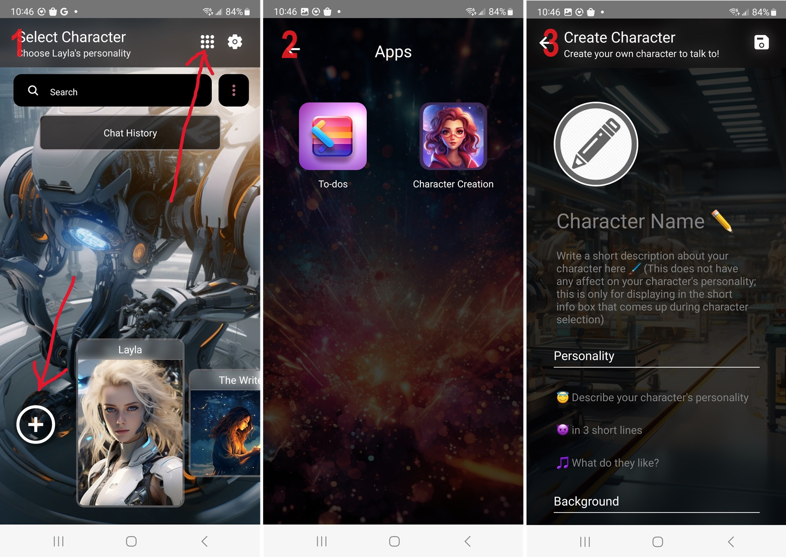

Follow these steps to create a custom character:

1. On the character-selection screen, tap the `+` button or the *Apps* button at the top.
2. If you tapped *Apps*, choose the *Create Character* app.
3. Fill in the details for your new character and tap *Save*.
4. Your character will appear after the default characters. If you want to hide all the default characters, you can do so on the Settings screen.

For inspiration, download any character from the [Personality Hub](/personality-hub-ai-characters/) and see what descriptions it uses.
