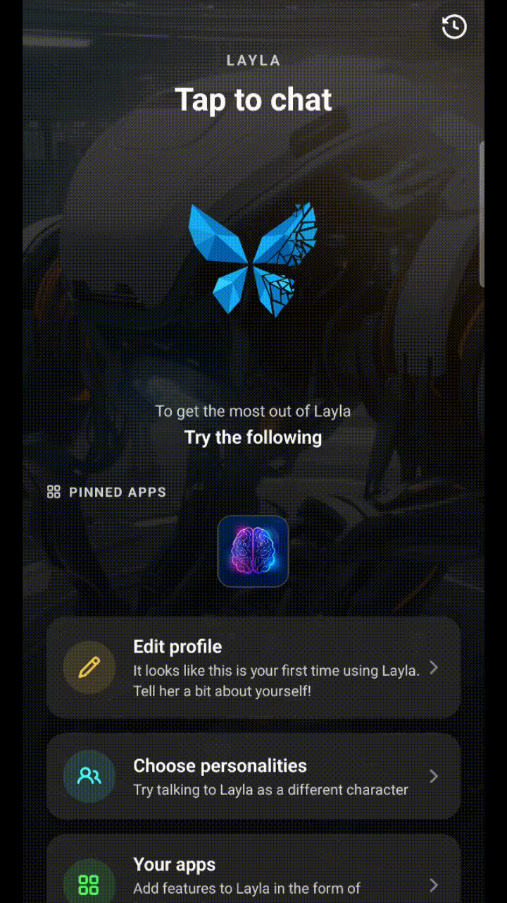

Layla automatically keeps your conversations available in the **History** screen, making it easy to return to previous chats without starting again. From the History screen, you can search your conversations, export copies, or permanently remove them.

This guide explains how to manage your Layla conversation history and what happens to your data when a chat is deleted.

> **Note:** Menu names and button positions may vary slightly depending on your version of Layla and your device.

## Open your conversation history

To view your previous conversations:

1. Open **Layla**.
2. Open the main navigation menu by swiping from the left or using the time icon.
3. Select **History**.
4. Tap a conversation to reopen it.

Your active conversations are displayed with their title, character or assistant, latest message preview, and most recent activity date.

Opening an existing conversation lets you continue chatting with its previous messages and settings intact.

## Search your Layla conversation history

Use the search bar at the top of the History screen to find a specific conversation.

Layla can search information such as:

- Conversation titles
- Character or assistant names
- Words and phrases from messages
- Conversation tags or categories

To search your chats:

1. Open **History**.
2. Tap the **Search** field.
3. Enter a title, character name, keyword, or phrase.
4. Select a result to open the conversation.

Search results update as you type, so you usually only need to enter part of a word or title.

## Delete a conversation

Deleting a conversation removes it from your active or archived history and moves it to **Recently Deleted**.

To delete a conversation:

1. Open **History**.
2. Tap the conversation's **Trash** icon.
3. Confirm the deletion.

## How long does Layla retain conversation history?

Layla's retention behaviour depends on the status of the conversation:

| Conversation status | Retention behaviour |
| --- | --- |
| Active | Remains in your History screen until you archive or delete it |
| Permanently deleted | Removed immediately and cannot be restored |

## What happens if I uninstall Layla or clear its data?

Conversation history stored locally on your device may be removed if you:

- Uninstall Layla
- Clear the app's storage or application data
- Factory-reset your device
- Delete Layla's data through your operating system
- Move to another device without transferring or restoring your data

Export important conversations or create a backup before uninstalling the app, clearing its data, or moving to a new device.

Where you have backed up your data, available conversations may be restored from your backup. Chats that were permanently deleted before the backup was created cannot be recovered.

## Frequently asked questions

### Does Layla save my conversations automatically?

Yes. Conversations are automatically added to your History screen as you chat. You do not need to save each conversation manually.

### Can I continue an old conversation?

Yes. Open the conversation from History and send a new message. Layla will continue using the conversation's available history and settings.

### Can I search inside previous chats?

Yes. Use the History search field to find conversations by title, character, assistant, keyword, or message content.

### Can I recover a permanently deleted chat?

No. Permanent deletion cannot be undone. An independently saved export or backup may still exist, but Layla cannot restore the permanently deleted copy from conversation history.

### Does exporting a conversation remove it from Layla?

No. Exporting creates a separate copy while leaving the original conversation unchanged.

### Will deleting a character delete all conversations with that character?

Yes. Deleting a character will delete all conversation history and memories associated with that character.

## Keep important conversations safe

For chats that you may need later, consider using both of these options:

- Give the conversation a clear and searchable title.
- Export a separate copy before deleting the original.

Exporting is better when you need an independent backup, and permanent deletion should be reserved for conversations you are certain you no longer need.
