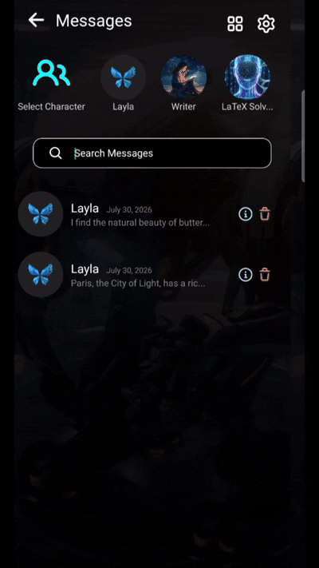

**In Layla, chat history belongs to the conversation rather than being permanently locked to one character, persona, AI model, or roleplay scenario.** When you reopen a conversation, Layla restores its saved configuration by default, but you can change that configuration for future messages without rewriting the existing history.

This article explains the expected behaviour as both a user guide and an engineering specification. It covers which settings are saved with a chat, what happens when a setting changes, and when it is better to branch a conversation instead of continuing the original.

## The short answer

A Layla conversation contains two related but separate kinds of data:

1. **Conversation history:** the messages already exchanged, including their order, roles, and stored content.
2. **Active configuration:** the character, user persona, model, roleplay scenario, prompt settings, and related resources used to generate the next response.

Existing messages remain part of the same history when the active configuration changes. The newly selected configuration applies from the next generated message onward.

For example, you can reopen an AI character chat that originally used one GGUF model, switch to another compatible local AI model, and continue the conversation. Layla does not regenerate or silently alter the earlier messages. However, the new model may interpret the same history differently because models vary in prompt handling, context length, writing style, and instruction-following behaviour.

## Chat history behaviour matrix

| Configuration item | Saved with the conversation | Can be changed after reopening | Changes existing messages | Applies to future replies |
| --- | --- | --- | --- | --- |
| Character | No | Yes | No | Yes |
| User persona | No | Yes | No | Yes |
| AI model | No | Yes | No | Yes |
| Inference engine | No | Yes | No | Yes |
| Roleplay scenario | No | Yes | No | Yes |
| System prompt or advanced instructions | No | Yes | No | Yes |
| LoreBooks or contextual resources | No | Yes | No | Yes |
| Generation settings | No | Yes | No | Yes |
| Chat title and organisational metadata | Yes | Yes | No | No |

The important rule is that configuration changes are **forward-looking**. They change how the next prompt is assembled and how the next reply is generated; they do not rewrite the saved transcript.

## Reopening a chat

When you reopen a saved conversation, Layla restores the character, persona, AI model, inference engine, scenario, contextual resources, and generation settings that were active when the chat was last used. This lets an AI companion or long-running roleplay continue without repeated setup.

These values are only the starting configuration. You can change them before sending the next message.

## Changing the active configuration

You can change one or more configuration items while keeping the same AI chat history. Layla uses the updated configuration when constructing the next request.

### Changing the character

Switching characters preserves the transcript but changes the instructions for future replies. The incoming character receives the conversation context that fits within the model's active context window. For an unrelated identity or background, branch the chat or start a new one to avoid continuity conflicts.

### Changing the user persona

Changing the persona keeps the messages and applies the new user description to later turns. Use a separate branch when the identities are substantially different.

### Changing the AI model

A saved chat can use another supported model. Layla keeps the history and prepares it with the new model's prompt format. Character interpretation, tone, capabilities, and context size may differ. A smaller context window can exclude older messages from a generation, but those messages remain stored.

### Changing the roleplay scenario

A new roleplay scenario guides future messages while the existing history remains available. Branch the chat first when testing a contradictory timeline, location, or outcome.

## Engineering behaviour specification

The following rules define the expected behaviour of configurable Layla chat histories:

1. **A conversation is the primary history container.** Its identity is independent of character, persona, model, and scenario IDs.
2. **Messages are preserved records.** Configuration changes must not silently rewrite saved content.
3. **The last active configuration is stored with the chat** and restored when its resources remain available.
4. **Changes apply to the next generation.** Prompt assembly uses the current configuration and eligible history.
5. **Context selection is model-dependent.** Context limits affect which messages enter a prompt, not which messages remain stored.
6. **Duplicates have independent identities.** Future state is not shared with the source chat.
7. **Deleting configuration and deleting history are separate operations.**

For diagnostics and exports, each generated message can retain provenance metadata identifying its character, persona, model, engine, and scenario. This helps explain behaviour changes in a conversation that has used multiple configurations.

## Privacy and local storage

Layla is a private, offline AI assistant for Android and iOS. With a local inference engine and local GGUF model selected, this private AI chatbot keeps chat history, configuration, prompt processing, and generation on-device. If you deliberately use a remote or OpenAI-compatible API, that endpoint's data-handling rules also apply.

## Frequently asked questions

### Are Layla chat histories isolated by character?

No. A conversation remembers its selected character, but the history belongs to the chat itself. You can switch characters for future messages without deleting or rewriting the existing transcript.

### Can I reopen the same conversation with another persona?

Yes. The new persona applies to future generation. If it conflicts with the history, branch the conversation or start a new chat.

### Can I change the AI model without losing chat history?

Yes. Stored messages remain available. A smaller context window may include fewer older messages in a generation, but it does not remove them from storage.

### Does changing a roleplay scenario reset the conversation?

No. Changing the scenario updates the instructions for future replies. The prior roleplay history remains part of the conversation.

### What is the safest way to compare two models or scenarios?

Branch the conversation, assign a different model or scenario to each copy, and continue them independently.

Layla's conversation-centred design supports long-running AI companion chats, character roleplay, and model experimentation without forcing every configuration change into a separate history. The transcript stays stable, while the active setup remains flexible enough to continue locally with the character, persona, model, and scenario appropriate for the next reply.
