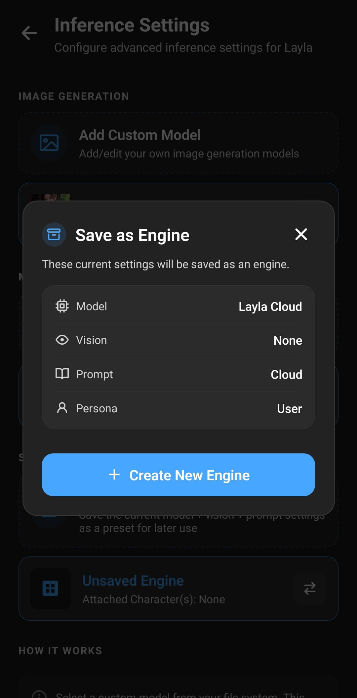

**A saved inference engine is a reusable collection of settings that tells Layla how to generate a response.** It can combine a model or model connection with a vision model, prompt template, user persona, and sampler preset. You can select an engine yourself or attach it to one or more characters so Layla uses the right setup when a chat begins.

This is useful when one configuration does not suit every conversation. A general assistant, a roleplay character, and a vision-enabled character may need different models and prompts even though they all run inside the same app.

## An inference engine is more than an AI model

The model is the part that produces text. In Layla, an inference engine describes the wider setup used to run or contact that model and prepare its responses.

For example, two saved engines can use the same local GGUF model but give it different prompt templates, personas, or generation settings. Alternatively, one engine can use a model stored on your phone while another connects to Layla Server, Layla Cloud, an OpenAI-compatible API, or a Claude API.

Think of **My Models** as the collection of models and connections available to Layla. **Saved Engines** turns a particular combination of settings into a named setup that you can return to later.

If you have not added your preferred model or connection yet, see [How to add a custom AI model to Layla](/how-to-add-custom-models-to-layla/).

## What a saved inference engine contains

When you save the current setup as an engine, Layla keeps the following choices together:

- **Model and inference source:** A local model, Layla Server, Layla Cloud, an OpenAI-compatible service, or a Claude-compatible service.
- **Vision model:** The selected vision component, if the language model needs one to understand images.
- **Prompt template:** The format used to arrange character instructions, context, user messages, and replies for the model.
- **Persona:** The user identity and description presented to the character.
- **Sampler preset:** An optional saved set of generation controls, selected while naming or editing the engine.
- **Character attachments:** The characters that should use the engine automatically.

The engine does not contain the model file itself. Saving an engine therefore does not create another copy of a local GGUF model. The original model or configured connection must remain available for the engine to work.

Image-generation models are configured separately. Character voices, Agents, LoreBooks, character instructions, and chat histories also remain separate from saved inference engines.

## How to create a saved inference engine

Open **Inference Settings** from Layla's **Settings** page, or open the **Inference Settings** mini-app directly.

1. Choose the model or connection you want under **My Models**.
2. Select a prompt template suitable for that model.
3. Select a vision model if the setup should accept images.
4. Select the user persona that should be used with this setup.
5. Under **Saved Engines**, tap **Save Current as Custom Engine**.

Layla first shows a summary of the current model, vision, prompt, and persona. Check this before continuing: these are the settings that will become the reusable engine. Tap **Create New Engine** to add a separate setup. If saved engines already exist, you can instead choose one under **Replace Existing** to update it with the current setup.

The next window controls how Layla identifies and uses the engine:

6. Enter a clear engine name.
7. Choose a saved sampler preset, or leave **Global** selected to use Layla's general generation settings.
8. Under **Attach to Character**, select every character that should switch to this engine automatically.
9. Tap **Save changes**.

Names such as “Local general chat,” “Vision assistant,” or “Roleplay — creative” make the engine list easier to scan. The name is especially important if a character has several engines attached, because Layla will use it in the selection window.

For more information about matching a model with the correct prompt format, see [How to set up custom prompt templates for models in Layla](/how-to-set-up-custom-prompt-templates-for-models/).

## How Layla chooses an engine for a chat

Layla checks whether the character has any saved engines attached when a chat starts.

### No engine is attached to the character

Layla uses the current general setup from **Inference Settings**. This is the normal fallback for characters that do not need a dedicated configuration.

You can change that general setup by opening the current engine card under **Saved Engines** and selecting another saved engine. Selecting an engine loads its model, vision, prompt, and persona choices as the current setup.

### One engine is attached to the character

Layla uses that engine automatically. It takes priority over the general setup, so the character can consistently use its intended model and prompt without requiring you to switch settings before every chat.

### Several engines are attached to the character

In a normal character chat, Layla asks you which engine to use before loading the conversation. This lets one character have several valid setups, such as a fast local model for short chats and a larger model for longer roleplay.

The selection window displays each engine's name and model source. Tap the setup you want to use for that chat; Layla then loads the selected engine.

## How to check the engine used by an open chat

Tap the chat title at the top of an open conversation to view **Chat Info**. Expand **Inference Engine** to see the selected engine, prompt format, system-prompt status, and persona. The same window shows the sampler settings and other chat features separately, which helps distinguish the inference engine from image generation, Long-Term Memory, and Agents.

## How attached engines work in group roleplay

In group roleplay, each participant can have a different engine attached. Layla checks the engine associated with the character whose turn it is and changes the model setup when necessary.

This makes it possible to give one participant a roleplay-focused local model and another a different model or prompt format. When consecutive speakers use the same engine, Layla can keep that model ready instead of loading it again. Changing between different local models can take time and may require substantial memory, so using a shared engine for several participants is usually smoother on devices with limited resources.

## Using sampler presets with engines

Sampler settings affect how a model chooses its next words. They can influence qualities such as predictability, variety, response length, and repetition.

When editing a saved engine, you can attach one of your saved sampler presets or leave the choice set to **Global**. A character-attached engine with its own preset uses that preset when the model starts. **Global** uses the current generation settings from Layla's advanced settings instead.

Sampler presets are useful when a particular character or model needs different generation behavior. For example, a creative roleplay setup may use a different preset from a concise assistant. They do not repair an incompatible prompt template or make an oversized model fit into memory; those are separate parts of the setup.

## Editing, replacing, and deleting engines

Open the current engine card under **Saved Engines** to view the saved list. Each card shows the engine name, model source, prompt, persona, and attached characters. Additional labels appear when an engine includes vision or a sampler preset.

Use the character filters at the top to narrow the list to engines attached to a particular character. Tap an engine card to make that setup current, or tap its pencil icon to edit it.

Use the edit control to rename an engine, change its sampler preset, update its character attachments, or delete it. To update all of its model, vision, prompt, and persona choices at once, first prepare the new combination on the main **Inference Settings** page, tap **Save Current as Custom Engine**, and replace the existing engine.

Deleting an engine removes the reusable setup and its character assignments. It does not delete the underlying local model, character, persona, prompt template, or chat history.

## Privacy and network use

Saving an inference engine does not determine whether it is offline. That depends on the model source inside the engine.

A local model and local vision model can run entirely on your device. Layla Server uses a connection to your own computer, while Layla Cloud and third-party APIs send requests to their configured services. Switching engines can therefore also change where inference takes place and which service's privacy terms apply.

## Frequently asked questions

### Is a saved inference engine the same as a model?

No. A model is one part of an engine. The saved engine also remembers the associated vision, prompt, persona, sampler, and character-assignment choices.

### Does saving an engine duplicate my local model?

No. The engine refers to the model already available to Layla. It does not create another copy of the GGUF or LiteRT file.

### Can I attach one engine to several characters?

Yes. Select all of the characters that should use it while creating or editing the engine.

### What happens if I attach several engines to the same character?

When you open a normal chat with that character, Layla asks which attached engine you want to use.

### Does an attached engine override my general inference settings?

Yes. If Layla finds an engine attached to the active character, that engine takes priority. When no matching attachment exists, Layla uses the general setup selected in **Inference Settings**.

### Does a saved engine include image generation?

No. Image-generation models and their settings are managed separately from language-model inference engines.

### What happens if I delete a model used by a saved engine?

The engine no longer has a working model to load. Select another model and replace the saved engine, or restore the missing model or connection.

Saved inference engines let Layla keep several model configurations organised without duplicating model files. A local engine remains an offline, on-device setup; remote engines remain available when you deliberately want to use a PC or online service.
