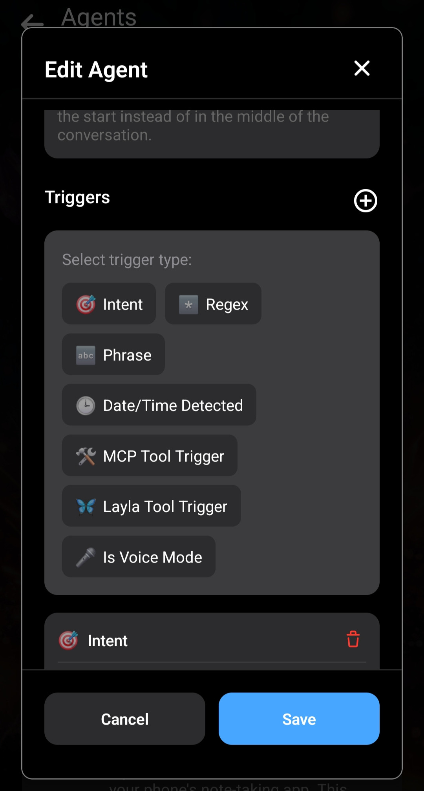
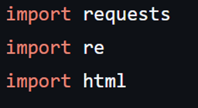
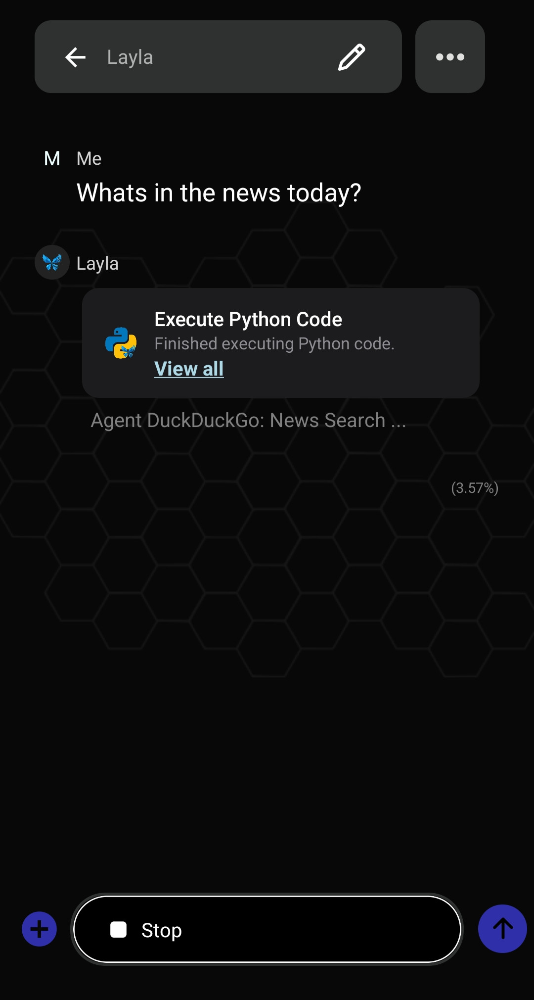
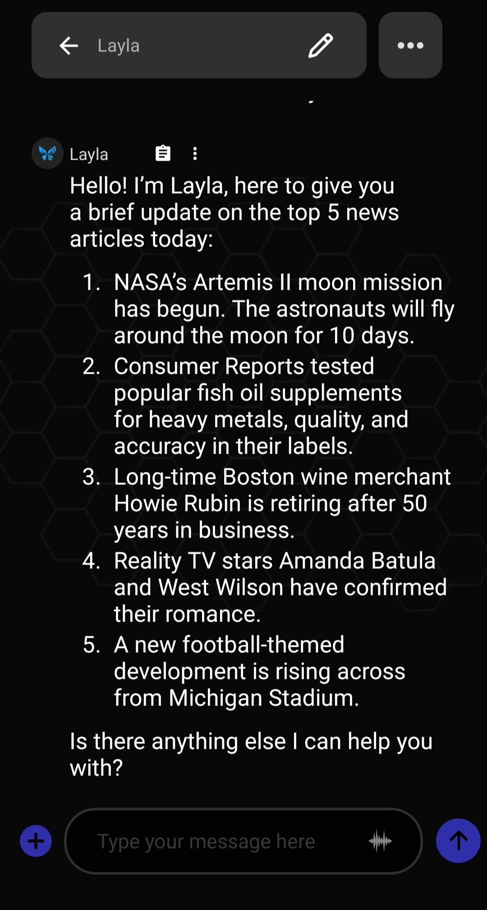

In this article, let's look at how to create a DuckDuckGo news search agent. This agent will be running in Python. We will be using the Agents mini-app in Layla to create this. Make sure you have [Python enabled in Layla](/how-to-enable-python-support-in-layla/).

**Step 1: Duplicate any existing agent**

The easiest way to start is to duplicate any existing agent. Then, edit the copy. Modify its name and description.

**Step 2: Add triggers**

Let's add a few triggers to this agent.

We are going to add the **News Search** intent and a hard-coded **news** phrase. Feel free to add your own triggers depending on how you would like to call this agent.

**Step 3: Add the Python tool**

Let's add the Execute Python tool next. This section contains the Python code that will actually execute the logic to query DuckDuckGo. You will need some familiarity with Python to understand this part.

Let's take a look at the [Python code in this GitHub Gist](https://gist.github.com/l3utterfly/bf9f703c09932fd87dbf68f2118e5ab4).

At the top of the file, notice we need the *requests* library (`re` and `html` are part of Python):

Let's go to the Python mini-app and add the `requests` package. See [How to enable Python support in Layla](/how-to-enable-python-support-in-layla/) for the installation steps.

The next part is the `QUERY`:

Note here that Layla injects the input—from your message or the previous tool's output—into a special template, `{{input}}`. This is done via simple text replacement; your input is not modified further.

You can use this pattern to receive different kinds of input into your Python script.

For this agent, we will simply pass the whole user query into the Python script.

The Python script then does a standard HTTP request and parses the response with the built-in HTML parser.

The next interesting bit is how the Python script passes information back to the LLM. This is done simply via `print` statements.

This makes it very flexible. You can just print out what you need the LLM to receive! It could be results, it could be instructions, or it could be a combination of both!

Let's copy and paste the whole Python script into the input of the Python tool:

And your agent is done!

**Lastly: Test out the agent**

Let's test the agent out! Remember to enable it for use with the default character, Layla, or attach it to your existing character.

You can see the agent starts to execute your Python code when the keyword **news** is triggered—remember, you configured this trigger in the first step.

Layla will read the output from the Python code and use it as context to answer your question!

This concludes a simple DuckDuckGo news search agent! In future articles, we will be creating more complex agents.
