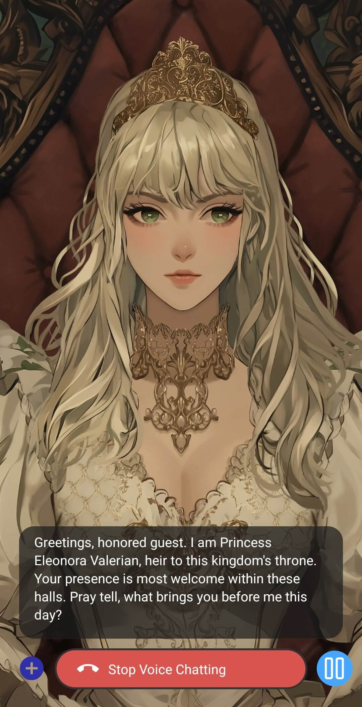
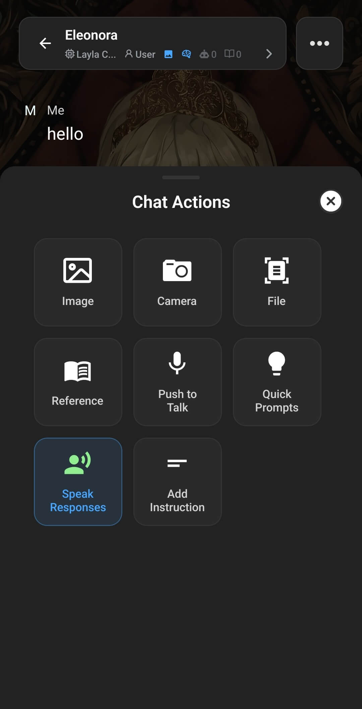
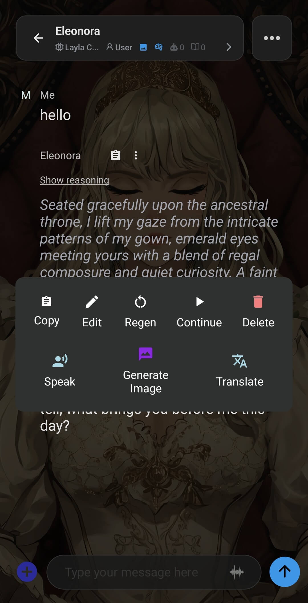

Layla can read your character's replies out loud. There are three ways to do this, and each suits a different situation: a hands-free voice conversation, automatic narration of every reply while you keep typing, or speaking one specific message on demand.

Before any of these will produce sound, your character needs a voice. If you have not set one up yet, see [How to use PocketTTS in Layla](/how-to-use-pockettts-in-layla/) or [How to add multilingual text-to-speech for your characters in Layla](/how-to-add-multilingual-text-to-speech-for-your-characters-in-layla/).

## Start a voice chat

Voice chat is a hands-free, back-and-forth spoken conversation. Layla listens to you, converts your speech to text, generates a reply, and reads that reply aloud. With an animated character, the character's lips move in sync with the voice.

To start it, open a chat and tap the **waveform icon** in the message bar, next to where you type. Layla will switch into voice chat mode and show _Initialising voice chat..._ while it starts up.

Once the microphone button turns green, start speaking. When you stop, give Layla a moment to process what you said and it will reply out loud. While you are in voice chat mode you have a few controls:

- **Pause and resume** — pause the conversation, then resume when you are ready to continue.
- **Hold to continue speaking** — press and hold if you need more time to finish a thought before Layla responds.
- **Stop Voice Chatting** — the red button ends voice chat mode and returns you to the normal text view.

For a step-by-step walkthrough with a video, see [How to start a voice chat with your characters](/how-to-start-a-voice-chat-with-your-characters/).

For the best recognition, speak clearly and use a quiet room. Background noise can interfere with the speech-to-text step.

## Speak responses automatically

If you would rather keep typing but hear every reply read aloud as it arrives, turn on automatic spoken responses. This is separate from voice chat - you still type your messages, and Layla narrates each answer.

1. In a chat, tap the **plus button** to the left of the message bar to open the **Chat Actions** menu.
2. Tap **Speak Responses**.

When it is on, the option is highlighted. From that point, each new reply from your character is read aloud automatically. To turn it off, open Chat Actions again and tap **Speak Responses** a second time; the highlight disappears and Layla stops reading new replies.

## Speak a single message

Sometimes you only want to hear one particular message rather than turn narration on for everything. You can do this on any message in the conversation, old or new.

1. Long-press the message you want to hear. On the most recent reply, you can instead tap the **more (...)** button on the message.
2. In the menu that appears, tap **Speak**.

Layla reads that one message aloud. Nothing else changes - automatic spoken responses stay off, and you can use this on as many individual messages as you like.

## Which one should I use?

- Use **voice chat** for a full spoken conversation with no typing.
- Use **Speak Responses** when you want to type but hear every reply.
- Use **Speak** on a message when you only want to hear one specific reply.

All three rely on the same text-to-speech voice you have configured for the character, so setting up a good voice first makes every option sound better.
