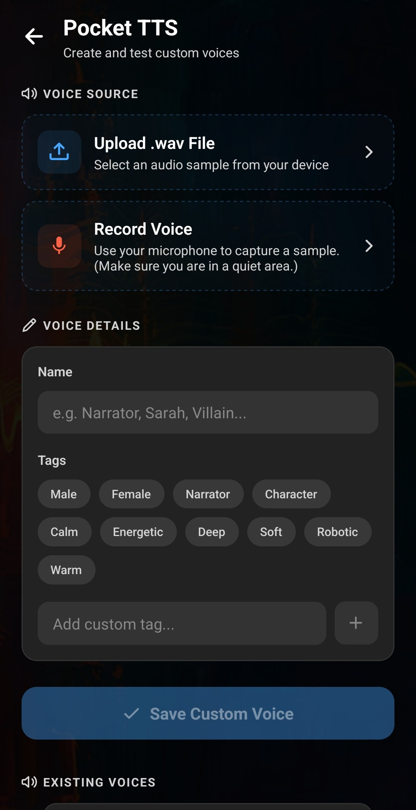

**PocketTTS is Layla's on-device voice-cloning mini-app. It creates a reusable text-to-speech voice from a short audio sample that you record in Layla or upload as a WAV file.** You can test the result, save it to your voice library, and use it as Layla's default voice or assign it to an individual AI character.

After the PocketTTS mini-app has been installed, voice generation runs locally on your Android device. Your reference recording and text do not need to be sent to a voice-cloning web service, which makes PocketTTS a useful option for private, offline AI conversations.

## What PocketTTS does in Layla

PocketTTS uses one-shot voice cloning: instead of training with a large collection of recordings, you give it one suitable reference sample. Layla uses that sample when turning new text into speech.

The PocketTTS mini-app lets you:

- record a reference sample with your phone's microphone;
- upload an existing 16-bit PCM WAV file;
- play the original sample back before using it;
- enter your own text and test the cloned voice;
- name and tag voices so they are easier to find;
- save multiple custom voices in Layla; and
- use a saved voice globally or for a particular character.

PocketTTS is a text-to-speech feature. It produces spoken audio from text; it does not change the language model that writes a character's replies.

## Install and open the PocketTTS mini-app

PocketTTS is an optional Layla mini-app and is not enabled by default.

1. Open **My Apps** in Layla.
2. Tap the plus sign to browse the available mini-apps.
3. Find **Pocket TTS (Voice Cloning)** and install it.
4. When installation is complete, open **Pocket TTS** from **My Apps**.

Installing the mini-app downloads the files required for local text-to-speech. You will need an internet connection for this installation, but the voice-cloning and speech-generation workflow can run on-device afterward.

For more detail about managing optional features, see [how to enable or disable mini-apps within Layla](/how-to-enable-disable-mini-apps-within-layla/).

## Step 1: Provide a voice sample

At the top of PocketTTS, choose one of two options under **Voice Source**.

### Upload a WAV file

Tap **Upload .wav File**, then select an audio sample from your device. Layla displays the file name and duration after loading it. If you have not already entered a name for the voice, Layla uses the file name without its extension as a starting point.

PocketTTS expects a **16-bit PCM WAV file**. If your recording is an MP3, AAC, or another format, convert it to 16-bit PCM WAV before importing it. Changing the extension to `.wav` is not enough; the audio itself must be converted.

### Record a voice in Layla

Tap **Record Voice** and allow microphone access when Android asks for it. Speak naturally, then tap **Stop Recording**. Layla prepares the recording as a WAV file and displays it on the screen. A new recording is named **My Recording** by default unless you have already entered another voice name.

Use **Play Sample** to listen to the uploaded or recorded source. If there is background noise, a long silence, clipping, or the wrong audio, tap the trash icon beside the sample and try again. This removes the current source from the form so you can upload or record a replacement.

## How to record a better PocketTTS sample

The reference recording has a direct effect on the generated voice. PocketTTS can learn unwanted qualities as readily as the voice itself, so a clean sample matters more than a long one.

- Record in a quiet room and keep the microphone a consistent distance from the speaker.
- Avoid music, other voices, echoes, fans, traffic, and microphone handling noise.
- Remove long gaps at the beginning, middle, or end. Silence in the reference can produce unwanted pauses in generated speech.
- Use a clear, steady recording without distortion or clipping.
- If you want a distinctive character voice, make those vocal qualities clear in the sample. Exaggerated voices tend to transfer more reliably than very subtle ones.
- Listen to the complete sample in Layla before testing the clone.

Only use a person's voice when you have their permission. A custom AI character voice can sound convincing, so consider how it may be understood if you share generated audio with someone else.

## Step 2: Test the custom voice

Once a sample is loaded, Layla shows the **Test Voice** section.

1. Edit the sentence in **Test Text**. Choose wording that contains a useful mix of sounds and resembles the type of dialogue the voice will normally speak.
2. Tap **Test Custom Voice**.
3. Wait while PocketTTS initialises and generates the speech locally.
4. Listen to the result. Tap **Stop Test** if you want to end playback early.

Testing does not save the voice. You can change the text and repeat the test as often as needed, or replace the source sample if the result has noise, excessive pauses, or weak vocal characteristics.

The test phrase does not need to match the words in the original recording. PocketTTS uses the reference as a voice sample and generates speech for the new text you enter.

## Step 3: Name and tag the voice

Enter a name under **Voice Details**. A name and an audio sample are both required before **Save Custom Voice** becomes available.

Choose a name you will recognise in Layla's voice selector, especially if you plan to create several voices. The name of a character, speaker, or role is usually more useful than a generic label such as “Voice 1.”

Tags are optional. Layla includes tags such as **Male**, **Female**, **Narrator**, **Character**, **Calm**, **Energetic**, **Deep**, **Soft**, **Robotic**, and **Warm**. Tap a tag to add or remove it, or type your own label and tap the plus button. Names and tags make a larger custom voice library easier to search and browse.

## Step 4: Save the PocketTTS voice

1. Tap **Save Custom Voice**.
2. Review the voice name, source, sample duration, and tags in the **Save Voice** summary.
3. Tap **Confirm & Save**.
4. Wait for Layla to finish processing the voice.

After saving, the new entry appears under **Existing Voices** on the PocketTTS screen and becomes available anywhere Layla displays its voice selector. Layla keeps a copy of the reference WAV in its app data so PocketTTS can generate speech from that voice later.

## Use the saved voice in Layla

There are two common ways to use a PocketTTS voice.

### Set it as Layla's default voice

Open **Settings**, select **Text-to-speech Settings**, then tap **Default Voice** and choose the saved PocketTTS voice. This default is used for characters that do not have a different custom voice selected.

### Assign it to one AI character

Open the character editor, tap **Voice**, and select the PocketTTS voice by its name or tags. That character will use the custom voice instead of the global default. For the complete character setup flow, see [how to create a custom AI character in Layla](/how-do-i-create-custom-characters/).

Once assigned, the voice can read chat messages aloud and can be used during a spoken character conversation. See [how to hear your characters speak](/how-to-hear-your-characters-speak-in-layla/) for the voice-chat controls.

## Manage or delete custom voices

Saved PocketTTS voices are listed under **Existing Voices** and in Layla's voice selector. A PocketTTS voice can be deleted from the voice list; Layla asks you to confirm because deletion cannot be undone.

Uninstalling the PocketTTS mini-app also deletes its custom voices. If you may want to recreate a voice later, retain the original reference WAV somewhere outside Layla before uninstalling the mini-app.

## Troubleshooting PocketTTS in Layla

### Why is Save Custom Voice disabled?

Make sure you have loaded or recorded an audio sample and entered a name under **Voice Details**. Both are required.

### Why will my audio file not work?

Convert it to a genuine 16-bit PCM WAV file. An MP3 or other compressed file does not become compatible simply by renaming its extension.

### Why does the cloned voice contain long pauses?

Check the reference audio for silence or gaps. Trim those sections, import the cleaned WAV, and test the voice again.

### Why does the cloned voice sound noisy or unclear?

PocketTTS is sensitive to background sound. Record again in a quieter environment, reduce echo, keep other speakers out of the sample, and avoid clipping.

### Why can I not record a sample?

PocketTTS needs microphone permission to record inside Layla. Allow the permission when prompted, or enable microphone access for Layla in Android's app settings and try again.

### Can PocketTTS clone a voice without an internet connection?

The mini-app and its required files must first be installed. After that setup, Layla can use PocketTTS for local, on-device voice cloning and text-to-speech without sending the sample or conversation to an online TTS API.

PocketTTS adds custom voices to Layla while preserving the main benefit of an offline AI assistant for Android: the language model, reference audio, and generated speech can remain on the device.
