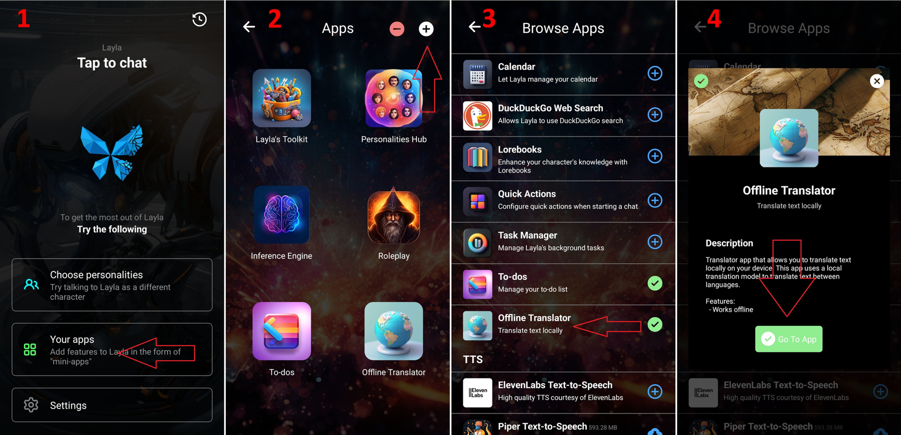

Layla comes with a mini-app called the **Offline Translator**.

It uses a small language model that translates text between languages completely locally on your phone, without any internet connection!

It is fast enough to translate conversations in real time. This means that even if you use an English LLM as your main chat AI, you can seamlessly translate your input and output into different languages.

**How to enable the Offline Translator app**

1. Go to *Mini-apps*.
2. Tap `+` to add a mini-app.
3. Search for *Offline Translator* in the list of apps.
4. Enable it.

**How to use the Offline Translator**

1. Tap the language name at the top to switch languages.
2. Search for your desired language pair.
3. The translation feature works similarly to Google Translate and other translation apps. Turn on *Automatically translate your chat* at the bottom.
4. Normally, your AI model—the LLM—will use English. Configure the translator to automatically translate your input, such as Korean, into English for the AI, then automatically translate the AI's output back into your language. *Make sure you have downloaded the translation model by tapping the cloud-download icon.*

The result will be an automatically translated chat!

<video controls playsinline src="/assets/articles/how-to-use-the-offline-translator-in-layla-to-make-all-your-chats-multi-lingual/translated-chat.mp4"></video>
